Set up Code book options


```r
knitr::opts_chunk$set(
  warning = TRUE, # show warnings during codebook generation
  message = TRUE, # show messages during codebook generation
  error = TRUE, # do not interrupt codebook generation in case of errors,
                # usually better for debugging
  echo = TRUE  # show R code
)
ggplot2::theme_set(ggplot2::theme_bw())
```

Code book preparation


```r
library(codebook)

codebook_data <- rio::import("codebook_source/accellerometer.rds")

# omit the following lines, if your missing values are already properly labelled
codebook_data <- detect_missing(codebook_data,
    only_labelled = TRUE, # only labelled values are autodetected as
                                   # missing
    negative_values_are_missing = FALSE, # negative values are missing values
    ninety_nine_problems = TRUE,   # 99/999 are missing values, if they
                                   # are more than 5 MAD from the median
    )

codebook_data <- detect_scales(codebook_data)
```


Create codebook


```r
codebook(codebook_data)
```

```
## No missing values.
```


### Metadata

#### Description
__Dataset name__: Accelerometer Standard Deviation and Mean Data

This data set contains the standard deviation and mean of the original data. See the README.txt found in the original data, "sample_data/getdata_projectfiles_UCI_HAR_Dataset/UCI HAR Dataset/README.txt", for more information.

<details>
<summary title="Expand this section to see some additional metadata in a structured format that is useful for search engines">Metadata for search engines</summary>


- __Spatial Coverage__: Online
- __Citation__: Davide Anguita, Alessandro Ghio, Luca Oneto, Xavier Parra and Jorge L. Reyes-Ortiz. Human Activity Recognition on Smartphones using a Multiclass Hardware-Friendly Support Vector Machine. International Workshop of Ambient Assisted Living (IWAAL 2012). Vitoria-Gasteiz, Spain. Dec 2012
- __URL__: [https://github.com/rodelor97/GettingCleaningDataWeek4Project](https://github.com/rodelor97/GettingCleaningDataWeek4Project)

- __Date published__: 2021-01-23

- __Creator__:

| name|value              |
|----:|:------------------|
|    1|Robert de Lorimier |


<table class="kable_wrapper">
<tbody>
  <tr>
   <td> 

|x                                              |
|:----------------------------------------------|
|subject_id                                     |
|activity_name                                  |
|timeof_body_accel_mean_x                       |
|timeof_body_accel_mean_y                       |
|timeof_body_accel_mean_z                       |
|timeof_body_accel_std_x                        |
|timeof_body_accel_std_y                        |
|timeof_body_accel_std_z                        |
|timeof_gravity_accel_mean_x                    |
|timeof_gravity_accel_mean_y                    |
|timeof_gravity_accel_mean_z                    |
|timeof_gravity_accel_std_x                     |
|timeof_gravity_accel_std_y                     |
|timeof_gravity_accel_std_z                     |
|timeof_body_accel_jerk_mean_x                  |
|timeof_body_accel_jerk_mean_y                  |
|timeof_body_accel_jerk_mean_z                  |
|timeof_body_accel_jerk_std_x                   |
|timeof_body_accel_jerk_std_y                   |
|timeof_body_accel_jerk_std_z                   |
|timeof_body_gyro_mean_x                        |
|timeof_body_gyro_mean_y                        |
|timeof_body_gyro_mean_z                        |
|timeof_body_gyro_std_x                         |
|timeof_body_gyro_std_y                         |
|timeof_body_gyro_std_z                         |
|timeof_body_gyro_jerk_mean_x                   |
|timeof_body_gyro_jerk_mean_y                   |
|timeof_body_gyro_jerk_mean_z                   |
|timeof_body_gyro_jerk_std_x                    |
|timeof_body_gyro_jerk_std_y                    |
|timeof_body_gyro_jerk_std_z                    |
|timeof_body_accel_magn_mean                    |
|timeof_body_accel_magn_std                     |
|timeof_gravity_accel_magn_mean                 |
|timeof_gravity_accel_magn_std                  |
|timeof_body_accel_jerk_magn_mean               |
|timeof_body_accel_jerk_magn_std                |
|timeof_body_gyro_magn_mean                     |
|timeof_body_gyro_magn_std                      |
|timeof_body_gyro_jerk_magn_mean                |
|timeof_body_gyro_jerk_magn_std                 |
|frequ_body_accel_mean_x                        |
|frequ_body_accel_mean_y                        |
|frequ_body_accel_mean_z                        |
|frequ_body_accel_std_x                         |
|frequ_body_accel_std_y                         |
|frequ_body_accel_std_z                         |
|frequ_body_accel_mean_freq_x                   |
|frequ_body_accel_mean_freq_y                   |
|frequ_body_accel_mean_freq_z                   |
|frequ_body_accel_jerk_mean_x                   |
|frequ_body_accel_jerk_mean_y                   |
|frequ_body_accel_jerk_mean_z                   |
|frequ_body_accel_jerk_std_x                    |
|frequ_body_accel_jerk_std_y                    |
|frequ_body_accel_jerk_std_z                    |
|frequ_body_accel_jerk_mean_freq_x              |
|frequ_body_accel_jerk_mean_freq_y              |
|frequ_body_accel_jerk_mean_freq_z              |
|frequ_body_gyro_mean_x                         |
|frequ_body_gyro_mean_y                         |
|frequ_body_gyro_mean_z                         |
|frequ_body_gyro_std_x                          |
|frequ_body_gyro_std_y                          |
|frequ_body_gyro_std_z                          |
|frequ_body_gyro_mean_freq_x                    |
|frequ_body_gyro_mean_freq_y                    |
|frequ_body_gyro_mean_freq_z                    |
|frequ_body_accel_magn_mean                     |
|frequ_body_accel_magn_std                      |
|frequ_body_accel_magn_mean_freq                |
|frequ_body_body_accel_jerk_magn_mean           |
|frequ_body_body_accel_jerk_magn_std            |
|frequ_body_body_accel_jerk_magn_mean_freq      |
|frequ_body_body_gyro_magn_mean                 |
|frequ_body_body_gyro_magn_std                  |
|frequ_body_body_gyro_magn_mean_freq            |
|frequ_body_body_gyro_jerk_magn_mean            |
|frequ_body_body_gyro_jerk_magn_std             |
|frequ_body_body_gyro_jerk_magn_mean_freq       |
|angle_timeof_body_accel_mean_gravity           |
|angle_timeof_body_accel_jerk_mean_gravity_mean |
|angle_timeof_body_gyro_mean_gravity_mean       |
|angle_timeof_body_gyro_jerk_mean_gravity_mean  |
|angle_x_gravity_mean                           |
|angle_y_gravity_mean                           |
|angle_z_gravity_mean                           |

 </td>
  </tr>
</tbody>
</table>

</details>


#Variables


### subject_id {#subject_id .tabset}

Subject id

#### Distribution {#subject_id_distribution}


0 missing values.

#### Summary statistics {#subject_id_summary}

|name       |label      |data_type | n_missing| complete_rate|min |median |max |     mean|       sd|hist  |
|:----------|:----------|:---------|---------:|-------------:|:---|:------|:---|--------:|--------:|:-----|
|subject_id |Subject id |numeric   |         0|             1|1   |17     |30  | 16.14642| 8.679067|▇▆▇▇▇ |


### activity_name {#activity_name .tabset}

Activity name

#### Distribution {#activity_name_distribution}


0 missing values.

#### Summary statistics {#activity_name_summary}

|name          |label         |data_type | n_missing| complete_rate| n_unique| empty|min |max | whitespace|
|:-------------|:-------------|:---------|---------:|-------------:|--------:|-----:|:---|:---|----------:|
|activity_name |Activity name |character |         0|             1|        6|     0|6   |18  |          0|


### timeof_body_accel_mean_x {#timeof_body_accel_mean_x .tabset}

Time domains signal (50Hz const rate), body acceleration mean X axis,

#### Distribution {#timeof_body_accel_mean_x_distribution}


0 missing values.

#### Summary statistics {#timeof_body_accel_mean_x_summary}

|name                     |label                                                                 |data_type | n_missing| complete_rate|min |median |max |      mean|        sd|hist  |
|:------------------------|:---------------------------------------------------------------------|:---------|---------:|-------------:|:---|:------|:---|---------:|---------:|:-----|
|timeof_body_accel_mean_x |Time domains signal (50Hz const rate), body acceleration mean X axis, |numeric   |         0|             1|-1  |0.28   |1   | 0.2743473| 0.0676278|▁▁▁▇▁ |


### timeof_body_accel_mean_y {#timeof_body_accel_mean_y .tabset}

Time domains signal (50Hz const rate), body acceleration mean Y axis,

#### Distribution {#timeof_body_accel_mean_y_distribution}


0 missing values.

#### Summary statistics {#timeof_body_accel_mean_y_summary}

|name                     |label                                                                 |data_type | n_missing| complete_rate|min |median |max |       mean|        sd|hist  |
|:------------------------|:---------------------------------------------------------------------|:---------|---------:|-------------:|:---|:------|:---|----------:|---------:|:-----|
|timeof_body_accel_mean_y |Time domains signal (50Hz const rate), body acceleration mean Y axis, |numeric   |         0|             1|-1  |-0.017 |1   | -0.0177435| 0.0371282|▁▁▇▁▁ |


### timeof_body_accel_mean_z {#timeof_body_accel_mean_z .tabset}

Time domains signal (50Hz const rate), body acceleration mean Z axis,

#### Distribution {#timeof_body_accel_mean_z_distribution}


0 missing values.

#### Summary statistics {#timeof_body_accel_mean_z_summary}

|name                     |label                                                                 |data_type | n_missing| complete_rate|min |median |max |      mean|        sd|hist  |
|:------------------------|:---------------------------------------------------------------------|:---------|---------:|-------------:|:---|:------|:---|---------:|---------:|:-----|
|timeof_body_accel_mean_z |Time domains signal (50Hz const rate), body acceleration mean Z axis, |numeric   |         0|             1|-1  |-0.11  |1   | -0.108925| 0.0530331|▁▁▇▁▁ |


### timeof_body_accel_std_x {#timeof_body_accel_std_x .tabset}

Time domains signal (50Hz const rate), body acceleration standard deviation X axis,

#### Distribution {#timeof_body_accel_std_x_distribution}


0 missing values.

#### Summary statistics {#timeof_body_accel_std_x_summary}

|name                    |label                                                                               |data_type | n_missing| complete_rate|min |median |max |       mean|        sd|hist  |
|:-----------------------|:-----------------------------------------------------------------------------------|:---------|---------:|-------------:|:---|:------|:---|----------:|---------:|:-----|
|timeof_body_accel_std_x |Time domains signal (50Hz const rate), body acceleration standard deviation X axis, |numeric   |         0|             1|-1  |-0.94  |1   | -0.6077838| 0.4386938|▇▃▂▁▁ |


### timeof_body_accel_std_y {#timeof_body_accel_std_y .tabset}

Time domains signal (50Hz const rate), body acceleration standard deviation Y axis,

#### Distribution {#timeof_body_accel_std_y_distribution}


0 missing values.

#### Summary statistics {#timeof_body_accel_std_y_summary}

|name                    |label                                                                               |data_type | n_missing| complete_rate|min |median |max |       mean|        sd|hist  |
|:-----------------------|:-----------------------------------------------------------------------------------|:---------|---------:|-------------:|:---|:------|:---|----------:|---------:|:-----|
|timeof_body_accel_std_y |Time domains signal (50Hz const rate), body acceleration standard deviation Y axis, |numeric   |         0|             1|-1  |-0.84  |1   | -0.5101914| 0.5002398|▇▁▅▁▁ |


### timeof_body_accel_std_z {#timeof_body_accel_std_z .tabset}

Time domains signal (50Hz const rate), body acceleration standard deviation Z axis,

#### Distribution {#timeof_body_accel_std_z_distribution}


0 missing values.

#### Summary statistics {#timeof_body_accel_std_z_summary}

|name                    |label                                                                               |data_type | n_missing| complete_rate|min |median |max |       mean|        sd|hist  |
|:-----------------------|:-----------------------------------------------------------------------------------|:---------|---------:|-------------:|:---|:------|:---|----------:|---------:|:-----|
|timeof_body_accel_std_z |Time domains signal (50Hz const rate), body acceleration standard deviation Z axis, |numeric   |         0|             1|-1  |-0.85  |1   | -0.6130643| 0.4036566|▇▅▂▁▁ |


### timeof_gravity_accel_mean_x {#timeof_gravity_accel_mean_x .tabset}

Time domains signal (50Hz const rate), gravity acceleration mean X axis,

#### Distribution {#timeof_gravity_accel_mean_x_distribution}


0 missing values.

#### Summary statistics {#timeof_gravity_accel_mean_x_summary}

|name                        |label                                                                    |data_type | n_missing| complete_rate|min |median |max |      mean|        sd|hist  |
|:---------------------------|:------------------------------------------------------------------------|:---------|---------:|-------------:|:---|:------|:---|---------:|---------:|:-----|
|timeof_gravity_accel_mean_x |Time domains signal (50Hz const rate), gravity acceleration mean X axis, |numeric   |         0|             1|-1  |0.92   |1   | 0.6692262| 0.5154858|▁▁▁▁▇ |


### timeof_gravity_accel_mean_y {#timeof_gravity_accel_mean_y .tabset}

Time domains signal (50Hz const rate), gravity acceleration mean Y axis,

#### Distribution {#timeof_gravity_accel_mean_y_distribution}


0 missing values.

#### Summary statistics {#timeof_gravity_accel_mean_y_summary}

|name                        |label                                                                    |data_type | n_missing| complete_rate|min |median |max |      mean|        sd|hist  |
|:---------------------------|:------------------------------------------------------------------------|:---------|---------:|-------------:|:---|:------|:---|---------:|---------:|:-----|
|timeof_gravity_accel_mean_y |Time domains signal (50Hz const rate), gravity acceleration mean Y axis, |numeric   |         0|             1|-1  |-0.14  |1   | 0.0040388| 0.3789092|▁▇▇▂▂ |


### timeof_gravity_accel_mean_z {#timeof_gravity_accel_mean_z .tabset}

Time domains signal (50Hz const rate), gravity acceleration mean Z axis,

#### Distribution {#timeof_gravity_accel_mean_z_distribution}


0 missing values.

#### Summary statistics {#timeof_gravity_accel_mean_z_summary}

|name                        |label                                                                    |data_type | n_missing| complete_rate|min |median |max |      mean|        sd|hist  |
|:---------------------------|:------------------------------------------------------------------------|:---------|---------:|-------------:|:---|:------|:---|---------:|---------:|:-----|
|timeof_gravity_accel_mean_z |Time domains signal (50Hz const rate), gravity acceleration mean Z axis, |numeric   |         0|             1|-1  |0.037  |1   | 0.0921509| 0.3342702|▁▂▇▂▂ |


### timeof_gravity_accel_std_x {#timeof_gravity_accel_std_x .tabset}

Time domains signal (50Hz const rate), gravity acceleration standard deviation X axis,

#### Distribution {#timeof_gravity_accel_std_x_distribution}


0 missing values.

#### Summary statistics {#timeof_gravity_accel_std_x_summary}

|name                       |label                                                                                  |data_type | n_missing| complete_rate|min |median |max |       mean|        sd|hist  |
|:--------------------------|:--------------------------------------------------------------------------------------|:---------|---------:|-------------:|:---|:------|:---|----------:|---------:|:-----|
|timeof_gravity_accel_std_x |Time domains signal (50Hz const rate), gravity acceleration standard deviation X axis, |numeric   |         0|             1|-1  |-0.98  |1   | -0.9652071| 0.0777148|▇▁▁▁▁ |


### timeof_gravity_accel_std_y {#timeof_gravity_accel_std_y .tabset}

Time domains signal (50Hz const rate), gravity acceleration standard deviation Y axis,

#### Distribution {#timeof_gravity_accel_std_y_distribution}

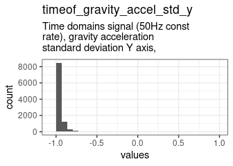

0 missing values.

#### Summary statistics {#timeof_gravity_accel_std_y_summary}

|name                       |label                                                                                  |data_type | n_missing| complete_rate|min |median |max |      mean|        sd|hist  |
|:--------------------------|:--------------------------------------------------------------------------------------|:---------|---------:|-------------:|:---|:------|:---|---------:|---------:|:-----|
|timeof_gravity_accel_std_y |Time domains signal (50Hz const rate), gravity acceleration standard deviation Y axis, |numeric   |         0|             1|-1  |-0.98  |1   | -0.954408| 0.0852866|▇▁▁▁▁ |


### timeof_gravity_accel_std_z {#timeof_gravity_accel_std_z .tabset}

Time domains signal (50Hz const rate), gravity acceleration standard deviation Z axis,

#### Distribution {#timeof_gravity_accel_std_z_distribution}

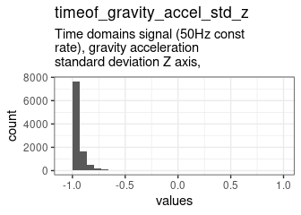

0 missing values.

#### Summary statistics {#timeof_gravity_accel_std_z_summary}

|name                       |label                                                                                  |data_type | n_missing| complete_rate|min |median |max |      mean|        sd|hist  |
|:--------------------------|:--------------------------------------------------------------------------------------|:---------|---------:|-------------:|:---|:------|:---|---------:|---------:|:-----|
|timeof_gravity_accel_std_z |Time domains signal (50Hz const rate), gravity acceleration standard deviation Z axis, |numeric   |         0|             1|-1  |-0.97  |1   | -0.938901| 0.1015548|▇▁▁▁▁ |


### timeof_body_accel_jerk_mean_x {#timeof_body_accel_jerk_mean_x .tabset}

Time domains signal (50Hz const rate), body acceleration jerk mean X axis,

#### Distribution {#timeof_body_accel_jerk_mean_x_distribution}

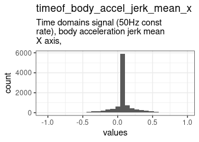

0 missing values.

#### Summary statistics {#timeof_body_accel_jerk_mean_x_summary}

|name                          |label                                                                      |data_type | n_missing| complete_rate|min |median |max |      mean|        sd|hist  |
|:-----------------------------|:--------------------------------------------------------------------------|:---------|---------:|-------------:|:---|:------|:---|---------:|---------:|:-----|
|timeof_body_accel_jerk_mean_x |Time domains signal (50Hz const rate), body acceleration jerk mean X axis, |numeric   |         0|             1|-1  |0.076  |1   | 0.0789381| 0.1761125|▁▁▇▁▁ |


### timeof_body_accel_jerk_mean_y {#timeof_body_accel_jerk_mean_y .tabset}

Time domains signal (50Hz const rate), body acceleration jerk mean Y axis,

#### Distribution {#timeof_body_accel_jerk_mean_y_distribution}


0 missing values.

#### Summary statistics {#timeof_body_accel_jerk_mean_y_summary}

|name                          |label                                                                      |data_type | n_missing| complete_rate|min |median |max |      mean|        sd|hist  |
|:-----------------------------|:--------------------------------------------------------------------------|:---------|---------:|-------------:|:---|:------|:---|---------:|---------:|:-----|
|timeof_body_accel_jerk_mean_y |Time domains signal (50Hz const rate), body acceleration jerk mean Y axis, |numeric   |         0|             1|-1  |0.011  |1   | 0.0079481| 0.1645184|▁▁▇▁▁ |


### timeof_body_accel_jerk_mean_z {#timeof_body_accel_jerk_mean_z .tabset}

Time domains signal (50Hz const rate), body acceleration jerk mean Z axis,

#### Distribution {#timeof_body_accel_jerk_mean_z_distribution}


0 missing values.

#### Summary statistics {#timeof_body_accel_jerk_mean_z_summary}

|name                          |label                                                                      |data_type | n_missing| complete_rate|min |median  |max |       mean|       sd|hist  |
|:-----------------------------|:--------------------------------------------------------------------------|:---------|---------:|-------------:|:---|:-------|:---|----------:|--------:|:-----|
|timeof_body_accel_jerk_mean_z |Time domains signal (50Hz const rate), body acceleration jerk mean Z axis, |numeric   |         0|             1|-1  |-0.0012 |1   | -0.0046747| 0.155979|▁▁▇▁▁ |


### timeof_body_accel_jerk_std_x {#timeof_body_accel_jerk_std_x .tabset}

Time domains signal (50Hz const rate), body acceleration jerk standard deviation X axis,

#### Distribution {#timeof_body_accel_jerk_std_x_distribution}


0 missing values.

#### Summary statistics {#timeof_body_accel_jerk_std_x_summary}

|name                         |label                                                                                    |data_type | n_missing| complete_rate|min |median |max |      mean|        sd|hist  |
|:----------------------------|:----------------------------------------------------------------------------------------|:---------|---------:|-------------:|:---|:------|:---|---------:|---------:|:-----|
|timeof_body_accel_jerk_std_x |Time domains signal (50Hz const rate), body acceleration jerk standard deviation X axis, |numeric   |         0|             1|-1  |-0.95  |1   | -0.639781| 0.4087118|▇▃▂▁▁ |


### timeof_body_accel_jerk_std_y {#timeof_body_accel_jerk_std_y .tabset}

Time domains signal (50Hz const rate), body acceleration jerk standard deviation Y axis,

#### Distribution {#timeof_body_accel_jerk_std_y_distribution}


0 missing values.

#### Summary statistics {#timeof_body_accel_jerk_std_y_summary}

|name                         |label                                                                                    |data_type | n_missing| complete_rate|min |median |max |       mean|        sd|hist  |
|:----------------------------|:----------------------------------------------------------------------------------------|:---------|---------:|-------------:|:---|:------|:---|----------:|---------:|:-----|
|timeof_body_accel_jerk_std_y |Time domains signal (50Hz const rate), body acceleration jerk standard deviation Y axis, |numeric   |         0|             1|-1  |-0.93  |1   | -0.6079716| 0.4328845|▇▃▃▁▁ |


### timeof_body_accel_jerk_std_z {#timeof_body_accel_jerk_std_z .tabset}

Time domains signal (50Hz const rate), body acceleration jerk standard deviation Z axis,

#### Distribution {#timeof_body_accel_jerk_std_z_distribution}

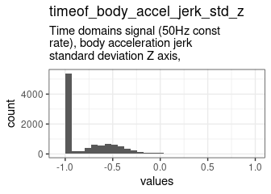

0 missing values.

#### Summary statistics {#timeof_body_accel_jerk_std_z_summary}

|name                         |label                                                                                    |data_type | n_missing| complete_rate|min |median |max |       mean|        sd|hist  |
|:----------------------------|:----------------------------------------------------------------------------------------|:---------|---------:|-------------:|:---|:------|:---|----------:|---------:|:-----|
|timeof_body_accel_jerk_std_z |Time domains signal (50Hz const rate), body acceleration jerk standard deviation Z axis, |numeric   |         0|             1|-1  |-0.95  |1   | -0.7628202| 0.2779014|▇▃▁▁▁ |


### timeof_body_gyro_mean_x {#timeof_body_gyro_mean_x .tabset}

Time domains signal (50Hz const rate), body gyroscope 3-axial raw signal mean X axis,

#### Distribution {#timeof_body_gyro_mean_x_distribution}

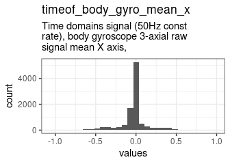

0 missing values.

#### Summary statistics {#timeof_body_gyro_mean_x_summary}

|name                    |label                                                                                 |data_type | n_missing| complete_rate|min |median |max |       mean|        sd|hist  |
|:-----------------------|:-------------------------------------------------------------------------------------|:---------|---------:|-------------:|:---|:------|:---|----------:|---------:|:-----|
|timeof_body_gyro_mean_x |Time domains signal (50Hz const rate), body gyroscope 3-axial raw signal mean X axis, |numeric   |         0|             1|-1  |-0.028 |1   | -0.0309825| 0.1831861|▁▁▇▁▁ |


### timeof_body_gyro_mean_y {#timeof_body_gyro_mean_y .tabset}

Time domains signal (50Hz const rate), body gyroscope 3-axial raw signal mean Y axis,

#### Distribution {#timeof_body_gyro_mean_y_distribution}


0 missing values.

#### Summary statistics {#timeof_body_gyro_mean_y_summary}

|name                    |label                                                                                 |data_type | n_missing| complete_rate|min |median |max |       mean|        sd|hist  |
|:-----------------------|:-------------------------------------------------------------------------------------|:---------|---------:|-------------:|:---|:------|:---|----------:|---------:|:-----|
|timeof_body_gyro_mean_y |Time domains signal (50Hz const rate), body gyroscope 3-axial raw signal mean Y axis, |numeric   |         0|             1|-1  |-0.075 |1   | -0.0747195| 0.1343171|▁▁▇▁▁ |


### timeof_body_gyro_mean_z {#timeof_body_gyro_mean_z .tabset}

Time domains signal (50Hz const rate), body gyroscope 3-axial raw signal mean Z axis,

#### Distribution {#timeof_body_gyro_mean_z_distribution}


0 missing values.

#### Summary statistics {#timeof_body_gyro_mean_z_summary}

|name                    |label                                                                                 |data_type | n_missing| complete_rate|min |median |max |      mean|        sd|hist  |
|:-----------------------|:-------------------------------------------------------------------------------------|:---------|---------:|-------------:|:---|:------|:---|---------:|---------:|:-----|
|timeof_body_gyro_mean_z |Time domains signal (50Hz const rate), body gyroscope 3-axial raw signal mean Z axis, |numeric   |         0|             1|-1  |0.086  |1   | 0.0883573| 0.1348753|▁▁▇▁▁ |


### timeof_body_gyro_std_x {#timeof_body_gyro_std_x .tabset}

Time domains signal (50Hz const rate), body gyroscope 3-axial raw signal standard deviation X axis,

#### Distribution {#timeof_body_gyro_std_x_distribution}


0 missing values.

#### Summary statistics {#timeof_body_gyro_std_x_summary}

|name                   |label                                                                                               |data_type | n_missing| complete_rate|min |median |max |       mean|        sd|hist  |
|:----------------------|:---------------------------------------------------------------------------------------------------|:---------|---------:|-------------:|:---|:------|:---|----------:|---------:|:-----|
|timeof_body_gyro_std_x |Time domains signal (50Hz const rate), body gyroscope 3-axial raw signal standard deviation X axis, |numeric   |         0|             1|-1  |-0.9   |1   | -0.7211926| 0.3010271|▇▅▁▁▁ |


### timeof_body_gyro_std_y {#timeof_body_gyro_std_y .tabset}

Time domains signal (50Hz const rate), body gyroscope 3-axial raw signal standard deviation Y axis,

#### Distribution {#timeof_body_gyro_std_y_distribution}

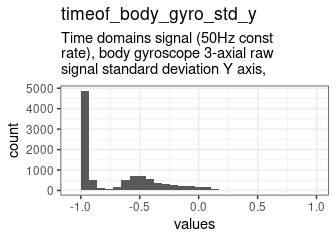

0 missing values.

#### Summary statistics {#timeof_body_gyro_std_y_summary}

|name                   |label                                                                                               |data_type | n_missing| complete_rate|min |median |max |       mean|        sd|hist  |
|:----------------------|:---------------------------------------------------------------------------------------------------|:---------|---------:|-------------:|:---|:------|:---|----------:|---------:|:-----|
|timeof_body_gyro_std_y |Time domains signal (50Hz const rate), body gyroscope 3-axial raw signal standard deviation Y axis, |numeric   |         0|             1|-1  |-0.91  |1   | -0.6826535| 0.3568845|▇▃▁▁▁ |


### timeof_body_gyro_std_z {#timeof_body_gyro_std_z .tabset}

Time domains signal (50Hz const rate), body gyroscope 3-axial raw signal standard deviation Z axis,

#### Distribution {#timeof_body_gyro_std_z_distribution}

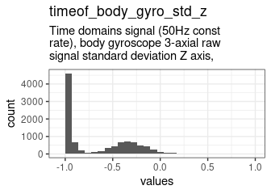

0 missing values.

#### Summary statistics {#timeof_body_gyro_std_z_summary}

|name                   |label                                                                                               |data_type | n_missing| complete_rate|min |median |max |       mean|        sd|hist  |
|:----------------------|:---------------------------------------------------------------------------------------------------|:---------|---------:|-------------:|:---|:------|:---|----------:|---------:|:-----|
|timeof_body_gyro_std_z |Time domains signal (50Hz const rate), body gyroscope 3-axial raw signal standard deviation Z axis, |numeric   |         0|             1|-1  |-0.88  |1   | -0.6536657| 0.3726061|▇▅▂▁▁ |


### timeof_body_gyro_jerk_mean_x {#timeof_body_gyro_jerk_mean_x .tabset}

Time domains signal (50Hz const rate), body gyroscope 3-axial raw signal jerk mean X axis,

#### Distribution {#timeof_body_gyro_jerk_mean_x_distribution}

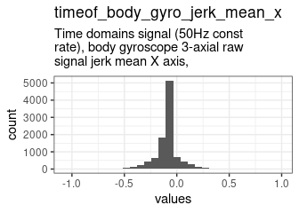

0 missing values.

#### Summary statistics {#timeof_body_gyro_jerk_mean_x_summary}

|name                         |label                                                                                      |data_type | n_missing| complete_rate|min |median |max |       mean|       sd|hist  |
|:----------------------------|:------------------------------------------------------------------------------------------|:---------|---------:|-------------:|:---|:------|:---|----------:|--------:|:-----|
|timeof_body_gyro_jerk_mean_x |Time domains signal (50Hz const rate), body gyroscope 3-axial raw signal jerk mean X axis, |numeric   |         0|             1|-1  |-0.098 |1   | -0.0967093| 0.128135|▁▁▇▁▁ |


### timeof_body_gyro_jerk_mean_y {#timeof_body_gyro_jerk_mean_y .tabset}

Time domains signal (50Hz const rate), body gyroscope 3-axial raw signal jerk mean Y axis,

#### Distribution {#timeof_body_gyro_jerk_mean_y_distribution}


0 missing values.

#### Summary statistics {#timeof_body_gyro_jerk_mean_y_summary}

|name                         |label                                                                                      |data_type | n_missing| complete_rate|min |median |max |       mean|        sd|hist  |
|:----------------------------|:------------------------------------------------------------------------------------------|:---------|---------:|-------------:|:---|:------|:---|----------:|---------:|:-----|
|timeof_body_gyro_jerk_mean_y |Time domains signal (50Hz const rate), body gyroscope 3-axial raw signal jerk mean Y axis, |numeric   |         0|             1|-1  |-0.041 |1   | -0.0423181| 0.1144092|▁▁▇▁▁ |


### timeof_body_gyro_jerk_mean_z {#timeof_body_gyro_jerk_mean_z .tabset}

Time domains signal (50Hz const rate), body gyroscope 3-axial raw signal jerk mean Z axis,

#### Distribution {#timeof_body_gyro_jerk_mean_z_distribution}


0 missing values.

#### Summary statistics {#timeof_body_gyro_jerk_mean_z_summary}

|name                         |label                                                                                      |data_type | n_missing| complete_rate|min |median |max |       mean|        sd|hist  |
|:----------------------------|:------------------------------------------------------------------------------------------|:---------|---------:|-------------:|:---|:------|:---|----------:|---------:|:-----|
|timeof_body_gyro_jerk_mean_z |Time domains signal (50Hz const rate), body gyroscope 3-axial raw signal jerk mean Z axis, |numeric   |         0|             1|-1  |-0.055 |1   | -0.0548303| 0.1288956|▁▁▇▁▁ |


### timeof_body_gyro_jerk_std_x {#timeof_body_gyro_jerk_std_x .tabset}

Time domains signal (50Hz const rate), body gyroscope 3-axial raw signal jerk standard deviation X axis,

#### Distribution {#timeof_body_gyro_jerk_std_x_distribution}

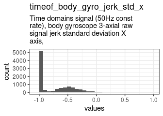

0 missing values.

#### Summary statistics {#timeof_body_gyro_jerk_std_x_summary}

|name                        |label                                                                                                    |data_type | n_missing| complete_rate|min |median |max |       mean|        sd|hist  |
|:---------------------------|:--------------------------------------------------------------------------------------------------------|:---------|---------:|-------------:|:---|:------|:---|----------:|---------:|:-----|
|timeof_body_gyro_jerk_std_x |Time domains signal (50Hz const rate), body gyroscope 3-axial raw signal jerk standard deviation X axis, |numeric   |         0|             1|-1  |-0.93  |1   | -0.7313485| 0.3038159|▇▃▁▁▁ |


### timeof_body_gyro_jerk_std_y {#timeof_body_gyro_jerk_std_y .tabset}

Time domains signal (50Hz const rate), body gyroscope 3-axial raw signal jerk standard deviation Y axis,

#### Distribution {#timeof_body_gyro_jerk_std_y_distribution}


0 missing values.

#### Summary statistics {#timeof_body_gyro_jerk_std_y_summary}

|name                        |label                                                                                                    |data_type | n_missing| complete_rate|min |median |max |       mean|        sd|hist  |
|:---------------------------|:--------------------------------------------------------------------------------------------------------|:---------|---------:|-------------:|:---|:------|:---|----------:|---------:|:-----|
|timeof_body_gyro_jerk_std_y |Time domains signal (50Hz const rate), body gyroscope 3-axial raw signal jerk standard deviation Y axis, |numeric   |         0|             1|-1  |-0.95  |1   | -0.7860623| 0.2727157|▇▂▁▁▁ |


### timeof_body_gyro_jerk_std_z {#timeof_body_gyro_jerk_std_z .tabset}

Time domains signal (50Hz const rate), body gyroscope 3-axial raw signal jerk standard deviation Z axis,

#### Distribution {#timeof_body_gyro_jerk_std_z_distribution}

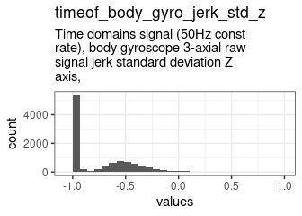

0 missing values.

#### Summary statistics {#timeof_body_gyro_jerk_std_z_summary}

|name                        |label                                                                                                    |data_type | n_missing| complete_rate|min |median |max |       mean|        sd|hist  |
|:---------------------------|:--------------------------------------------------------------------------------------------------------|:---------|---------:|-------------:|:---|:------|:---|----------:|---------:|:-----|
|timeof_body_gyro_jerk_std_z |Time domains signal (50Hz const rate), body gyroscope 3-axial raw signal jerk standard deviation Z axis, |numeric   |         0|             1|-1  |-0.95  |1   | -0.7399324| 0.3019942|▇▃▁▁▁ |


### timeof_body_accel_magn_mean {#timeof_body_accel_magn_mean .tabset}

Time domains signal (50Hz const rate), body acceleration euclidean norm magnitude mean

#### Distribution {#timeof_body_accel_magn_mean_distribution}

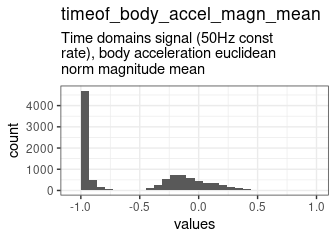

0 missing values.

#### Summary statistics {#timeof_body_accel_magn_mean_summary}

|name                        |label                                                                                  |data_type | n_missing| complete_rate|min |median |max |       mean|        sd|hist  |
|:---------------------------|:--------------------------------------------------------------------------------------|:---------|---------:|-------------:|:---|:------|:---|----------:|---------:|:-----|
|timeof_body_accel_magn_mean |Time domains signal (50Hz const rate), body acceleration euclidean norm magnitude mean |numeric   |         0|             1|-1  |-0.87  |1   | -0.5482217| 0.4670937|▇▂▅▁▁ |


### timeof_body_accel_magn_std {#timeof_body_accel_magn_std .tabset}

Time domains signal (50Hz const rate), body acceleration euclidean norm magnitude standard deviation

#### Distribution {#timeof_body_accel_magn_std_distribution}


0 missing values.

#### Summary statistics {#timeof_body_accel_magn_std_summary}

|name                       |label                                                                                                |data_type | n_missing| complete_rate|min |median |max |       mean|        sd|hist  |
|:--------------------------|:----------------------------------------------------------------------------------------------------|:---------|---------:|-------------:|:---|:------|:---|----------:|---------:|:-----|
|timeof_body_accel_magn_std |Time domains signal (50Hz const rate), body acceleration euclidean norm magnitude standard deviation |numeric   |         0|             1|-1  |-0.84  |1   | -0.5912253| 0.4294313|▇▃▂▁▁ |


### timeof_gravity_accel_magn_mean {#timeof_gravity_accel_magn_mean .tabset}

Time domains signal (50Hz const rate), gravity acceleration euclidean norm magnitude mean

#### Distribution {#timeof_gravity_accel_magn_mean_distribution}


0 missing values.

#### Summary statistics {#timeof_gravity_accel_magn_mean_summary}

|name                           |label                                                                                     |data_type | n_missing| complete_rate|min |median |max |       mean|        sd|hist  |
|:------------------------------|:-----------------------------------------------------------------------------------------|:---------|---------:|-------------:|:---|:------|:---|----------:|---------:|:-----|
|timeof_gravity_accel_magn_mean |Time domains signal (50Hz const rate), gravity acceleration euclidean norm magnitude mean |numeric   |         0|             1|-1  |-0.87  |1   | -0.5482217| 0.4670937|▇▂▅▁▁ |


### timeof_gravity_accel_magn_std {#timeof_gravity_accel_magn_std .tabset}

Time domains signal (50Hz const rate), gravity acceleration euclidean norm magnitude standard deviation

#### Distribution {#timeof_gravity_accel_magn_std_distribution}


0 missing values.

#### Summary statistics {#timeof_gravity_accel_magn_std_summary}

|name                          |label                                                                                                   |data_type | n_missing| complete_rate|min |median |max |       mean|        sd|hist  |
|:-----------------------------|:-------------------------------------------------------------------------------------------------------|:---------|---------:|-------------:|:---|:------|:---|----------:|---------:|:-----|
|timeof_gravity_accel_magn_std |Time domains signal (50Hz const rate), gravity acceleration euclidean norm magnitude standard deviation |numeric   |         0|             1|-1  |-0.84  |1   | -0.5912253| 0.4294313|▇▃▂▁▁ |


### timeof_body_accel_jerk_magn_mean {#timeof_body_accel_jerk_magn_mean .tabset}

Time domains signal (50Hz const rate), body acceleration jerk euclidean norm magnitude mean

#### Distribution {#timeof_body_accel_jerk_magn_mean_distribution}


0 missing values.

#### Summary statistics {#timeof_body_accel_jerk_magn_mean_summary}

|name                             |label                                                                                       |data_type | n_missing| complete_rate|min |median |max |      mean|        sd|hist  |
|:--------------------------------|:-------------------------------------------------------------------------------------------|:---------|---------:|-------------:|:---|:------|:---|---------:|---------:|:-----|
|timeof_body_accel_jerk_magn_mean |Time domains signal (50Hz const rate), body acceleration jerk euclidean norm magnitude mean |numeric   |         0|             1|-1  |-0.95  |1   | -0.649418| 0.3894942|▇▃▂▁▁ |


### timeof_body_accel_jerk_magn_std {#timeof_body_accel_jerk_magn_std .tabset}

Time domains signal (50Hz const rate), body acceleration jerk euclidean norm magnitude standard deviation

#### Distribution {#timeof_body_accel_jerk_magn_std_distribution}


0 missing values.

#### Summary statistics {#timeof_body_accel_jerk_magn_std_summary}

|name                            |label                                                                                                     |data_type | n_missing| complete_rate|min |median |max |       mean|        sd|hist  |
|:-------------------------------|:---------------------------------------------------------------------------------------------------------|:---------|---------:|-------------:|:---|:------|:---|----------:|---------:|:-----|
|timeof_body_accel_jerk_magn_std |Time domains signal (50Hz const rate), body acceleration jerk euclidean norm magnitude standard deviation |numeric   |         0|             1|-1  |-0.93  |1   | -0.6277629| 0.4172213|▇▃▂▁▁ |


### timeof_body_gyro_magn_mean {#timeof_body_gyro_magn_mean .tabset}

Time domains signal (50Hz const rate), body gyroscope 3-axial raw signal euclidean norm magnitude mean

#### Distribution {#timeof_body_gyro_magn_mean_distribution}


0 missing values.

#### Summary statistics {#timeof_body_gyro_magn_mean_summary}

|name                       |label                                                                                                  |data_type | n_missing| complete_rate|min |median |max |       mean|        sd|hist  |
|:--------------------------|:------------------------------------------------------------------------------------------------------|:---------|---------:|-------------:|:---|:------|:---|----------:|---------:|:-----|
|timeof_body_gyro_magn_mean |Time domains signal (50Hz const rate), body gyroscope 3-axial raw signal euclidean norm magnitude mean |numeric   |         0|             1|-1  |-0.82  |1   | -0.6052486| 0.3997096|▇▃▃▁▁ |


### timeof_body_gyro_magn_std {#timeof_body_gyro_magn_std .tabset}

Time domains signal (50Hz const rate), body gyroscope 3-axial raw signal euclidean norm magnitude standard deviation

#### Distribution {#timeof_body_gyro_magn_std_distribution}

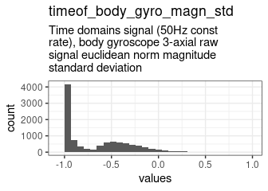

0 missing values.

#### Summary statistics {#timeof_body_gyro_magn_std_summary}

|name                      |label                                                                                                                |data_type | n_missing| complete_rate|min |median |max |       mean|        sd|hist  |
|:-------------------------|:--------------------------------------------------------------------------------------------------------------------|:---------|---------:|-------------:|:---|:------|:---|----------:|---------:|:-----|
|timeof_body_gyro_magn_std |Time domains signal (50Hz const rate), body gyroscope 3-axial raw signal euclidean norm magnitude standard deviation |numeric   |         0|             1|-1  |-0.83  |1   | -0.6625331| 0.3492246|▇▅▂▁▁ |


### timeof_body_gyro_jerk_magn_mean {#timeof_body_gyro_jerk_magn_mean .tabset}

Time domains signal (50Hz const rate), body gyroscope 3-axial raw signal jerk euclidean norm magnitude mean

#### Distribution {#timeof_body_gyro_jerk_magn_mean_distribution}


0 missing values.

#### Summary statistics {#timeof_body_gyro_jerk_magn_mean_summary}

|name                            |label                                                                                                       |data_type | n_missing| complete_rate|min |median |max |       mean|        sd|hist  |
|:-------------------------------|:-----------------------------------------------------------------------------------------------------------|:---------|---------:|-------------:|:---|:------|:---|----------:|---------:|:-----|
|timeof_body_gyro_jerk_magn_mean |Time domains signal (50Hz const rate), body gyroscope 3-axial raw signal jerk euclidean norm magnitude mean |numeric   |         0|             1|-1  |-0.96  |1   | -0.7621376| 0.2765145|▇▃▁▁▁ |


### timeof_body_gyro_jerk_magn_std {#timeof_body_gyro_jerk_magn_std .tabset}

Time domains signal (50Hz const rate), body gyroscope 3-axial raw signal jerk euclidean norm magnitude standard deviation

#### Distribution {#timeof_body_gyro_jerk_magn_std_distribution}


0 missing values.

#### Summary statistics {#timeof_body_gyro_jerk_magn_std_summary}

|name                           |label                                                                                                                     |data_type | n_missing| complete_rate|min |median |max |       mean|        sd|hist  |
|:------------------------------|:-------------------------------------------------------------------------------------------------------------------------|:---------|---------:|-------------:|:---|:------|:---|----------:|---------:|:-----|
|timeof_body_gyro_jerk_magn_std |Time domains signal (50Hz const rate), body gyroscope 3-axial raw signal jerk euclidean norm magnitude standard deviation |numeric   |         0|             1|-1  |-0.94  |1   | -0.7779932| 0.2715902|▇▂▁▁▁ |


### frequ_body_accel_mean_x {#frequ_body_accel_mean_x .tabset}

Fast fourier tranform frequecy signal, body acceleration mean X axis,

#### Distribution {#frequ_body_accel_mean_x_distribution}


0 missing values.

#### Summary statistics {#frequ_body_accel_mean_x_summary}

|name                    |label                                                                 |data_type | n_missing| complete_rate|min |median |max |       mean|        sd|hist  |
|:-----------------------|:---------------------------------------------------------------------|:---------|---------:|-------------:|:---|:------|:---|----------:|---------:|:-----|
|frequ_body_accel_mean_x |Fast fourier tranform frequecy signal, body acceleration mean X axis, |numeric   |         0|             1|-1  |-0.95  |1   | -0.6227617| 0.4207946|▇▃▂▁▁ |


### frequ_body_accel_mean_y {#frequ_body_accel_mean_y .tabset}

Fast fourier tranform frequecy signal, body acceleration mean Y axis,

#### Distribution {#frequ_body_accel_mean_y_distribution}


0 missing values.

#### Summary statistics {#frequ_body_accel_mean_y_summary}

|name                    |label                                                                 |data_type | n_missing| complete_rate|min |median |max |       mean|        sd|hist  |
|:-----------------------|:---------------------------------------------------------------------|:---------|---------:|-------------:|:---|:------|:---|----------:|---------:|:-----|
|frequ_body_accel_mean_y |Fast fourier tranform frequecy signal, body acceleration mean Y axis, |numeric   |         0|             1|-1  |-0.86  |1   | -0.5374933| 0.4816819|▇▂▃▁▁ |


### frequ_body_accel_mean_z {#frequ_body_accel_mean_z .tabset}

Fast fourier tranform frequecy signal, body acceleration mean Z axis,

#### Distribution {#frequ_body_accel_mean_z_distribution}


0 missing values.

#### Summary statistics {#frequ_body_accel_mean_z_summary}

|name                    |label                                                                 |data_type | n_missing| complete_rate|min |median |max |       mean|        sd|hist  |
|:-----------------------|:---------------------------------------------------------------------|:---------|---------:|-------------:|:---|:------|:---|----------:|---------:|:-----|
|frequ_body_accel_mean_z |Fast fourier tranform frequecy signal, body acceleration mean Z axis, |numeric   |         0|             1|-1  |-0.9   |1   | -0.6650335| 0.3588531|▇▅▁▁▁ |


### frequ_body_accel_std_x {#frequ_body_accel_std_x .tabset}

Fast fourier tranform frequecy signal, body acceleration standard deviation X axis,

#### Distribution {#frequ_body_accel_std_x_distribution}


0 missing values.

#### Summary statistics {#frequ_body_accel_std_x_summary}

|name                   |label                                                                               |data_type | n_missing| complete_rate|min |median |max |       mean|        sd|hist  |
|:----------------------|:-----------------------------------------------------------------------------------|:---------|---------:|-------------:|:---|:------|:---|----------:|---------:|:-----|
|frequ_body_accel_std_x |Fast fourier tranform frequecy signal, body acceleration standard deviation X axis, |numeric   |         0|             1|-1  |-0.94  |1   | -0.6033563| 0.4467928|▇▃▂▁▁ |


### frequ_body_accel_std_y {#frequ_body_accel_std_y .tabset}

Fast fourier tranform frequecy signal, body acceleration standard deviation Y axis,

#### Distribution {#frequ_body_accel_std_y_distribution}


0 missing values.

#### Summary statistics {#frequ_body_accel_std_y_summary}

|name                   |label                                                                               |data_type | n_missing| complete_rate|min |median |max |     mean|       sd|hist  |
|:----------------------|:-----------------------------------------------------------------------------------|:---------|---------:|-------------:|:---|:------|:---|--------:|--------:|:-----|
|frequ_body_accel_std_y |Fast fourier tranform frequecy signal, body acceleration standard deviation Y axis, |numeric   |         0|             1|-1  |-0.83  |1   | -0.52842| 0.479925|▇▂▅▁▁ |


### frequ_body_accel_std_z {#frequ_body_accel_std_z .tabset}

Fast fourier tranform frequecy signal, body acceleration standard deviation Z axis,

#### Distribution {#frequ_body_accel_std_z_distribution}

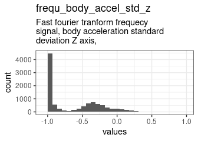

0 missing values.

#### Summary statistics {#frequ_body_accel_std_z_summary}

|name                   |label                                                                               |data_type | n_missing| complete_rate|min |median |max |       mean|        sd|hist  |
|:----------------------|:-----------------------------------------------------------------------------------|:---------|---------:|-------------:|:---|:------|:---|----------:|---------:|:-----|
|frequ_body_accel_std_z |Fast fourier tranform frequecy signal, body acceleration standard deviation Z axis, |numeric   |         0|             1|-1  |-0.84  |1   | -0.6178748| 0.3989732|▇▅▂▁▁ |


### frequ_body_accel_mean_freq_x {#frequ_body_accel_mean_freq_x .tabset}

Fast fourier tranform frequecy signal, body acceleration mean freq X axis,

#### Distribution {#frequ_body_accel_mean_freq_x_distribution}

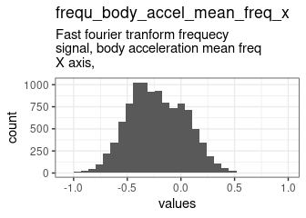

0 missing values.

#### Summary statistics {#frequ_body_accel_mean_freq_x_summary}

|name                         |label                                                                      |data_type | n_missing| complete_rate|min |median |max |       mean|        sd|hist  |
|:----------------------------|:--------------------------------------------------------------------------|:---------|---------:|-------------:|:---|:------|:---|----------:|---------:|:-----|
|frequ_body_accel_mean_freq_x |Fast fourier tranform frequecy signal, body acceleration mean freq X axis, |numeric   |         0|             1|-1  |-0.24  |1   | -0.2214691| 0.2645858|▁▇▆▁▁ |


### frequ_body_accel_mean_freq_y {#frequ_body_accel_mean_freq_y .tabset}

Fast fourier tranform frequecy signal, body acceleration mean freq Y axis,

#### Distribution {#frequ_body_accel_mean_freq_y_distribution}


0 missing values.

#### Summary statistics {#frequ_body_accel_mean_freq_y_summary}

|name                         |label                                                                      |data_type | n_missing| complete_rate|min |median |max |      mean|       sd|hist  |
|:----------------------------|:--------------------------------------------------------------------------|:---------|---------:|-------------:|:---|:------|:---|---------:|--------:|:-----|
|frequ_body_accel_mean_freq_y |Fast fourier tranform frequecy signal, body acceleration mean freq Y axis, |numeric   |         0|             1|-1  |0.0047 |1   | 0.0154006| 0.240846|▁▂▇▃▁ |


### frequ_body_accel_mean_freq_z {#frequ_body_accel_mean_freq_z .tabset}

Fast fourier tranform frequecy signal, body acceleration mean freq Z axis,

#### Distribution {#frequ_body_accel_mean_freq_z_distribution}


0 missing values.

#### Summary statistics {#frequ_body_accel_mean_freq_z_summary}

|name                         |label                                                                      |data_type | n_missing| complete_rate|min |median |max |      mean|        sd|hist  |
|:----------------------------|:--------------------------------------------------------------------------|:---------|---------:|-------------:|:---|:------|:---|---------:|---------:|:-----|
|frequ_body_accel_mean_freq_z |Fast fourier tranform frequecy signal, body acceleration mean freq Z axis, |numeric   |         0|             1|-1  |0.061  |1   | 0.0473099| 0.2837848|▁▃▇▅▁ |


### frequ_body_accel_jerk_mean_x {#frequ_body_accel_jerk_mean_x .tabset}

Fast fourier tranform frequecy signal, body acceleration jerk mean X axis,

#### Distribution {#frequ_body_accel_jerk_mean_x_distribution}


0 missing values.

#### Summary statistics {#frequ_body_accel_jerk_mean_x_summary}

|name                         |label                                                                      |data_type | n_missing| complete_rate|min |median |max |       mean|        sd|hist  |
|:----------------------------|:--------------------------------------------------------------------------|:---------|---------:|-------------:|:---|:------|:---|----------:|---------:|:-----|
|frequ_body_accel_jerk_mean_x |Fast fourier tranform frequecy signal, body acceleration jerk mean X axis, |numeric   |         0|             1|-1  |-0.95  |1   | -0.6567135| 0.3899946|▇▃▂▁▁ |


### frequ_body_accel_jerk_mean_y {#frequ_body_accel_jerk_mean_y .tabset}

Fast fourier tranform frequecy signal, body acceleration jerk mean Y axis,

#### Distribution {#frequ_body_accel_jerk_mean_y_distribution}

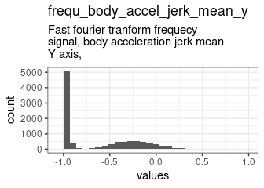

0 missing values.

#### Summary statistics {#frequ_body_accel_jerk_mean_y_summary}

|name                         |label                                                                      |data_type | n_missing| complete_rate|min |median |max |       mean|        sd|hist  |
|:----------------------------|:--------------------------------------------------------------------------|:---------|---------:|-------------:|:---|:------|:---|----------:|---------:|:-----|
|frequ_body_accel_jerk_mean_y |Fast fourier tranform frequecy signal, body acceleration jerk mean Y axis, |numeric   |         0|             1|-1  |-0.93  |1   | -0.6289612| 0.4073001|▇▃▂▁▁ |


### frequ_body_accel_jerk_mean_z {#frequ_body_accel_jerk_mean_z .tabset}

Fast fourier tranform frequecy signal, body acceleration jerk mean Z axis,

#### Distribution {#frequ_body_accel_jerk_mean_z_distribution}


0 missing values.

#### Summary statistics {#frequ_body_accel_jerk_mean_z_summary}

|name                         |label                                                                      |data_type | n_missing| complete_rate|min |median |max |       mean|        sd|hist  |
|:----------------------------|:--------------------------------------------------------------------------|:---------|---------:|-------------:|:---|:------|:---|----------:|---------:|:-----|
|frequ_body_accel_jerk_mean_z |Fast fourier tranform frequecy signal, body acceleration jerk mean Z axis, |numeric   |         0|             1|-1  |-0.95  |1   | -0.7436082| 0.2977082|▇▃▁▁▁ |


### frequ_body_accel_jerk_std_x {#frequ_body_accel_jerk_std_x .tabset}

Fast fourier tranform frequecy signal, body acceleration jerk standard deviation X axis,

#### Distribution {#frequ_body_accel_jerk_std_x_distribution}

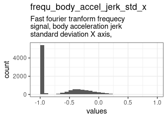

0 missing values.

#### Summary statistics {#frequ_body_accel_jerk_std_x_summary}

|name                        |label                                                                                    |data_type | n_missing| complete_rate|min |median |max |       mean|        sd|hist  |
|:---------------------------|:----------------------------------------------------------------------------------------|:---------|---------:|-------------:|:---|:------|:---|----------:|---------:|:-----|
|frequ_body_accel_jerk_std_x |Fast fourier tranform frequecy signal, body acceleration jerk standard deviation X axis, |numeric   |         0|             1|-1  |-0.96  |1   | -0.6549798| 0.3932918|▇▃▂▁▁ |


### frequ_body_accel_jerk_std_y {#frequ_body_accel_jerk_std_y .tabset}

Fast fourier tranform frequecy signal, body acceleration jerk standard deviation Y axis,

#### Distribution {#frequ_body_accel_jerk_std_y_distribution}


0 missing values.

#### Summary statistics {#frequ_body_accel_jerk_std_y_summary}

|name                        |label                                                                                    |data_type | n_missing| complete_rate|min |median |max |       mean|        sd|hist  |
|:---------------------------|:----------------------------------------------------------------------------------------|:---------|---------:|-------------:|:---|:------|:---|----------:|---------:|:-----|
|frequ_body_accel_jerk_std_y |Fast fourier tranform frequecy signal, body acceleration jerk standard deviation Y axis, |numeric   |         0|             1|-1  |-0.93  |1   | -0.6122436| 0.4335249|▇▃▃▁▁ |


### frequ_body_accel_jerk_std_z {#frequ_body_accel_jerk_std_z .tabset}

Fast fourier tranform frequecy signal, body acceleration jerk standard deviation Z axis,

#### Distribution {#frequ_body_accel_jerk_std_z_distribution}


0 missing values.

#### Summary statistics {#frequ_body_accel_jerk_std_z_summary}

|name                        |label                                                                                    |data_type | n_missing| complete_rate|min |median |max |       mean|        sd|hist  |
|:---------------------------|:----------------------------------------------------------------------------------------|:---------|---------:|-------------:|:---|:------|:---|----------:|---------:|:-----|
|frequ_body_accel_jerk_std_z |Fast fourier tranform frequecy signal, body acceleration jerk standard deviation Z axis, |numeric   |         0|             1|-1  |-0.96  |1   | -0.7809284| 0.2595436|▇▂▁▁▁ |


### frequ_body_accel_jerk_mean_freq_x {#frequ_body_accel_jerk_mean_freq_x .tabset}

Fast fourier tranform frequecy signal, body acceleration jerk mean freq X axis,

#### Distribution {#frequ_body_accel_jerk_mean_freq_x_distribution}


0 missing values.

#### Summary statistics {#frequ_body_accel_jerk_mean_freq_x_summary}

|name                              |label                                                                           |data_type | n_missing| complete_rate|min |median |max |       mean|        sd|hist  |
|:---------------------------------|:-------------------------------------------------------------------------------|:---------|---------:|-------------:|:---|:------|:---|----------:|---------:|:-----|
|frequ_body_accel_jerk_mean_freq_x |Fast fourier tranform frequecy signal, body acceleration jerk mean freq X axis, |numeric   |         0|             1|-1  |-0.045 |1   | -0.0477063| 0.2955416|▁▇▇▅▁ |


### frequ_body_accel_jerk_mean_freq_y {#frequ_body_accel_jerk_mean_freq_y .tabset}

Fast fourier tranform frequecy signal, body acceleration jerk mean freq Y axis,

#### Distribution {#frequ_body_accel_jerk_mean_freq_y_distribution}

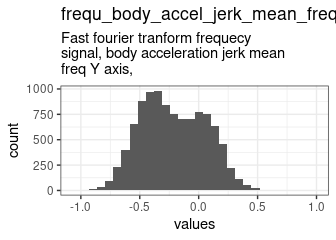

0 missing values.

#### Summary statistics {#frequ_body_accel_jerk_mean_freq_y_summary}

|name                              |label                                                                           |data_type | n_missing| complete_rate|min |median |max |       mean|        sd|hist  |
|:---------------------------------|:-------------------------------------------------------------------------------|:---------|---------:|-------------:|:---|:------|:---|----------:|---------:|:-----|
|frequ_body_accel_jerk_mean_freq_y |Fast fourier tranform frequecy signal, body acceleration jerk mean freq Y axis, |numeric   |         0|             1|-1  |-0.24  |1   | -0.2133929| 0.2721863|▁▇▇▁▁ |


### frequ_body_accel_jerk_mean_freq_z {#frequ_body_accel_jerk_mean_freq_z .tabset}

Fast fourier tranform frequecy signal, body acceleration jerk mean freq Z axis,

#### Distribution {#frequ_body_accel_jerk_mean_freq_z_distribution}

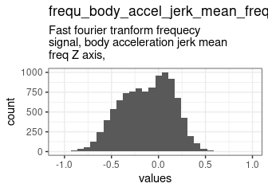

0 missing values.

#### Summary statistics {#frequ_body_accel_jerk_mean_freq_z_summary}

|name                              |label                                                                           |data_type | n_missing| complete_rate|min |median |max |      mean|        sd|hist  |
|:---------------------------------|:-------------------------------------------------------------------------------|:---------|---------:|-------------:|:---|:------|:---|---------:|---------:|:-----|
|frequ_body_accel_jerk_mean_freq_z |Fast fourier tranform frequecy signal, body acceleration jerk mean freq Z axis, |numeric   |         0|             1|-1  |-0.1   |1   | -0.123828| 0.2733538|▁▆▇▂▁ |


### frequ_body_gyro_mean_x {#frequ_body_gyro_mean_x .tabset}

Fast fourier tranform frequecy signal, body gyroscope 3-axial raw signal mean X axis,

#### Distribution {#frequ_body_gyro_mean_x_distribution}


0 missing values.

#### Summary statistics {#frequ_body_gyro_mean_x_summary}

|name                   |label                                                                                 |data_type | n_missing| complete_rate|min |median |max |       mean|        sd|hist  |
|:----------------------|:-------------------------------------------------------------------------------------|:---------|---------:|-------------:|:---|:------|:---|----------:|---------:|:-----|
|frequ_body_gyro_mean_x |Fast fourier tranform frequecy signal, body gyroscope 3-axial raw signal mean X axis, |numeric   |         0|             1|-1  |-0.89  |1   | -0.6720943| 0.3514984|▇▅▁▁▁ |


### frequ_body_gyro_mean_y {#frequ_body_gyro_mean_y .tabset}

Fast fourier tranform frequecy signal, body gyroscope 3-axial raw signal mean Y axis,

#### Distribution {#frequ_body_gyro_mean_y_distribution}

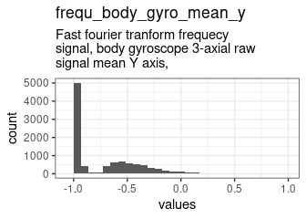

0 missing values.

#### Summary statistics {#frequ_body_gyro_mean_y_summary}

|name                   |label                                                                                 |data_type | n_missing| complete_rate|min |median |max |       mean|        sd|hist  |
|:----------------------|:-------------------------------------------------------------------------------------|:---------|---------:|-------------:|:---|:------|:---|----------:|---------:|:-----|
|frequ_body_gyro_mean_y |Fast fourier tranform frequecy signal, body gyroscope 3-axial raw signal mean Y axis, |numeric   |         0|             1|-1  |-0.92  |1   | -0.7062166| 0.3356653|▇▃▁▁▁ |


### frequ_body_gyro_mean_z {#frequ_body_gyro_mean_z .tabset}

Fast fourier tranform frequecy signal, body gyroscope 3-axial raw signal mean Z axis,

#### Distribution {#frequ_body_gyro_mean_z_distribution}


0 missing values.

#### Summary statistics {#frequ_body_gyro_mean_z_summary}

|name                   |label                                                                                 |data_type | n_missing| complete_rate|min |median |max |       mean|        sd|hist  |
|:----------------------|:-------------------------------------------------------------------------------------|:---------|---------:|-------------:|:---|:------|:---|----------:|---------:|:-----|
|frequ_body_gyro_mean_z |Fast fourier tranform frequecy signal, body gyroscope 3-axial raw signal mean Z axis, |numeric   |         0|             1|-1  |-0.89  |1   | -0.6441928| 0.3820194|▇▅▂▁▁ |


### frequ_body_gyro_std_x {#frequ_body_gyro_std_x .tabset}

Fast fourier tranform frequecy signal, body gyroscope 3-axial raw signal standard deviation X axis,

#### Distribution {#frequ_body_gyro_std_x_distribution}

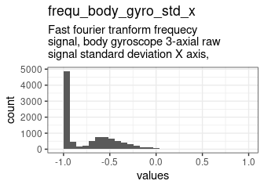

0 missing values.

#### Summary statistics {#frequ_body_gyro_std_x_summary}

|name                  |label                                                                                               |data_type | n_missing| complete_rate|min |median |max |       mean|       sd|hist  |
|:---------------------|:---------------------------------------------------------------------------------------------------|:---------|---------:|-------------:|:---|:------|:---|----------:|--------:|:-----|
|frequ_body_gyro_std_x |Fast fourier tranform frequecy signal, body gyroscope 3-axial raw signal standard deviation X axis, |numeric   |         0|             1|-1  |-0.91  |1   | -0.7385948| 0.285773|▇▃▁▁▁ |


### frequ_body_gyro_std_y {#frequ_body_gyro_std_y .tabset}

Fast fourier tranform frequecy signal, body gyroscope 3-axial raw signal standard deviation Y axis,

#### Distribution {#frequ_body_gyro_std_y_distribution}


0 missing values.

#### Summary statistics {#frequ_body_gyro_std_y_summary}

|name                  |label                                                                                               |data_type | n_missing| complete_rate|min |median |max |       mean|        sd|hist  |
|:---------------------|:---------------------------------------------------------------------------------------------------|:---------|---------:|-------------:|:---|:------|:---|----------:|---------:|:-----|
|frequ_body_gyro_std_y |Fast fourier tranform frequecy signal, body gyroscope 3-axial raw signal standard deviation Y axis, |numeric   |         0|             1|-1  |-0.91  |1   | -0.6742269| 0.3696647|▇▃▁▁▁ |


### frequ_body_gyro_std_z {#frequ_body_gyro_std_z .tabset}

Fast fourier tranform frequecy signal, body gyroscope 3-axial raw signal standard deviation Z axis,

#### Distribution {#frequ_body_gyro_std_z_distribution}


0 missing values.

#### Summary statistics {#frequ_body_gyro_std_z_summary}

|name                  |label                                                                                               |data_type | n_missing| complete_rate|min |median |max |       mean|        sd|hist  |
|:---------------------|:---------------------------------------------------------------------------------------------------|:---------|---------:|-------------:|:---|:------|:---|----------:|---------:|:-----|
|frequ_body_gyro_std_z |Fast fourier tranform frequecy signal, body gyroscope 3-axial raw signal standard deviation Z axis, |numeric   |         0|             1|-1  |-0.89  |1   | -0.6904463| 0.3373102|▇▅▁▁▁ |


### frequ_body_gyro_mean_freq_x {#frequ_body_gyro_mean_freq_x .tabset}

Fast fourier tranform frequecy signal, body gyroscope 3-axial raw signal mean freq X axis,

#### Distribution {#frequ_body_gyro_mean_freq_x_distribution}


0 missing values.

#### Summary statistics {#frequ_body_gyro_mean_freq_x_summary}

|name                        |label                                                                                      |data_type | n_missing| complete_rate|min |median |max |       mean|        sd|hist  |
|:---------------------------|:------------------------------------------------------------------------------------------|:---------|---------:|-------------:|:---|:------|:---|----------:|---------:|:-----|
|frequ_body_gyro_mean_freq_x |Fast fourier tranform frequecy signal, body gyroscope 3-axial raw signal mean freq X axis, |numeric   |         0|             1|-1  |-0.099 |1   | -0.1010427| 0.2558889|▁▅▇▂▁ |


### frequ_body_gyro_mean_freq_y {#frequ_body_gyro_mean_freq_y .tabset}

Fast fourier tranform frequecy signal, body gyroscope 3-axial raw signal mean freq Y axis,

#### Distribution {#frequ_body_gyro_mean_freq_y_distribution}

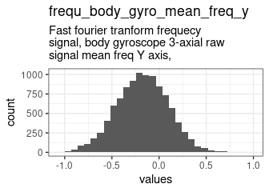

0 missing values.

#### Summary statistics {#frequ_body_gyro_mean_freq_y_summary}

|name                        |label                                                                                      |data_type | n_missing| complete_rate|min |median |max |       mean|        sd|hist  |
|:---------------------------|:------------------------------------------------------------------------------------------|:---------|---------:|-------------:|:---|:------|:---|----------:|---------:|:-----|
|frequ_body_gyro_mean_freq_y |Fast fourier tranform frequecy signal, body gyroscope 3-axial raw signal mean freq Y axis, |numeric   |         0|             1|-1  |-0.17  |1   | -0.1742776| 0.2733333|▁▇▇▂▁ |


### frequ_body_gyro_mean_freq_z {#frequ_body_gyro_mean_freq_z .tabset}

Fast fourier tranform frequecy signal, body gyroscope 3-axial raw signal mean freq Z axis,

#### Distribution {#frequ_body_gyro_mean_freq_z_distribution}


0 missing values.

#### Summary statistics {#frequ_body_gyro_mean_freq_z_summary}

|name                        |label                                                                                      |data_type | n_missing| complete_rate|min |median |max |       mean|        sd|hist  |
|:---------------------------|:------------------------------------------------------------------------------------------|:---------|---------:|-------------:|:---|:------|:---|----------:|---------:|:-----|
|frequ_body_gyro_mean_freq_z |Fast fourier tranform frequecy signal, body gyroscope 3-axial raw signal mean freq Z axis, |numeric   |         0|             1|-1  |-0.054 |1   | -0.0513929| 0.2661928|▁▅▇▂▁ |


### frequ_body_accel_magn_mean {#frequ_body_accel_magn_mean .tabset}

Fast fourier tranform frequecy signal, body acceleration euclidean norm magnitude mean

#### Distribution {#frequ_body_accel_magn_mean_distribution}


0 missing values.

#### Summary statistics {#frequ_body_accel_magn_mean_summary}

|name                       |label                                                                                  |data_type | n_missing| complete_rate|min |median |max |       mean|        sd|hist  |
|:--------------------------|:--------------------------------------------------------------------------------------|:---------|---------:|-------------:|:---|:------|:---|----------:|---------:|:-----|
|frequ_body_accel_magn_mean |Fast fourier tranform frequecy signal, body acceleration euclidean norm magnitude mean |numeric   |         0|             1|-1  |-0.88  |1   | -0.5859627| 0.4453266|▇▃▃▁▁ |


### frequ_body_accel_magn_std {#frequ_body_accel_magn_std .tabset}

Fast fourier tranform frequecy signal, body acceleration euclidean norm magnitude standard deviation

#### Distribution {#frequ_body_accel_magn_std_distribution}


0 missing values.

#### Summary statistics {#frequ_body_accel_magn_std_summary}

|name                      |label                                                                                                |data_type | n_missing| complete_rate|min |median |max |       mean|        sd|hist  |
|:-------------------------|:----------------------------------------------------------------------------------------------------|:---------|---------:|-------------:|:---|:------|:---|----------:|---------:|:-----|
|frequ_body_accel_magn_std |Fast fourier tranform frequecy signal, body acceleration euclidean norm magnitude standard deviation |numeric   |         0|             1|-1  |-0.85  |1   | -0.6595312| 0.3554288|▇▅▂▁▁ |


### frequ_body_accel_magn_mean_freq {#frequ_body_accel_magn_mean_freq .tabset}

Fast fourier tranform frequecy signal, body acceleration euclidean norm magnitude mean freq

#### Distribution {#frequ_body_accel_magn_mean_freq_distribution}


0 missing values.

#### Summary statistics {#frequ_body_accel_magn_mean_freq_summary}

|name                            |label                                                                                       |data_type | n_missing| complete_rate|min |median |max |     mean|        sd|hist  |
|:-------------------------------|:-------------------------------------------------------------------------------------------|:---------|---------:|-------------:|:---|:------|:---|--------:|---------:|:-----|
|frequ_body_accel_magn_mean_freq |Fast fourier tranform frequecy signal, body acceleration euclidean norm magnitude mean freq |numeric   |         0|             1|-1  |0.07   |1   | 0.076876| 0.2629581|▁▂▇▅▁ |


### frequ_body_body_accel_jerk_magn_mean {#frequ_body_body_accel_jerk_magn_mean .tabset}

Fast fourier tranform frequecy signal, body to body acceleration jerk euclidean norm magnitude mean

#### Distribution {#frequ_body_body_accel_jerk_magn_mean_distribution}


0 missing values.

#### Summary statistics {#frequ_body_body_accel_jerk_magn_mean_summary}

|name                                 |label                                                                                               |data_type | n_missing| complete_rate|min |median |max |       mean|        sd|hist  |
|:------------------------------------|:---------------------------------------------------------------------------------------------------|:---------|---------:|-------------:|:---|:------|:---|----------:|---------:|:-----|
|frequ_body_body_accel_jerk_magn_mean |Fast fourier tranform frequecy signal, body to body acceleration jerk euclidean norm magnitude mean |numeric   |         0|             1|-1  |-0.93  |1   | -0.6207899| 0.4250641|▇▃▂▁▁ |


### frequ_body_body_accel_jerk_magn_std {#frequ_body_body_accel_jerk_magn_std .tabset}

Fast fourier tranform frequecy signal, body to body acceleration jerk euclidean norm magnitude standard deviation

#### Distribution {#frequ_body_body_accel_jerk_magn_std_distribution}

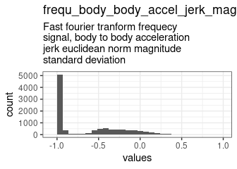

0 missing values.

#### Summary statistics {#frequ_body_body_accel_jerk_magn_std_summary}

|name                                |label                                                                                                             |data_type | n_missing| complete_rate|min |median |max |       mean|       sd|hist  |
|:-----------------------------------|:-----------------------------------------------------------------------------------------------------------------|:---------|---------:|-------------:|:---|:------|:---|----------:|--------:|:-----|
|frequ_body_body_accel_jerk_magn_std |Fast fourier tranform frequecy signal, body to body acceleration jerk euclidean norm magnitude standard deviation |numeric   |         0|             1|-1  |-0.93  |1   | -0.6400768| 0.406022|▇▃▂▁▁ |


### frequ_body_body_accel_jerk_magn_mean_freq {#frequ_body_body_accel_jerk_magn_mean_freq .tabset}

Fast fourier tranform frequecy signal, body to body acceleration jerk euclidean norm magnitude mean freq

#### Distribution {#frequ_body_body_accel_jerk_magn_mean_freq_distribution}


0 missing values.

#### Summary statistics {#frequ_body_body_accel_jerk_magn_mean_freq_summary}

|name                                      |label                                                                                                    |data_type | n_missing| complete_rate|min |median |max |      mean|       sd|hist  |
|:-----------------------------------------|:--------------------------------------------------------------------------------------------------------|:---------|---------:|-------------:|:---|:------|:---|---------:|--------:|:-----|
|frequ_body_body_accel_jerk_magn_mean_freq |Fast fourier tranform frequecy signal, body to body acceleration jerk euclidean norm magnitude mean freq |numeric   |         0|             1|-1  |0.16   |1   | 0.1732197| 0.252537|▁▁▇▆▁ |


### frequ_body_body_gyro_magn_mean {#frequ_body_body_gyro_magn_mean .tabset}

Fast fourier tranform frequecy signal, body to body gyroscope 3-axial raw signal euclidean norm magnitude mean

#### Distribution {#frequ_body_body_gyro_magn_mean_distribution}


0 missing values.

#### Summary statistics {#frequ_body_body_gyro_magn_mean_summary}

|name                           |label                                                                                                          |data_type | n_missing| complete_rate|min |median |max |       mean|        sd|hist  |
|:------------------------------|:--------------------------------------------------------------------------------------------------------------|:---------|---------:|-------------:|:---|:------|:---|----------:|---------:|:-----|
|frequ_body_body_gyro_magn_mean |Fast fourier tranform frequecy signal, body to body gyroscope 3-axial raw signal euclidean norm magnitude mean |numeric   |         0|             1|-1  |-0.88  |1   | -0.6974111| 0.3237012|▇▅▁▁▁ |


### frequ_body_body_gyro_magn_std {#frequ_body_body_gyro_magn_std .tabset}

Fast fourier tranform frequecy signal, body to body gyroscope 3-axial raw signal euclidean norm magnitude standard deviation

#### Distribution {#frequ_body_body_gyro_magn_std_distribution}

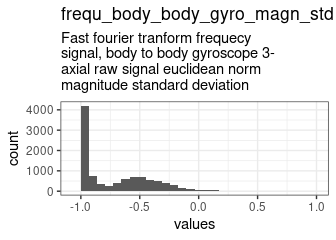

0 missing values.

#### Summary statistics {#frequ_body_body_gyro_magn_std_summary}

|name                          |label                                                                                                                        |data_type | n_missing| complete_rate|min |median |max |       mean|        sd|hist  |
|:-----------------------------|:----------------------------------------------------------------------------------------------------------------------------|:---------|---------:|-------------:|:---|:------|:---|----------:|---------:|:-----|
|frequ_body_body_gyro_magn_std |Fast fourier tranform frequecy signal, body to body gyroscope 3-axial raw signal euclidean norm magnitude standard deviation |numeric   |         0|             1|-1  |-0.83  |1   | -0.6999764| 0.3104431|▇▃▁▁▁ |


### frequ_body_body_gyro_magn_mean_freq {#frequ_body_body_gyro_magn_mean_freq .tabset}

Fast fourier tranform frequecy signal, body to body gyroscope 3-axial raw signal euclidean norm magnitude mean freq

#### Distribution {#frequ_body_body_gyro_magn_mean_freq_distribution}


0 missing values.

#### Summary statistics {#frequ_body_body_gyro_magn_mean_freq_summary}

|name                                |label                                                                                                               |data_type | n_missing| complete_rate|min |median |max |       mean|        sd|hist  |
|:-----------------------------------|:-------------------------------------------------------------------------------------------------------------------|:---------|---------:|-------------:|:---|:------|:---|----------:|---------:|:-----|
|frequ_body_body_gyro_magn_mean_freq |Fast fourier tranform frequecy signal, body to body gyroscope 3-axial raw signal euclidean norm magnitude mean freq |numeric   |         0|             1|-1  |-0.052 |1   | -0.0415636| 0.2801418|▁▅▇▃▁ |


### frequ_body_body_gyro_jerk_magn_mean {#frequ_body_body_gyro_jerk_magn_mean .tabset}

Fast fourier tranform frequecy signal, body to body gyroscope 3-axial raw signal jerk euclidean norm magnitude mean

#### Distribution {#frequ_body_body_gyro_jerk_magn_mean_distribution}

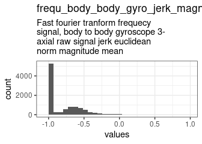

0 missing values.

#### Summary statistics {#frequ_body_body_gyro_jerk_magn_mean_summary}

|name                                |label                                                                                                               |data_type | n_missing| complete_rate|min |median |max |       mean|        sd|hist  |
|:-----------------------------------|:-------------------------------------------------------------------------------------------------------------------|:---------|---------:|-------------:|:---|:------|:---|----------:|---------:|:-----|
|frequ_body_body_gyro_jerk_magn_mean |Fast fourier tranform frequecy signal, body to body gyroscope 3-axial raw signal jerk euclidean norm magnitude mean |numeric   |         0|             1|-1  |-0.95  |1   | -0.7797676| 0.2675916|▇▂▁▁▁ |


### frequ_body_body_gyro_jerk_magn_std {#frequ_body_body_gyro_jerk_magn_std .tabset}

Fast fourier tranform frequecy signal, body to body gyroscope 3-axial raw signal jerk euclidean norm magnitude standard deviation

#### Distribution {#frequ_body_body_gyro_jerk_magn_std_distribution}


0 missing values.

#### Summary statistics {#frequ_body_body_gyro_jerk_magn_std_summary}

|name                               |label                                                                                                                             |data_type | n_missing| complete_rate|min |median |max |       mean|        sd|hist  |
|:----------------------------------|:---------------------------------------------------------------------------------------------------------------------------------|:---------|---------:|-------------:|:---|:------|:---|----------:|---------:|:-----|
|frequ_body_body_gyro_jerk_magn_std |Fast fourier tranform frequecy signal, body to body gyroscope 3-axial raw signal jerk euclidean norm magnitude standard deviation |numeric   |         0|             1|-1  |-0.94  |1   | -0.7921902| 0.2591601|▇▂▁▁▁ |


### frequ_body_body_gyro_jerk_magn_mean_freq {#frequ_body_body_gyro_jerk_magn_mean_freq .tabset}

Fast fourier tranform frequecy signal, body to body gyroscope 3-axial raw signal jerk euclidean norm magnitude mean freq

#### Distribution {#frequ_body_body_gyro_jerk_magn_mean_freq_distribution}


0 missing values.

#### Summary statistics {#frequ_body_body_gyro_jerk_magn_mean_freq_summary}

|name                                     |label                                                                                                                    |data_type | n_missing| complete_rate|min |median |max |      mean|       sd|hist  |
|:----------------------------------------|:------------------------------------------------------------------------------------------------------------------------|:---------|---------:|-------------:|:---|:------|:---|---------:|--------:|:-----|
|frequ_body_body_gyro_jerk_magn_mean_freq |Fast fourier tranform frequecy signal, body to body gyroscope 3-axial raw signal jerk euclidean norm magnitude mean freq |numeric   |         0|             1|-1  |0.14   |1   | 0.1267078| 0.245443|▁▁▇▆▁ |


### angle_timeof_body_accel_mean_gravity {#angle_timeof_body_accel_mean_gravity .tabset}

Angle of time domains signal (50Hz const rate), body acceleration mean gravity

#### Distribution {#angle_timeof_body_accel_mean_gravity_distribution}


0 missing values.

#### Summary statistics {#angle_timeof_body_accel_mean_gravity_summary}

|name                                 |label                                                                          |data_type | n_missing| complete_rate|min |median |max |      mean|       sd|hist  |
|:------------------------------------|:------------------------------------------------------------------------------|:---------|---------:|-------------:|:---|:------|:---|---------:|--------:|:-----|
|angle_timeof_body_accel_mean_gravity |Angle of time domains signal (50Hz const rate), body acceleration mean gravity |numeric   |         0|             1|-1  |0.0081 |1   | 0.0077051| 0.336591|▁▂▇▂▁ |


### angle_timeof_body_accel_jerk_mean_gravity_mean {#angle_timeof_body_accel_jerk_mean_gravity_mean .tabset}

Angle of time domains signal (50Hz const rate), body acceleration jerk mean gravity mean

#### Distribution {#angle_timeof_body_accel_jerk_mean_gravity_mean_distribution}


0 missing values.

#### Summary statistics {#angle_timeof_body_accel_jerk_mean_gravity_mean_summary}

|name                                           |label                                                                                    |data_type | n_missing| complete_rate|min |median |max |      mean|        sd|hist  |
|:----------------------------------------------|:----------------------------------------------------------------------------------------|:---------|---------:|-------------:|:---|:------|:---|---------:|---------:|:-----|
|angle_timeof_body_accel_jerk_mean_gravity_mean |Angle of time domains signal (50Hz const rate), body acceleration jerk mean gravity mean |numeric   |         0|             1|-1  |0.0077 |1   | 0.0026477| 0.4473638|▂▃▇▃▂ |


### angle_timeof_body_gyro_mean_gravity_mean {#angle_timeof_body_gyro_mean_gravity_mean .tabset}

Angle of time domains signal (50Hz const rate), body gyroscope 3-axial raw signal mean gravity mean

#### Distribution {#angle_timeof_body_gyro_mean_gravity_mean_distribution}

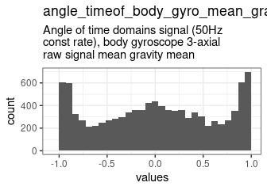

0 missing values.

#### Summary statistics {#angle_timeof_body_gyro_mean_gravity_mean_summary}

|name                                     |label                                                                                               |data_type | n_missing| complete_rate|min |median |max |      mean|        sd|hist  |
|:----------------------------------------|:---------------------------------------------------------------------------------------------------|:---------|---------:|-------------:|:---|:------|:---|---------:|---------:|:-----|
|angle_timeof_body_gyro_mean_gravity_mean |Angle of time domains signal (50Hz const rate), body gyroscope 3-axial raw signal mean gravity mean |numeric   |         0|             1|-1  |0.017  |1   | 0.0176831| 0.6161885|▇▆▇▆▇ |


### angle_timeof_body_gyro_jerk_mean_gravity_mean {#angle_timeof_body_gyro_jerk_mean_gravity_mean .tabset}

Angle of time domains signal (50Hz const rate), body gyroscope 3-axial raw signal jerk mean gravity mean

#### Distribution {#angle_timeof_body_gyro_jerk_mean_gravity_mean_distribution}


0 missing values.

#### Summary statistics {#angle_timeof_body_gyro_jerk_mean_gravity_mean_summary}

|name                                          |label                                                                                                    |data_type | n_missing| complete_rate|min |median  |max |       mean|        sd|hist  |
|:---------------------------------------------|:--------------------------------------------------------------------------------------------------------|:---------|---------:|-------------:|:---|:-------|:---|----------:|---------:|:-----|
|angle_timeof_body_gyro_jerk_mean_gravity_mean |Angle of time domains signal (50Hz const rate), body gyroscope 3-axial raw signal jerk mean gravity mean |numeric   |         0|             1|-1  |-0.0072 |1   | -0.0092191| 0.4847698|▃▆▇▆▃ |


### angle_x_gravity_mean {#angle_x_gravity_mean .tabset}

Angle of X axis, gravity mean

#### Distribution {#angle_x_gravity_mean_distribution}


0 missing values.

#### Summary statistics {#angle_x_gravity_mean_summary}

|name                 |label                         |data_type | n_missing| complete_rate|min |median |max |       mean|        sd|hist  |
|:--------------------|:-----------------------------|:---------|---------:|-------------:|:---|:------|:---|----------:|---------:|:-----|
|angle_x_gravity_mean |Angle of X axis, gravity mean |numeric   |         0|             1|-1  |-0.72  |1   | -0.4965222| 0.5111578|▇▂▁▂▁ |


### angle_y_gravity_mean {#angle_y_gravity_mean .tabset}

Angle of Y axis, gravity mean

#### Distribution {#angle_y_gravity_mean_distribution}


0 missing values.

#### Summary statistics {#angle_y_gravity_mean_summary}

|name                 |label                         |data_type | n_missing| complete_rate|min |median |max |      mean|       sd|hist  |
|:--------------------|:-----------------------------|:---------|---------:|-------------:|:---|:------|:---|---------:|--------:|:-----|
|angle_y_gravity_mean |Angle of Y axis, gravity mean |numeric   |         0|             1|-1  |0.18   |1   | 0.0632552| 0.305468|▁▂▇▇▁ |


### angle_z_gravity_mean {#angle_z_gravity_mean .tabset}

Angle of Z axis, gravity mean

#### Distribution {#angle_z_gravity_mean_distribution}


0 missing values.

#### Summary statistics {#angle_z_gravity_mean_summary}

|name                 |label                         |data_type | n_missing| complete_rate|min |median  |max |       mean|        sd|hist  |
|:--------------------|:-----------------------------|:---------|---------:|-------------:|:---|:-------|:---|----------:|---------:|:-----|
|angle_z_gravity_mean |Angle of Z axis, gravity mean |numeric   |         0|             1|-1  |-0.0039 |1   | -0.0542843| 0.2688982|▁▂▇▁▁ |


## Missingness report


## Codebook table

<!--html_preserve--><div id="htmlwidget-ee460050520819b5c1bf" style="width:100%;height:auto;" class="datatables html-widget"></div>
<script type="application/json" data-for="htmlwidget-ee460050520819b5c1bf">{"x":{"filter":"top","filterHTML":"<tr>\n  <td data-type=\"character\" style=\"vertical-align: top;\">\n    <div class=\"form-group has-feedback\" style=\"margin-bottom: auto;\">\n      <input type=\"search\" placeholder=\"All\" class=\"form-control\" style=\"width: 100%;\"/>\n      <span class=\"glyphicon glyphicon-remove-circle form-control-feedback\"><\/span>\n    <\/div>\n  <\/td>\n  <td data-type=\"character\" style=\"vertical-align: top;\">\n    <div class=\"form-group has-feedback\" style=\"margin-bottom: auto;\">\n      <input type=\"search\" placeholder=\"All\" class=\"form-control\" style=\"width: 100%;\"/>\n      <span class=\"glyphicon glyphicon-remove-circle form-control-feedback\"><\/span>\n    <\/div>\n  <\/td>\n  <td data-type=\"character\" style=\"vertical-align: top;\">\n    <div class=\"form-group has-feedback\" style=\"margin-bottom: auto;\">\n      <input type=\"search\" placeholder=\"All\" class=\"form-control\" style=\"width: 100%;\"/>\n      <span class=\"glyphicon glyphicon-remove-circle form-control-feedback\"><\/span>\n    <\/div>\n  <\/td>\n  <td data-type=\"disabled\" style=\"vertical-align: top;\">\n    <div class=\"form-group has-feedback\" style=\"margin-bottom: auto;\">\n      <input type=\"search\" placeholder=\"All\" class=\"form-control\" style=\"width: 100%;\"/>\n      <span class=\"glyphicon glyphicon-remove-circle form-control-feedback\"><\/span>\n    <\/div>\n  <\/td>\n  <td data-type=\"disabled\" style=\"vertical-align: top;\">\n    <div class=\"form-group has-feedback\" style=\"margin-bottom: auto;\">\n      <input type=\"search\" placeholder=\"All\" class=\"form-control\" style=\"width: 100%;\"/>\n      <span class=\"glyphicon glyphicon-remove-circle form-control-feedback\"><\/span>\n    <\/div>\n  <\/td>\n  <td data-type=\"disabled\" style=\"vertical-align: top;\">\n    <div class=\"form-group has-feedback\" style=\"margin-bottom: auto;\">\n      <input type=\"search\" placeholder=\"All\" class=\"form-control\" style=\"width: 100%;\"/>\n      <span class=\"glyphicon glyphicon-remove-circle form-control-feedback\"><\/span>\n    <\/div>\n  <\/td>\n  <td data-type=\"disabled\" style=\"vertical-align: top;\">\n    <div class=\"form-group has-feedback\" style=\"margin-bottom: auto;\">\n      <input type=\"search\" placeholder=\"All\" class=\"form-control\" style=\"width: 100%;\"/>\n      <span class=\"glyphicon glyphicon-remove-circle form-control-feedback\"><\/span>\n    <\/div>\n  <\/td>\n  <td data-type=\"character\" style=\"vertical-align: top;\">\n    <div class=\"form-group has-feedback\" style=\"margin-bottom: auto;\">\n      <input type=\"search\" placeholder=\"All\" class=\"form-control\" style=\"width: 100%;\"/>\n      <span class=\"glyphicon glyphicon-remove-circle form-control-feedback\"><\/span>\n    <\/div>\n  <\/td>\n  <td data-type=\"character\" style=\"vertical-align: top;\">\n    <div class=\"form-group has-feedback\" style=\"margin-bottom: auto;\">\n      <input type=\"search\" placeholder=\"All\" class=\"form-control\" style=\"width: 100%;\"/>\n      <span class=\"glyphicon glyphicon-remove-circle form-control-feedback\"><\/span>\n    <\/div>\n  <\/td>\n  <td data-type=\"character\" style=\"vertical-align: top;\">\n    <div class=\"form-group has-feedback\" style=\"margin-bottom: auto;\">\n      <input type=\"search\" placeholder=\"All\" class=\"form-control\" style=\"width: 100%;\"/>\n      <span class=\"glyphicon glyphicon-remove-circle form-control-feedback\"><\/span>\n    <\/div>\n  <\/td>\n  <td data-type=\"number\" style=\"vertical-align: top;\">\n    <div class=\"form-group has-feedback\" style=\"margin-bottom: auto;\">\n      <input type=\"search\" placeholder=\"All\" class=\"form-control\" style=\"width: 100%;\"/>\n      <span class=\"glyphicon glyphicon-remove-circle form-control-feedback\"><\/span>\n    <\/div>\n    <div style=\"display: none; position: absolute; width: 200px;\">\n      <div data-min=\"-0.965207115039422\" data-max=\"16.1464219827168\" data-scale=\"15\"><\/div>\n      <span style=\"float: left;\"><\/span>\n      <span style=\"float: right;\"><\/span>\n    <\/div>\n  <\/td>\n  <td data-type=\"number\" style=\"vertical-align: top;\">\n    <div class=\"form-group has-feedback\" style=\"margin-bottom: auto;\">\n      <input type=\"search\" placeholder=\"All\" class=\"form-control\" style=\"width: 100%;\"/>\n      <span class=\"glyphicon glyphicon-remove-circle form-control-feedback\"><\/span>\n    <\/div>\n    <div style=\"display: none; position: absolute; width: 200px;\">\n      <div data-min=\"0.037128166382743\" data-max=\"8.67906670325713\" data-scale=\"15\"><\/div>\n      <span style=\"float: left;\"><\/span>\n      <span style=\"float: right;\"><\/span>\n    <\/div>\n  <\/td>\n  <td data-type=\"disabled\" style=\"vertical-align: top;\">\n    <div class=\"form-group has-feedback\" style=\"margin-bottom: auto;\">\n      <input type=\"search\" placeholder=\"All\" class=\"form-control\" style=\"width: 100%;\"/>\n      <span class=\"glyphicon glyphicon-remove-circle form-control-feedback\"><\/span>\n    <\/div>\n  <\/td>\n  <td data-type=\"character\" style=\"vertical-align: top;\">\n    <div class=\"form-group has-feedback\" style=\"margin-bottom: auto;\">\n      <input type=\"search\" placeholder=\"All\" class=\"form-control\" style=\"width: 100%;\"/>\n      <span class=\"glyphicon glyphicon-remove-circle form-control-feedback\"><\/span>\n    <\/div>\n  <\/td>\n<\/tr>","extensions":["Buttons"],"data":[["<a href=\"#subject_id\">subject_id<\/a>","<a href=\"#activity_name\">activity_name<\/a>","<a href=\"#timeof_body_accel_mean_x\">timeof_body_accel_mean_x<\/a>","<a href=\"#timeof_body_accel_mean_y\">timeof_body_accel_mean_y<\/a>","<a href=\"#timeof_body_accel_mean_z\">timeof_body_accel_mean_z<\/a>","<a href=\"#timeof_body_accel_std_x\">timeof_body_accel_std_x<\/a>","<a href=\"#timeof_body_accel_std_y\">timeof_body_accel_std_y<\/a>","<a href=\"#timeof_body_accel_std_z\">timeof_body_accel_std_z<\/a>","<a href=\"#timeof_gravity_accel_mean_x\">timeof_gravity_accel_mean_x<\/a>","<a href=\"#timeof_gravity_accel_mean_y\">timeof_gravity_accel_mean_y<\/a>","<a href=\"#timeof_gravity_accel_mean_z\">timeof_gravity_accel_mean_z<\/a>","<a href=\"#timeof_gravity_accel_std_x\">timeof_gravity_accel_std_x<\/a>","<a href=\"#timeof_gravity_accel_std_y\">timeof_gravity_accel_std_y<\/a>","<a href=\"#timeof_gravity_accel_std_z\">timeof_gravity_accel_std_z<\/a>","<a href=\"#timeof_body_accel_jerk_mean_x\">timeof_body_accel_jerk_mean_x<\/a>","<a href=\"#timeof_body_accel_jerk_mean_y\">timeof_body_accel_jerk_mean_y<\/a>","<a href=\"#timeof_body_accel_jerk_mean_z\">timeof_body_accel_jerk_mean_z<\/a>","<a href=\"#timeof_body_accel_jerk_std_x\">timeof_body_accel_jerk_std_x<\/a>","<a href=\"#timeof_body_accel_jerk_std_y\">timeof_body_accel_jerk_std_y<\/a>","<a href=\"#timeof_body_accel_jerk_std_z\">timeof_body_accel_jerk_std_z<\/a>","<a href=\"#timeof_body_gyro_mean_x\">timeof_body_gyro_mean_x<\/a>","<a href=\"#timeof_body_gyro_mean_y\">timeof_body_gyro_mean_y<\/a>","<a href=\"#timeof_body_gyro_mean_z\">timeof_body_gyro_mean_z<\/a>","<a href=\"#timeof_body_gyro_std_x\">timeof_body_gyro_std_x<\/a>","<a href=\"#timeof_body_gyro_std_y\">timeof_body_gyro_std_y<\/a>","<a href=\"#timeof_body_gyro_std_z\">timeof_body_gyro_std_z<\/a>","<a href=\"#timeof_body_gyro_jerk_mean_x\">timeof_body_gyro_jerk_mean_x<\/a>","<a href=\"#timeof_body_gyro_jerk_mean_y\">timeof_body_gyro_jerk_mean_y<\/a>","<a href=\"#timeof_body_gyro_jerk_mean_z\">timeof_body_gyro_jerk_mean_z<\/a>","<a href=\"#timeof_body_gyro_jerk_std_x\">timeof_body_gyro_jerk_std_x<\/a>","<a href=\"#timeof_body_gyro_jerk_std_y\">timeof_body_gyro_jerk_std_y<\/a>","<a href=\"#timeof_body_gyro_jerk_std_z\">timeof_body_gyro_jerk_std_z<\/a>","<a href=\"#timeof_body_accel_magn_mean\">timeof_body_accel_magn_mean<\/a>","<a href=\"#timeof_body_accel_magn_std\">timeof_body_accel_magn_std<\/a>","<a href=\"#timeof_gravity_accel_magn_mean\">timeof_gravity_accel_magn_mean<\/a>","<a href=\"#timeof_gravity_accel_magn_std\">timeof_gravity_accel_magn_std<\/a>","<a href=\"#timeof_body_accel_jerk_magn_mean\">timeof_body_accel_jerk_magn_mean<\/a>","<a href=\"#timeof_body_accel_jerk_magn_std\">timeof_body_accel_jerk_magn_std<\/a>","<a href=\"#timeof_body_gyro_magn_mean\">timeof_body_gyro_magn_mean<\/a>","<a href=\"#timeof_body_gyro_magn_std\">timeof_body_gyro_magn_std<\/a>","<a href=\"#timeof_body_gyro_jerk_magn_mean\">timeof_body_gyro_jerk_magn_mean<\/a>","<a href=\"#timeof_body_gyro_jerk_magn_std\">timeof_body_gyro_jerk_magn_std<\/a>","<a href=\"#frequ_body_accel_mean_x\">frequ_body_accel_mean_x<\/a>","<a href=\"#frequ_body_accel_mean_y\">frequ_body_accel_mean_y<\/a>","<a href=\"#frequ_body_accel_mean_z\">frequ_body_accel_mean_z<\/a>","<a href=\"#frequ_body_accel_std_x\">frequ_body_accel_std_x<\/a>","<a href=\"#frequ_body_accel_std_y\">frequ_body_accel_std_y<\/a>","<a href=\"#frequ_body_accel_std_z\">frequ_body_accel_std_z<\/a>","<a href=\"#frequ_body_accel_mean_freq_x\">frequ_body_accel_mean_freq_x<\/a>","<a href=\"#frequ_body_accel_mean_freq_y\">frequ_body_accel_mean_freq_y<\/a>","<a href=\"#frequ_body_accel_mean_freq_z\">frequ_body_accel_mean_freq_z<\/a>","<a href=\"#frequ_body_accel_jerk_mean_x\">frequ_body_accel_jerk_mean_x<\/a>","<a href=\"#frequ_body_accel_jerk_mean_y\">frequ_body_accel_jerk_mean_y<\/a>","<a href=\"#frequ_body_accel_jerk_mean_z\">frequ_body_accel_jerk_mean_z<\/a>","<a href=\"#frequ_body_accel_jerk_std_x\">frequ_body_accel_jerk_std_x<\/a>","<a href=\"#frequ_body_accel_jerk_std_y\">frequ_body_accel_jerk_std_y<\/a>","<a href=\"#frequ_body_accel_jerk_std_z\">frequ_body_accel_jerk_std_z<\/a>","<a href=\"#frequ_body_accel_jerk_mean_freq_x\">frequ_body_accel_jerk_mean_freq_x<\/a>","<a href=\"#frequ_body_accel_jerk_mean_freq_y\">frequ_body_accel_jerk_mean_freq_y<\/a>","<a href=\"#frequ_body_accel_jerk_mean_freq_z\">frequ_body_accel_jerk_mean_freq_z<\/a>","<a href=\"#frequ_body_gyro_mean_x\">frequ_body_gyro_mean_x<\/a>","<a href=\"#frequ_body_gyro_mean_y\">frequ_body_gyro_mean_y<\/a>","<a href=\"#frequ_body_gyro_mean_z\">frequ_body_gyro_mean_z<\/a>","<a href=\"#frequ_body_gyro_std_x\">frequ_body_gyro_std_x<\/a>","<a href=\"#frequ_body_gyro_std_y\">frequ_body_gyro_std_y<\/a>","<a href=\"#frequ_body_gyro_std_z\">frequ_body_gyro_std_z<\/a>","<a href=\"#frequ_body_gyro_mean_freq_x\">frequ_body_gyro_mean_freq_x<\/a>","<a href=\"#frequ_body_gyro_mean_freq_y\">frequ_body_gyro_mean_freq_y<\/a>","<a href=\"#frequ_body_gyro_mean_freq_z\">frequ_body_gyro_mean_freq_z<\/a>","<a href=\"#frequ_body_accel_magn_mean\">frequ_body_accel_magn_mean<\/a>","<a href=\"#frequ_body_accel_magn_std\">frequ_body_accel_magn_std<\/a>","<a href=\"#frequ_body_accel_magn_mean_freq\">frequ_body_accel_magn_mean_freq<\/a>","<a href=\"#frequ_body_body_accel_jerk_magn_mean\">frequ_body_body_accel_jerk_magn_mean<\/a>","<a href=\"#frequ_body_body_accel_jerk_magn_std\">frequ_body_body_accel_jerk_magn_std<\/a>","<a href=\"#frequ_body_body_accel_jerk_magn_mean_freq\">frequ_body_body_accel_jerk_magn_mean_freq<\/a>","<a href=\"#frequ_body_body_gyro_magn_mean\">frequ_body_body_gyro_magn_mean<\/a>","<a href=\"#frequ_body_body_gyro_magn_std\">frequ_body_body_gyro_magn_std<\/a>","<a href=\"#frequ_body_body_gyro_magn_mean_freq\">frequ_body_body_gyro_magn_mean_freq<\/a>","<a href=\"#frequ_body_body_gyro_jerk_magn_mean\">frequ_body_body_gyro_jerk_magn_mean<\/a>","<a href=\"#frequ_body_body_gyro_jerk_magn_std\">frequ_body_body_gyro_jerk_magn_std<\/a>","<a href=\"#frequ_body_body_gyro_jerk_magn_mean_freq\">frequ_body_body_gyro_jerk_magn_mean_freq<\/a>","<a href=\"#angle_timeof_body_accel_mean_gravity\">angle_timeof_body_accel_mean_gravity<\/a>","<a href=\"#angle_timeof_body_accel_jerk_mean_gravity_mean\">angle_timeof_body_accel_jerk_mean_gravity_mean<\/a>","<a href=\"#angle_timeof_body_gyro_mean_gravity_mean\">angle_timeof_body_gyro_mean_gravity_mean<\/a>","<a href=\"#angle_timeof_body_gyro_jerk_mean_gravity_mean\">angle_timeof_body_gyro_jerk_mean_gravity_mean<\/a>","<a href=\"#angle_x_gravity_mean\">angle_x_gravity_mean<\/a>","<a href=\"#angle_y_gravity_mean\">angle_y_gravity_mean<\/a>","<a href=\"#angle_z_gravity_mean\">angle_z_gravity_mean<\/a>"],["Subject id","Activity name","Time domains signal (50Hz const rate), body acceleration mean X axis,","Time domains signal (50Hz const rate), body acceleration mean Y axis,","Time domains signal (50Hz const rate), body acceleration mean Z axis,","Time domains signal (50Hz const rate), body acceleration standard deviation X axis,","Time domains signal (50Hz const rate), body acceleration standard deviation Y axis,","Time domains signal (50Hz const rate), body acceleration standard deviation Z axis,","Time domains signal (50Hz const rate), gravity acceleration mean X axis,","Time domains signal (50Hz const rate), gravity acceleration mean Y axis,","Time domains signal (50Hz const rate), gravity acceleration mean Z axis,","Time domains signal (50Hz const rate), gravity acceleration standard deviation X axis,","Time domains signal (50Hz const rate), gravity acceleration standard deviation Y axis,","Time domains signal (50Hz const rate), gravity acceleration standard deviation Z axis,","Time domains signal (50Hz const rate), body acceleration jerk mean X axis,","Time domains signal (50Hz const rate), body acceleration jerk mean Y axis,","Time domains signal (50Hz const rate), body acceleration jerk mean Z axis,","Time domains signal (50Hz const rate), body acceleration jerk standard deviation X axis,","Time domains signal (50Hz const rate), body acceleration jerk standard deviation Y axis,","Time domains signal (50Hz const rate), body acceleration jerk standard deviation Z axis,","Time domains signal (50Hz const rate), body gyroscope 3-axial raw signal mean X axis,","Time domains signal (50Hz const rate), body gyroscope 3-axial raw signal mean Y axis,","Time domains signal (50Hz const rate), body gyroscope 3-axial raw signal mean Z axis,","Time domains signal (50Hz const rate), body gyroscope 3-axial raw signal standard deviation X axis,","Time domains signal (50Hz const rate), body gyroscope 3-axial raw signal standard deviation Y axis,","Time domains signal (50Hz const rate), body gyroscope 3-axial raw signal standard deviation Z axis,","Time domains signal (50Hz const rate), body gyroscope 3-axial raw signal jerk mean X axis,","Time domains signal (50Hz const rate), body gyroscope 3-axial raw signal jerk mean Y axis,","Time domains signal (50Hz const rate), body gyroscope 3-axial raw signal jerk mean Z axis,","Time domains signal (50Hz const rate), body gyroscope 3-axial raw signal jerk standard deviation X axis,","Time domains signal (50Hz const rate), body gyroscope 3-axial raw signal jerk standard deviation Y axis,","Time domains signal (50Hz const rate), body gyroscope 3-axial raw signal jerk standard deviation Z axis,","Time domains signal (50Hz const rate), body acceleration euclidean norm magnitude mean","Time domains signal (50Hz const rate), body acceleration euclidean norm magnitude standard deviation","Time domains signal (50Hz const rate), gravity acceleration euclidean norm magnitude mean","Time domains signal (50Hz const rate), gravity acceleration euclidean norm magnitude standard deviation","Time domains signal (50Hz const rate), body acceleration jerk euclidean norm magnitude mean","Time domains signal (50Hz const rate), body acceleration jerk euclidean norm magnitude standard deviation","Time domains signal (50Hz const rate), body gyroscope 3-axial raw signal euclidean norm magnitude mean","Time domains signal (50Hz const rate), body gyroscope 3-axial raw signal euclidean norm magnitude standard deviation","Time domains signal (50Hz const rate), body gyroscope 3-axial raw signal jerk euclidean norm magnitude mean","Time domains signal (50Hz const rate), body gyroscope 3-axial raw signal jerk euclidean norm magnitude standard deviation","Fast fourier tranform frequecy signal, body acceleration mean X axis,","Fast fourier tranform frequecy signal, body acceleration mean Y axis,","Fast fourier tranform frequecy signal, body acceleration mean Z axis,","Fast fourier tranform frequecy signal, body acceleration standard deviation X axis,","Fast fourier tranform frequecy signal, body acceleration standard deviation Y axis,","Fast fourier tranform frequecy signal, body acceleration standard deviation Z axis,","Fast fourier tranform frequecy signal, body acceleration mean freq X axis,","Fast fourier tranform frequecy signal, body acceleration mean freq Y axis,","Fast fourier tranform frequecy signal, body acceleration mean freq Z axis,","Fast fourier tranform frequecy signal, body acceleration jerk mean X axis,","Fast fourier tranform frequecy signal, body acceleration jerk mean Y axis,","Fast fourier tranform frequecy signal, body acceleration jerk mean Z axis,","Fast fourier tranform frequecy signal, body acceleration jerk standard deviation X axis,","Fast fourier tranform frequecy signal, body acceleration jerk standard deviation Y axis,","Fast fourier tranform frequecy signal, body acceleration jerk standard deviation Z axis,","Fast fourier tranform frequecy signal, body acceleration jerk mean freq X axis,","Fast fourier tranform frequecy signal, body acceleration jerk mean freq Y axis,","Fast fourier tranform frequecy signal, body acceleration jerk mean freq Z axis,","Fast fourier tranform frequecy signal, body gyroscope 3-axial raw signal mean X axis,","Fast fourier tranform frequecy signal, body gyroscope 3-axial raw signal mean Y axis,","Fast fourier tranform frequecy signal, body gyroscope 3-axial raw signal mean Z axis,","Fast fourier tranform frequecy signal, body gyroscope 3-axial raw signal standard deviation X axis,","Fast fourier tranform frequecy signal, body gyroscope 3-axial raw signal standard deviation Y axis,","Fast fourier tranform frequecy signal, body gyroscope 3-axial raw signal standard deviation Z axis,","Fast fourier tranform frequecy signal, body gyroscope 3-axial raw signal mean freq X axis,","Fast fourier tranform frequecy signal, body gyroscope 3-axial raw signal mean freq Y axis,","Fast fourier tranform frequecy signal, body gyroscope 3-axial raw signal mean freq Z axis,","Fast fourier tranform frequecy signal, body acceleration euclidean norm magnitude mean","Fast fourier tranform frequecy signal, body acceleration euclidean norm magnitude standard deviation","Fast fourier tranform frequecy signal, body acceleration euclidean norm magnitude mean freq","Fast fourier tranform frequecy signal, body to body acceleration jerk euclidean norm magnitude mean","Fast fourier tranform frequecy signal, body to body acceleration jerk euclidean norm magnitude standard deviation","Fast fourier tranform frequecy signal, body to body acceleration jerk euclidean norm magnitude mean freq","Fast fourier tranform frequecy signal, body to body gyroscope 3-axial raw signal euclidean norm magnitude mean","Fast fourier tranform frequecy signal, body to body gyroscope 3-axial raw signal euclidean norm magnitude standard deviation","Fast fourier tranform frequecy signal, body to body gyroscope 3-axial raw signal euclidean norm magnitude mean freq","Fast fourier tranform frequecy signal, body to body gyroscope 3-axial raw signal jerk euclidean norm magnitude mean","Fast fourier tranform frequecy signal, body to body gyroscope 3-axial raw signal jerk euclidean norm magnitude standard deviation","Fast fourier tranform frequecy signal, body to body gyroscope 3-axial raw signal jerk euclidean norm magnitude mean freq","Angle of time domains signal (50Hz const rate), body acceleration mean gravity","Angle of time domains signal (50Hz const rate), body acceleration jerk mean gravity mean","Angle of time domains signal (50Hz const rate), body gyroscope 3-axial raw signal mean gravity mean","Angle of time domains signal (50Hz const rate), body gyroscope 3-axial raw signal jerk mean gravity mean","Angle of X axis, gravity mean","Angle of Y axis, gravity mean","Angle of Z axis, gravity mean"],["numeric","character","numeric","numeric","numeric","numeric","numeric","numeric","numeric","numeric","numeric","numeric","numeric","numeric","numeric","numeric","numeric","numeric","numeric","numeric","numeric","numeric","numeric","numeric","numeric","numeric","numeric","numeric","numeric","numeric","numeric","numeric","numeric","numeric","numeric","numeric","numeric","numeric","numeric","numeric","numeric","numeric","numeric","numeric","numeric","numeric","numeric","numeric","numeric","numeric","numeric","numeric","numeric","numeric","numeric","numeric","numeric","numeric","numeric","numeric","numeric","numeric","numeric","numeric","numeric","numeric","numeric","numeric","numeric","numeric","numeric","numeric","numeric","numeric","numeric","numeric","numeric","numeric","numeric","numeric","numeric","numeric","numeric","numeric","numeric","numeric","numeric","numeric"],[0,0,0,0,0,0,0,0,0,0,0,0,0,0,0,0,0,0,0,0,0,0,0,0,0,0,0,0,0,0,0,0,0,0,0,0,0,0,0,0,0,0,0,0,0,0,0,0,0,0,0,0,0,0,0,0,0,0,0,0,0,0,0,0,0,0,0,0,0,0,0,0,0,0,0,0,0,0,0,0,0,0,0,0,0,0,0,0],[1,1,1,1,1,1,1,1,1,1,1,1,1,1,1,1,1,1,1,1,1,1,1,1,1,1,1,1,1,1,1,1,1,1,1,1,1,1,1,1,1,1,1,1,1,1,1,1,1,1,1,1,1,1,1,1,1,1,1,1,1,1,1,1,1,1,1,1,1,1,1,1,1,1,1,1,1,1,1,1,1,1,1,1,1,1,1,1],[null,6,null,null,null,null,null,null,null,null,null,null,null,null,null,null,null,null,null,null,null,null,null,null,null,null,null,null,null,null,null,null,null,null,null,null,null,null,null,null,null,null,null,null,null,null,null,null,null,null,null,null,null,null,null,null,null,null,null,null,null,null,null,null,null,null,null,null,null,null,null,null,null,null,null,null,null,null,null,null,null,null,null,null,null,null,null,null],[null,0,null,null,null,null,null,null,null,null,null,null,null,null,null,null,null,null,null,null,null,null,null,null,null,null,null,null,null,null,null,null,null,null,null,null,null,null,null,null,null,null,null,null,null,null,null,null,null,null,null,null,null,null,null,null,null,null,null,null,null,null,null,null,null,null,null,null,null,null,null,null,null,null,null,null,null,null,null,null,null,null,null,null,null,null,null,null],[" 1","6","-1","-1","-1","-1","-1","-1","-1","-1","-1","-1","-1","-1","-1","-1","-1","-1","-1","-1","-1","-1","-1","-1","-1","-1","-1","-1","-1","-1","-1","-1","-1","-1","-1","-1","-1","-1","-1","-1","-1","-1","-1","-1","-1","-1","-1","-1","-1","-1","-1","-1","-1","-1","-1","-1","-1","-1","-1","-1","-1","-1","-1","-1","-1","-1","-1","-1","-1","-1","-1","-1","-1","-1","-1","-1","-1","-1","-1","-1","-1","-1","-1","-1","-1","-1","-1","-1"],["17.0000",null," 0.2772","-0.0172","-0.1086","-0.9430","-0.8350","-0.8508"," 0.9218","-0.1436"," 0.0368","-0.9819","-0.9759","-0.9665"," 0.0760"," 0.0108","-0.0012","-0.9513","-0.9250","-0.9543","-0.0278","-0.0748"," 0.0863","-0.9016","-0.9106","-0.8819","-0.0982","-0.0406","-0.0546","-0.9348","-0.9548","-0.9503","-0.8746","-0.8437","-0.8746","-0.8437","-0.9481","-0.9288","-0.8223","-0.8259","-0.9559","-0.9403","-0.9456","-0.8643","-0.8954","-0.9416","-0.8326","-0.8398","-0.2383"," 0.0047"," 0.0608","-0.9516","-0.9257","-0.9475","-0.9562","-0.9280","-0.9590","-0.0454","-0.2365","-0.1025","-0.8917","-0.9197","-0.8877","-0.9053","-0.9061","-0.8915","-0.0987","-0.1730","-0.0537","-0.8755","-0.8547"," 0.0703","-0.9290","-0.9255"," 0.1642","-0.8756","-0.8275","-0.0521","-0.9453","-0.9382"," 0.1362"," 0.0081"," 0.0077"," 0.0172","-0.0072","-0.7156"," 0.1820","-0.0039"],["30","18"," 1"," 1"," 1"," 1"," 1"," 1"," 1"," 1"," 1"," 1"," 1"," 1"," 1"," 1"," 1"," 1"," 1"," 1"," 1"," 1"," 1"," 1"," 1"," 1"," 1"," 1"," 1"," 1"," 1"," 1"," 1"," 1"," 1"," 1"," 1"," 1"," 1"," 1"," 1"," 1"," 1"," 1"," 1"," 1"," 1"," 1"," 1"," 1"," 1"," 1"," 1"," 1"," 1"," 1"," 1"," 1"," 1"," 1"," 1"," 1"," 1"," 1"," 1"," 1"," 1"," 1"," 1"," 1"," 1"," 1"," 1"," 1"," 1"," 1"," 1"," 1"," 1"," 1"," 1"," 1"," 1"," 1"," 1"," 1"," 1"," 1"],[16.1464219827168,null,0.274347260646063,-0.0177434918458972,-0.108925032737064,-0.607783818968688,-0.510191378479501,-0.61306429934125,0.669226222373046,0.00403879092060517,0.0921508600211059,-0.965207115039421,-0.95440802665318,-0.938900969424022,0.0789381220355816,0.0079481069090025,-0.00467469823628666,-0.63978102073413,-0.607971599340832,-0.762820240449202,-0.0309824871713436,-0.0747194855994359,0.088357304227173,-0.721192598029789,-0.682653506899942,-0.653665674372188,-0.0967092754729682,-0.0423181079782632,-0.0548303497968374,-0.731348533131935,-0.786062320321895,-0.739932395222129,-0.54822165976717,-0.591225327146546,-0.54822165976717,-0.591225327146546,-0.649417950650692,-0.627762945785391,-0.60524856977632,-0.662533062898382,-0.762137610987416,-0.77799317279698,-0.622761658493734,-0.53749328145871,-0.665033506271952,-0.603356276555826,-0.528420009576204,-0.617874813333395,-0.2214691368263,0.015400588735675,0.0473098698476722,-0.656713524546605,-0.628961179980356,-0.743608246170053,-0.654979816705833,-0.612243590244114,-0.780928428167213,-0.0477062917542325,-0.213392904926883,-0.123828014584147,-0.672094306818974,-0.70621663959074,-0.644192752866115,-0.738594816501343,-0.674226934551517,-0.690446312501126,-0.101042702224631,-0.174277577553958,-0.0513928953203266,-0.585962696268539,-0.659531216655476,0.0768760112631957,-0.620789916331592,-0.640076803144351,0.173219742700723,-0.697411069729937,-0.699976372277643,-0.0415636227771787,-0.779767633083527,-0.792190209274884,0.126707820497791,0.00770513730366637,0.00264770963963395,0.0176831301958708,-0.00921912899702262,-0.496522166185746,0.0632551738495058,-0.0542842821505305],[8.67906670325713,null,0.0676277962784943,0.0371281663827435,0.0530330859935597,0.438693831339194,0.500239766883052,0.403656584651858,0.515485780308741,0.378909215421356,0.334270168704641,0.0777147960480108,0.0852866205384834,0.101554847657515,0.176112457141583,0.164518387624882,0.155978985687957,0.408711816447501,0.43288446111401,0.277901388841564,0.183186086288647,0.134317132299449,0.134875256324883,0.301027072676107,0.356884535690522,0.372606080407907,0.128134958190288,0.114409175563585,0.12889560784934,0.303815898902629,0.272715680791952,0.301994176894438,0.467093741712107,0.429431345143224,0.467093741712107,0.429431345143224,0.389494205866934,0.41722133114306,0.399709556285823,0.349224601712275,0.276514503019,0.271590190956826,0.420794621128506,0.481681850416162,0.358853083334195,0.446792819087921,0.479924986365809,0.398973184544622,0.26458578361303,0.240846041776942,0.283784833517026,0.389994623739824,0.407300107685122,0.297708213609458,0.393291807713421,0.433524948432751,0.259543592492186,0.295541570708683,0.272186281568714,0.273353750555325,0.35149842860383,0.335665288148602,0.382019381474912,0.285773041831007,0.369664683490479,0.337310154388265,0.255888865648293,0.273333251651214,0.266192798184612,0.445326568748138,0.355428822604272,0.262958087372081,0.425064058475465,0.406022019765095,0.252536980465226,0.323701247447165,0.310443110261479,0.280141787984183,0.267591646696675,0.25916005947039,0.245443027441107,0.336591046179278,0.44736375602737,0.616188498331737,0.48476983995559,0.511157750223321,0.305467964061558,0.26889816410019],[null,0,null,null,null,null,null,null,null,null,null,null,null,null,null,null,null,null,null,null,null,null,null,null,null,null,null,null,null,null,null,null,null,null,null,null,null,null,null,null,null,null,null,null,null,null,null,null,null,null,null,null,null,null,null,null,null,null,null,null,null,null,null,null,null,null,null,null,null,null,null,null,null,null,null,null,null,null,null,null,null,null,null,null,null,null,null,null],["▇▆▇▇▇",null,"▁▁▁▇▁","▁▁▇▁▁","▁▁▇▁▁","▇▃▂▁▁","▇▁▅▁▁","▇▅▂▁▁","▁▁▁▁▇","▁▇▇▂▂","▁▂▇▂▂","▇▁▁▁▁","▇▁▁▁▁","▇▁▁▁▁","▁▁▇▁▁","▁▁▇▁▁","▁▁▇▁▁","▇▃▂▁▁","▇▃▃▁▁","▇▃▁▁▁","▁▁▇▁▁","▁▁▇▁▁","▁▁▇▁▁","▇▅▁▁▁","▇▃▁▁▁","▇▅▂▁▁","▁▁▇▁▁","▁▁▇▁▁","▁▁▇▁▁","▇▃▁▁▁","▇▂▁▁▁","▇▃▁▁▁","▇▂▅▁▁","▇▃▂▁▁","▇▂▅▁▁","▇▃▂▁▁","▇▃▂▁▁","▇▃▂▁▁","▇▃▃▁▁","▇▅▂▁▁","▇▃▁▁▁","▇▂▁▁▁","▇▃▂▁▁","▇▂▃▁▁","▇▅▁▁▁","▇▃▂▁▁","▇▂▅▁▁","▇▅▂▁▁","▁▇▆▁▁","▁▂▇▃▁","▁▃▇▅▁","▇▃▂▁▁","▇▃▂▁▁","▇▃▁▁▁","▇▃▂▁▁","▇▃▃▁▁","▇▂▁▁▁","▁▇▇▅▁","▁▇▇▁▁","▁▆▇▂▁","▇▅▁▁▁","▇▃▁▁▁","▇▅▂▁▁","▇▃▁▁▁","▇▃▁▁▁","▇▅▁▁▁","▁▅▇▂▁","▁▇▇▂▁","▁▅▇▂▁","▇▃▃▁▁","▇▅▂▁▁","▁▂▇▅▁","▇▃▂▁▁","▇▃▂▁▁","▁▁▇▆▁","▇▅▁▁▁","▇▃▁▁▁","▁▅▇▃▁","▇▂▁▁▁","▇▂▁▁▁","▁▁▇▆▁","▁▂▇▂▁","▂▃▇▃▂","▇▆▇▆▇","▃▆▇▆▃","▇▂▁▂▁","▁▂▇▇▁","▁▂▇▁▁"]],"container":"<table class=\"display\">\n  <thead>\n    <tr>\n      <th>name<\/th>\n      <th>label<\/th>\n      <th>data_type<\/th>\n      <th>n_missing<\/th>\n      <th>complete_rate<\/th>\n      <th>n_unique<\/th>\n      <th>empty<\/th>\n      <th>min<\/th>\n      <th>median<\/th>\n      <th>max<\/th>\n      <th>mean<\/th>\n      <th>sd<\/th>\n      <th>whitespace<\/th>\n      <th>hist<\/th>\n    <\/tr>\n  <\/thead>\n<\/table>","options":{"dom":"Bfrtip","buttons":["copy","csv","excel","pdf","print"],"pageLength":200,"columnDefs":[{"className":"dt-right","targets":[3,4,5,6,10,11,12]}],"order":[],"autoWidth":false,"orderClasses":false,"orderCellsTop":true,"lengthMenu":[10,25,50,100,200]}},"evals":[],"jsHooks":[]}</script><!--/html_preserve-->


<script type="application/ld+json">
{
  "name": "Accelerometer Standard Deviation and Mean Data",
  "description": "This data set contains the standard deviation and mean of the original data. See the README.txt found in the original data, \"sample_data/getdata_projectfiles_UCI_HAR_Dataset/UCI HAR Dataset/README.txt\", for more information.\n\n\n## Table of variables\nThis table contains variable names, labels, and number of missing values.\nSee the complete codebook for more.\n\n[truncated]\n\n### Note\nThis dataset was automatically described using the [codebook R package](https://rubenarslan.github.io/codebook/) (version 0.9.2).",
  "creator": "Robert de Lorimier",
  "citation": "Davide Anguita, Alessandro Ghio, Luca Oneto, Xavier Parra and Jorge L. Reyes-Ortiz. Human Activity Recognition on Smartphones using a Multiclass Hardware-Friendly Support Vector Machine. International Workshop of Ambient Assisted Living (IWAAL 2012). Vitoria-Gasteiz, Spain. Dec 2012",
  "url": "https://github.com/rodelor97/GettingCleaningDataWeek4Project",
  "datePublished": "2021-01-23",
  "spatialCoverage": "Online",
  "keywords": ["subject_id", "activity_name", "timeof_body_accel_mean_x", "timeof_body_accel_mean_y", "timeof_body_accel_mean_z", "timeof_body_accel_std_x", "timeof_body_accel_std_y", "timeof_body_accel_std_z", "timeof_gravity_accel_mean_x", "timeof_gravity_accel_mean_y", "timeof_gravity_accel_mean_z", "timeof_gravity_accel_std_x", "timeof_gravity_accel_std_y", "timeof_gravity_accel_std_z", "timeof_body_accel_jerk_mean_x", "timeof_body_accel_jerk_mean_y", "timeof_body_accel_jerk_mean_z", "timeof_body_accel_jerk_std_x", "timeof_body_accel_jerk_std_y", "timeof_body_accel_jerk_std_z", "timeof_body_gyro_mean_x", "timeof_body_gyro_mean_y", "timeof_body_gyro_mean_z", "timeof_body_gyro_std_x", "timeof_body_gyro_std_y", "timeof_body_gyro_std_z", "timeof_body_gyro_jerk_mean_x", "timeof_body_gyro_jerk_mean_y", "timeof_body_gyro_jerk_mean_z", "timeof_body_gyro_jerk_std_x", "timeof_body_gyro_jerk_std_y", "timeof_body_gyro_jerk_std_z", "timeof_body_accel_magn_mean", "timeof_body_accel_magn_std", "timeof_gravity_accel_magn_mean", "timeof_gravity_accel_magn_std", "timeof_body_accel_jerk_magn_mean", "timeof_body_accel_jerk_magn_std", "timeof_body_gyro_magn_mean", "timeof_body_gyro_magn_std", "timeof_body_gyro_jerk_magn_mean", "timeof_body_gyro_jerk_magn_std", "frequ_body_accel_mean_x", "frequ_body_accel_mean_y", "frequ_body_accel_mean_z", "frequ_body_accel_std_x", "frequ_body_accel_std_y", "frequ_body_accel_std_z", "frequ_body_accel_mean_freq_x", "frequ_body_accel_mean_freq_y", "frequ_body_accel_mean_freq_z", "frequ_body_accel_jerk_mean_x", "frequ_body_accel_jerk_mean_y", "frequ_body_accel_jerk_mean_z", "frequ_body_accel_jerk_std_x", "frequ_body_accel_jerk_std_y", "frequ_body_accel_jerk_std_z", "frequ_body_accel_jerk_mean_freq_x", "frequ_body_accel_jerk_mean_freq_y", "frequ_body_accel_jerk_mean_freq_z", "frequ_body_gyro_mean_x", "frequ_body_gyro_mean_y", "frequ_body_gyro_mean_z", "frequ_body_gyro_std_x", "frequ_body_gyro_std_y", "frequ_body_gyro_std_z", "frequ_body_gyro_mean_freq_x", "frequ_body_gyro_mean_freq_y", "frequ_body_gyro_mean_freq_z", "frequ_body_accel_magn_mean", "frequ_body_accel_magn_std", "frequ_body_accel_magn_mean_freq", "frequ_body_body_accel_jerk_magn_mean", "frequ_body_body_accel_jerk_magn_std", "frequ_body_body_accel_jerk_magn_mean_freq", "frequ_body_body_gyro_magn_mean", "frequ_body_body_gyro_magn_std", "frequ_body_body_gyro_magn_mean_freq", "frequ_body_body_gyro_jerk_magn_mean", "frequ_body_body_gyro_jerk_magn_std", "frequ_body_body_gyro_jerk_magn_mean_freq", "angle_timeof_body_accel_mean_gravity", "angle_timeof_body_accel_jerk_mean_gravity_mean", "angle_timeof_body_gyro_mean_gravity_mean", "angle_timeof_body_gyro_jerk_mean_gravity_mean", "angle_x_gravity_mean", "angle_y_gravity_mean", "angle_z_gravity_mean"],
  "@context": "http://schema.org/",
  "@type": "Dataset",
  "variableMeasured": [
    {
      "name": "subject_id",
      "description": "Subject id",
      "@type": "propertyValue"
    },
    {
      "name": "activity_name",
      "description": "Activity name",
      "@type": "propertyValue"
    },
    {
      "name": "timeof_body_accel_mean_x",
      "description": "Time domains signal (50Hz const rate), body acceleration mean X axis,",
      "@type": "propertyValue"
    },
    {
      "name": "timeof_body_accel_mean_y",
      "description": "Time domains signal (50Hz const rate), body acceleration mean Y axis,",
      "@type": "propertyValue"
    },
    {
      "name": "timeof_body_accel_mean_z",
      "description": "Time domains signal (50Hz const rate), body acceleration mean Z axis,",
      "@type": "propertyValue"
    },
    {
      "name": "timeof_body_accel_std_x",
      "description": "Time domains signal (50Hz const rate), body acceleration standard deviation X axis,",
      "@type": "propertyValue"
    },
    {
      "name": "timeof_body_accel_std_y",
      "description": "Time domains signal (50Hz const rate), body acceleration standard deviation Y axis,",
      "@type": "propertyValue"
    },
    {
      "name": "timeof_body_accel_std_z",
      "description": "Time domains signal (50Hz const rate), body acceleration standard deviation Z axis,",
      "@type": "propertyValue"
    },
    {
      "name": "timeof_gravity_accel_mean_x",
      "description": "Time domains signal (50Hz const rate), gravity acceleration mean X axis,",
      "@type": "propertyValue"
    },
    {
      "name": "timeof_gravity_accel_mean_y",
      "description": "Time domains signal (50Hz const rate), gravity acceleration mean Y axis,",
      "@type": "propertyValue"
    },
    {
      "name": "timeof_gravity_accel_mean_z",
      "description": "Time domains signal (50Hz const rate), gravity acceleration mean Z axis,",
      "@type": "propertyValue"
    },
    {
      "name": "timeof_gravity_accel_std_x",
      "description": "Time domains signal (50Hz const rate), gravity acceleration standard deviation X axis,",
      "@type": "propertyValue"
    },
    {
      "name": "timeof_gravity_accel_std_y",
      "description": "Time domains signal (50Hz const rate), gravity acceleration standard deviation Y axis,",
      "@type": "propertyValue"
    },
    {
      "name": "timeof_gravity_accel_std_z",
      "description": "Time domains signal (50Hz const rate), gravity acceleration standard deviation Z axis,",
      "@type": "propertyValue"
    },
    {
      "name": "timeof_body_accel_jerk_mean_x",
      "description": "Time domains signal (50Hz const rate), body acceleration jerk mean X axis,",
      "@type": "propertyValue"
    },
    {
      "name": "timeof_body_accel_jerk_mean_y",
      "description": "Time domains signal (50Hz const rate), body acceleration jerk mean Y axis,",
      "@type": "propertyValue"
    },
    {
      "name": "timeof_body_accel_jerk_mean_z",
      "description": "Time domains signal (50Hz const rate), body acceleration jerk mean Z axis,",
      "@type": "propertyValue"
    },
    {
      "name": "timeof_body_accel_jerk_std_x",
      "description": "Time domains signal (50Hz const rate), body acceleration jerk standard deviation X axis,",
      "@type": "propertyValue"
    },
    {
      "name": "timeof_body_accel_jerk_std_y",
      "description": "Time domains signal (50Hz const rate), body acceleration jerk standard deviation Y axis,",
      "@type": "propertyValue"
    },
    {
      "name": "timeof_body_accel_jerk_std_z",
      "description": "Time domains signal (50Hz const rate), body acceleration jerk standard deviation Z axis,",
      "@type": "propertyValue"
    },
    {
      "name": "timeof_body_gyro_mean_x",
      "description": "Time domains signal (50Hz const rate), body gyroscope 3-axial raw signal mean X axis,",
      "@type": "propertyValue"
    },
    {
      "name": "timeof_body_gyro_mean_y",
      "description": "Time domains signal (50Hz const rate), body gyroscope 3-axial raw signal mean Y axis,",
      "@type": "propertyValue"
    },
    {
      "name": "timeof_body_gyro_mean_z",
      "description": "Time domains signal (50Hz const rate), body gyroscope 3-axial raw signal mean Z axis,",
      "@type": "propertyValue"
    },
    {
      "name": "timeof_body_gyro_std_x",
      "description": "Time domains signal (50Hz const rate), body gyroscope 3-axial raw signal standard deviation X axis,",
      "@type": "propertyValue"
    },
    {
      "name": "timeof_body_gyro_std_y",
      "description": "Time domains signal (50Hz const rate), body gyroscope 3-axial raw signal standard deviation Y axis,",
      "@type": "propertyValue"
    },
    {
      "name": "timeof_body_gyro_std_z",
      "description": "Time domains signal (50Hz const rate), body gyroscope 3-axial raw signal standard deviation Z axis,",
      "@type": "propertyValue"
    },
    {
      "name": "timeof_body_gyro_jerk_mean_x",
      "description": "Time domains signal (50Hz const rate), body gyroscope 3-axial raw signal jerk mean X axis,",
      "@type": "propertyValue"
    },
    {
      "name": "timeof_body_gyro_jerk_mean_y",
      "description": "Time domains signal (50Hz const rate), body gyroscope 3-axial raw signal jerk mean Y axis,",
      "@type": "propertyValue"
    },
    {
      "name": "timeof_body_gyro_jerk_mean_z",
      "description": "Time domains signal (50Hz const rate), body gyroscope 3-axial raw signal jerk mean Z axis,",
      "@type": "propertyValue"
    },
    {
      "name": "timeof_body_gyro_jerk_std_x",
      "description": "Time domains signal (50Hz const rate), body gyroscope 3-axial raw signal jerk standard deviation X axis,",
      "@type": "propertyValue"
    },
    {
      "name": "timeof_body_gyro_jerk_std_y",
      "description": "Time domains signal (50Hz const rate), body gyroscope 3-axial raw signal jerk standard deviation Y axis,",
      "@type": "propertyValue"
    },
    {
      "name": "timeof_body_gyro_jerk_std_z",
      "description": "Time domains signal (50Hz const rate), body gyroscope 3-axial raw signal jerk standard deviation Z axis,",
      "@type": "propertyValue"
    },
    {
      "name": "timeof_body_accel_magn_mean",
      "description": "Time domains signal (50Hz const rate), body acceleration euclidean norm magnitude mean",
      "@type": "propertyValue"
    },
    {
      "name": "timeof_body_accel_magn_std",
      "description": "Time domains signal (50Hz const rate), body acceleration euclidean norm magnitude standard deviation",
      "@type": "propertyValue"
    },
    {
      "name": "timeof_gravity_accel_magn_mean",
      "description": "Time domains signal (50Hz const rate), gravity acceleration euclidean norm magnitude mean",
      "@type": "propertyValue"
    },
    {
      "name": "timeof_gravity_accel_magn_std",
      "description": "Time domains signal (50Hz const rate), gravity acceleration euclidean norm magnitude standard deviation",
      "@type": "propertyValue"
    },
    {
      "name": "timeof_body_accel_jerk_magn_mean",
      "description": "Time domains signal (50Hz const rate), body acceleration jerk euclidean norm magnitude mean",
      "@type": "propertyValue"
    },
    {
      "name": "timeof_body_accel_jerk_magn_std",
      "description": "Time domains signal (50Hz const rate), body acceleration jerk euclidean norm magnitude standard deviation",
      "@type": "propertyValue"
    },
    {
      "name": "timeof_body_gyro_magn_mean",
      "description": "Time domains signal (50Hz const rate), body gyroscope 3-axial raw signal euclidean norm magnitude mean",
      "@type": "propertyValue"
    },
    {
      "name": "timeof_body_gyro_magn_std",
      "description": "Time domains signal (50Hz const rate), body gyroscope 3-axial raw signal euclidean norm magnitude standard deviation",
      "@type": "propertyValue"
    },
    {
      "name": "timeof_body_gyro_jerk_magn_mean",
      "description": "Time domains signal (50Hz const rate), body gyroscope 3-axial raw signal jerk euclidean norm magnitude mean",
      "@type": "propertyValue"
    },
    {
      "name": "timeof_body_gyro_jerk_magn_std",
      "description": "Time domains signal (50Hz const rate), body gyroscope 3-axial raw signal jerk euclidean norm magnitude standard deviation",
      "@type": "propertyValue"
    },
    {
      "name": "frequ_body_accel_mean_x",
      "description": "Fast fourier tranform frequecy signal, body acceleration mean X axis,",
      "@type": "propertyValue"
    },
    {
      "name": "frequ_body_accel_mean_y",
      "description": "Fast fourier tranform frequecy signal, body acceleration mean Y axis,",
      "@type": "propertyValue"
    },
    {
      "name": "frequ_body_accel_mean_z",
      "description": "Fast fourier tranform frequecy signal, body acceleration mean Z axis,",
      "@type": "propertyValue"
    },
    {
      "name": "frequ_body_accel_std_x",
      "description": "Fast fourier tranform frequecy signal, body acceleration standard deviation X axis,",
      "@type": "propertyValue"
    },
    {
      "name": "frequ_body_accel_std_y",
      "description": "Fast fourier tranform frequecy signal, body acceleration standard deviation Y axis,",
      "@type": "propertyValue"
    },
    {
      "name": "frequ_body_accel_std_z",
      "description": "Fast fourier tranform frequecy signal, body acceleration standard deviation Z axis,",
      "@type": "propertyValue"
    },
    {
      "name": "frequ_body_accel_mean_freq_x",
      "description": "Fast fourier tranform frequecy signal, body acceleration mean freq X axis,",
      "@type": "propertyValue"
    },
    {
      "name": "frequ_body_accel_mean_freq_y",
      "description": "Fast fourier tranform frequecy signal, body acceleration mean freq Y axis,",
      "@type": "propertyValue"
    },
    {
      "name": "frequ_body_accel_mean_freq_z",
      "description": "Fast fourier tranform frequecy signal, body acceleration mean freq Z axis,",
      "@type": "propertyValue"
    },
    {
      "name": "frequ_body_accel_jerk_mean_x",
      "description": "Fast fourier tranform frequecy signal, body acceleration jerk mean X axis,",
      "@type": "propertyValue"
    },
    {
      "name": "frequ_body_accel_jerk_mean_y",
      "description": "Fast fourier tranform frequecy signal, body acceleration jerk mean Y axis,",
      "@type": "propertyValue"
    },
    {
      "name": "frequ_body_accel_jerk_mean_z",
      "description": "Fast fourier tranform frequecy signal, body acceleration jerk mean Z axis,",
      "@type": "propertyValue"
    },
    {
      "name": "frequ_body_accel_jerk_std_x",
      "description": "Fast fourier tranform frequecy signal, body acceleration jerk standard deviation X axis,",
      "@type": "propertyValue"
    },
    {
      "name": "frequ_body_accel_jerk_std_y",
      "description": "Fast fourier tranform frequecy signal, body acceleration jerk standard deviation Y axis,",
      "@type": "propertyValue"
    },
    {
      "name": "frequ_body_accel_jerk_std_z",
      "description": "Fast fourier tranform frequecy signal, body acceleration jerk standard deviation Z axis,",
      "@type": "propertyValue"
    },
    {
      "name": "frequ_body_accel_jerk_mean_freq_x",
      "description": "Fast fourier tranform frequecy signal, body acceleration jerk mean freq X axis,",
      "@type": "propertyValue"
    },
    {
      "name": "frequ_body_accel_jerk_mean_freq_y",
      "description": "Fast fourier tranform frequecy signal, body acceleration jerk mean freq Y axis,",
      "@type": "propertyValue"
    },
    {
      "name": "frequ_body_accel_jerk_mean_freq_z",
      "description": "Fast fourier tranform frequecy signal, body acceleration jerk mean freq Z axis,",
      "@type": "propertyValue"
    },
    {
      "name": "frequ_body_gyro_mean_x",
      "description": "Fast fourier tranform frequecy signal, body gyroscope 3-axial raw signal mean X axis,",
      "@type": "propertyValue"
    },
    {
      "name": "frequ_body_gyro_mean_y",
      "description": "Fast fourier tranform frequecy signal, body gyroscope 3-axial raw signal mean Y axis,",
      "@type": "propertyValue"
    },
    {
      "name": "frequ_body_gyro_mean_z",
      "description": "Fast fourier tranform frequecy signal, body gyroscope 3-axial raw signal mean Z axis,",
      "@type": "propertyValue"
    },
    {
      "name": "frequ_body_gyro_std_x",
      "description": "Fast fourier tranform frequecy signal, body gyroscope 3-axial raw signal standard deviation X axis,",
      "@type": "propertyValue"
    },
    {
      "name": "frequ_body_gyro_std_y",
      "description": "Fast fourier tranform frequecy signal, body gyroscope 3-axial raw signal standard deviation Y axis,",
      "@type": "propertyValue"
    },
    {
      "name": "frequ_body_gyro_std_z",
      "description": "Fast fourier tranform frequecy signal, body gyroscope 3-axial raw signal standard deviation Z axis,",
      "@type": "propertyValue"
    },
    {
      "name": "frequ_body_gyro_mean_freq_x",
      "description": "Fast fourier tranform frequecy signal, body gyroscope 3-axial raw signal mean freq X axis,",
      "@type": "propertyValue"
    },
    {
      "name": "frequ_body_gyro_mean_freq_y",
      "description": "Fast fourier tranform frequecy signal, body gyroscope 3-axial raw signal mean freq Y axis,",
      "@type": "propertyValue"
    },
    {
      "name": "frequ_body_gyro_mean_freq_z",
      "description": "Fast fourier tranform frequecy signal, body gyroscope 3-axial raw signal mean freq Z axis,",
      "@type": "propertyValue"
    },
    {
      "name": "frequ_body_accel_magn_mean",
      "description": "Fast fourier tranform frequecy signal, body acceleration euclidean norm magnitude mean",
      "@type": "propertyValue"
    },
    {
      "name": "frequ_body_accel_magn_std",
      "description": "Fast fourier tranform frequecy signal, body acceleration euclidean norm magnitude standard deviation",
      "@type": "propertyValue"
    },
    {
      "name": "frequ_body_accel_magn_mean_freq",
      "description": "Fast fourier tranform frequecy signal, body acceleration euclidean norm magnitude mean freq",
      "@type": "propertyValue"
    },
    {
      "name": "frequ_body_body_accel_jerk_magn_mean",
      "description": "Fast fourier tranform frequecy signal, body to body acceleration jerk euclidean norm magnitude mean",
      "@type": "propertyValue"
    },
    {
      "name": "frequ_body_body_accel_jerk_magn_std",
      "description": "Fast fourier tranform frequecy signal, body to body acceleration jerk euclidean norm magnitude standard deviation",
      "@type": "propertyValue"
    },
    {
      "name": "frequ_body_body_accel_jerk_magn_mean_freq",
      "description": "Fast fourier tranform frequecy signal, body to body acceleration jerk euclidean norm magnitude mean freq",
      "@type": "propertyValue"
    },
    {
      "name": "frequ_body_body_gyro_magn_mean",
      "description": "Fast fourier tranform frequecy signal, body to body gyroscope 3-axial raw signal euclidean norm magnitude mean",
      "@type": "propertyValue"
    },
    {
      "name": "frequ_body_body_gyro_magn_std",
      "description": "Fast fourier tranform frequecy signal, body to body gyroscope 3-axial raw signal euclidean norm magnitude standard deviation",
      "@type": "propertyValue"
    },
    {
      "name": "frequ_body_body_gyro_magn_mean_freq",
      "description": "Fast fourier tranform frequecy signal, body to body gyroscope 3-axial raw signal euclidean norm magnitude mean freq",
      "@type": "propertyValue"
    },
    {
      "name": "frequ_body_body_gyro_jerk_magn_mean",
      "description": "Fast fourier tranform frequecy signal, body to body gyroscope 3-axial raw signal jerk euclidean norm magnitude mean",
      "@type": "propertyValue"
    },
    {
      "name": "frequ_body_body_gyro_jerk_magn_std",
      "description": "Fast fourier tranform frequecy signal, body to body gyroscope 3-axial raw signal jerk euclidean norm magnitude standard deviation",
      "@type": "propertyValue"
    },
    {
      "name": "frequ_body_body_gyro_jerk_magn_mean_freq",
      "description": "Fast fourier tranform frequecy signal, body to body gyroscope 3-axial raw signal jerk euclidean norm magnitude mean freq",
      "@type": "propertyValue"
    },
    {
      "name": "angle_timeof_body_accel_mean_gravity",
      "description": "Angle of time domains signal (50Hz const rate), body acceleration mean gravity",
      "@type": "propertyValue"
    },
    {
      "name": "angle_timeof_body_accel_jerk_mean_gravity_mean",
      "description": "Angle of time domains signal (50Hz const rate), body acceleration jerk mean gravity mean",
      "@type": "propertyValue"
    },
    {
      "name": "angle_timeof_body_gyro_mean_gravity_mean",
      "description": "Angle of time domains signal (50Hz const rate), body gyroscope 3-axial raw signal mean gravity mean",
      "@type": "propertyValue"
    },
    {
      "name": "angle_timeof_body_gyro_jerk_mean_gravity_mean",
      "description": "Angle of time domains signal (50Hz const rate), body gyroscope 3-axial raw signal jerk mean gravity mean",
      "@type": "propertyValue"
    },
    {
      "name": "angle_x_gravity_mean",
      "description": "Angle of X axis, gravity mean",
      "@type": "propertyValue"
    },
    {
      "name": "angle_y_gravity_mean",
      "description": "Angle of Y axis, gravity mean",
      "@type": "propertyValue"
    },
    {
      "name": "angle_z_gravity_mean",
      "description": "Angle of Z axis, gravity mean",
      "@type": "propertyValue"
    }
  ]
}
</script>

<details><summary>JSON-LD metadata</summary>
The following JSON-LD can be found by search engines, if you share this codebook
publicly on the web.

```json
{
  "name": "Accelerometer Standard Deviation and Mean Data",
  "description": "This data set contains the standard deviation and mean of the original data. See the README.txt found in the original data, \"sample_data/getdata_projectfiles_UCI_HAR_Dataset/UCI HAR Dataset/README.txt\", for more information.\n\n\n## Table of variables\nThis table contains variable names, labels, and number of missing values.\nSee the complete codebook for more.\n\n[truncated]\n\n### Note\nThis dataset was automatically described using the [codebook R package](https://rubenarslan.github.io/codebook/) (version 0.9.2).",
  "creator": "Robert de Lorimier",
  "citation": "Davide Anguita, Alessandro Ghio, Luca Oneto, Xavier Parra and Jorge L. Reyes-Ortiz. Human Activity Recognition on Smartphones using a Multiclass Hardware-Friendly Support Vector Machine. International Workshop of Ambient Assisted Living (IWAAL 2012). Vitoria-Gasteiz, Spain. Dec 2012",
  "url": "https://github.com/rodelor97/GettingCleaningDataWeek4Project",
  "datePublished": "2021-01-23",
  "spatialCoverage": "Online",
  "keywords": ["subject_id", "activity_name", "timeof_body_accel_mean_x", "timeof_body_accel_mean_y", "timeof_body_accel_mean_z", "timeof_body_accel_std_x", "timeof_body_accel_std_y", "timeof_body_accel_std_z", "timeof_gravity_accel_mean_x", "timeof_gravity_accel_mean_y", "timeof_gravity_accel_mean_z", "timeof_gravity_accel_std_x", "timeof_gravity_accel_std_y", "timeof_gravity_accel_std_z", "timeof_body_accel_jerk_mean_x", "timeof_body_accel_jerk_mean_y", "timeof_body_accel_jerk_mean_z", "timeof_body_accel_jerk_std_x", "timeof_body_accel_jerk_std_y", "timeof_body_accel_jerk_std_z", "timeof_body_gyro_mean_x", "timeof_body_gyro_mean_y", "timeof_body_gyro_mean_z", "timeof_body_gyro_std_x", "timeof_body_gyro_std_y", "timeof_body_gyro_std_z", "timeof_body_gyro_jerk_mean_x", "timeof_body_gyro_jerk_mean_y", "timeof_body_gyro_jerk_mean_z", "timeof_body_gyro_jerk_std_x", "timeof_body_gyro_jerk_std_y", "timeof_body_gyro_jerk_std_z", "timeof_body_accel_magn_mean", "timeof_body_accel_magn_std", "timeof_gravity_accel_magn_mean", "timeof_gravity_accel_magn_std", "timeof_body_accel_jerk_magn_mean", "timeof_body_accel_jerk_magn_std", "timeof_body_gyro_magn_mean", "timeof_body_gyro_magn_std", "timeof_body_gyro_jerk_magn_mean", "timeof_body_gyro_jerk_magn_std", "frequ_body_accel_mean_x", "frequ_body_accel_mean_y", "frequ_body_accel_mean_z", "frequ_body_accel_std_x", "frequ_body_accel_std_y", "frequ_body_accel_std_z", "frequ_body_accel_mean_freq_x", "frequ_body_accel_mean_freq_y", "frequ_body_accel_mean_freq_z", "frequ_body_accel_jerk_mean_x", "frequ_body_accel_jerk_mean_y", "frequ_body_accel_jerk_mean_z", "frequ_body_accel_jerk_std_x", "frequ_body_accel_jerk_std_y", "frequ_body_accel_jerk_std_z", "frequ_body_accel_jerk_mean_freq_x", "frequ_body_accel_jerk_mean_freq_y", "frequ_body_accel_jerk_mean_freq_z", "frequ_body_gyro_mean_x", "frequ_body_gyro_mean_y", "frequ_body_gyro_mean_z", "frequ_body_gyro_std_x", "frequ_body_gyro_std_y", "frequ_body_gyro_std_z", "frequ_body_gyro_mean_freq_x", "frequ_body_gyro_mean_freq_y", "frequ_body_gyro_mean_freq_z", "frequ_body_accel_magn_mean", "frequ_body_accel_magn_std", "frequ_body_accel_magn_mean_freq", "frequ_body_body_accel_jerk_magn_mean", "frequ_body_body_accel_jerk_magn_std", "frequ_body_body_accel_jerk_magn_mean_freq", "frequ_body_body_gyro_magn_mean", "frequ_body_body_gyro_magn_std", "frequ_body_body_gyro_magn_mean_freq", "frequ_body_body_gyro_jerk_magn_mean", "frequ_body_body_gyro_jerk_magn_std", "frequ_body_body_gyro_jerk_magn_mean_freq", "angle_timeof_body_accel_mean_gravity", "angle_timeof_body_accel_jerk_mean_gravity_mean", "angle_timeof_body_gyro_mean_gravity_mean", "angle_timeof_body_gyro_jerk_mean_gravity_mean", "angle_x_gravity_mean", "angle_y_gravity_mean", "angle_z_gravity_mean"],
  "@context": "http://schema.org/",
  "@type": "Dataset",
  "variableMeasured": [
    {
      "name": "subject_id",
      "description": "Subject id",
      "@type": "propertyValue"
    },
    {
      "name": "activity_name",
      "description": "Activity name",
      "@type": "propertyValue"
    },
    {
      "name": "timeof_body_accel_mean_x",
      "description": "Time domains signal (50Hz const rate), body acceleration mean X axis,",
      "@type": "propertyValue"
    },
    {
      "name": "timeof_body_accel_mean_y",
      "description": "Time domains signal (50Hz const rate), body acceleration mean Y axis,",
      "@type": "propertyValue"
    },
    {
      "name": "timeof_body_accel_mean_z",
      "description": "Time domains signal (50Hz const rate), body acceleration mean Z axis,",
      "@type": "propertyValue"
    },
    {
      "name": "timeof_body_accel_std_x",
      "description": "Time domains signal (50Hz const rate), body acceleration standard deviation X axis,",
      "@type": "propertyValue"
    },
    {
      "name": "timeof_body_accel_std_y",
      "description": "Time domains signal (50Hz const rate), body acceleration standard deviation Y axis,",
      "@type": "propertyValue"
    },
    {
      "name": "timeof_body_accel_std_z",
      "description": "Time domains signal (50Hz const rate), body acceleration standard deviation Z axis,",
      "@type": "propertyValue"
    },
    {
      "name": "timeof_gravity_accel_mean_x",
      "description": "Time domains signal (50Hz const rate), gravity acceleration mean X axis,",
      "@type": "propertyValue"
    },
    {
      "name": "timeof_gravity_accel_mean_y",
      "description": "Time domains signal (50Hz const rate), gravity acceleration mean Y axis,",
      "@type": "propertyValue"
    },
    {
      "name": "timeof_gravity_accel_mean_z",
      "description": "Time domains signal (50Hz const rate), gravity acceleration mean Z axis,",
      "@type": "propertyValue"
    },
    {
      "name": "timeof_gravity_accel_std_x",
      "description": "Time domains signal (50Hz const rate), gravity acceleration standard deviation X axis,",
      "@type": "propertyValue"
    },
    {
      "name": "timeof_gravity_accel_std_y",
      "description": "Time domains signal (50Hz const rate), gravity acceleration standard deviation Y axis,",
      "@type": "propertyValue"
    },
    {
      "name": "timeof_gravity_accel_std_z",
      "description": "Time domains signal (50Hz const rate), gravity acceleration standard deviation Z axis,",
      "@type": "propertyValue"
    },
    {
      "name": "timeof_body_accel_jerk_mean_x",
      "description": "Time domains signal (50Hz const rate), body acceleration jerk mean X axis,",
      "@type": "propertyValue"
    },
    {
      "name": "timeof_body_accel_jerk_mean_y",
      "description": "Time domains signal (50Hz const rate), body acceleration jerk mean Y axis,",
      "@type": "propertyValue"
    },
    {
      "name": "timeof_body_accel_jerk_mean_z",
      "description": "Time domains signal (50Hz const rate), body acceleration jerk mean Z axis,",
      "@type": "propertyValue"
    },
    {
      "name": "timeof_body_accel_jerk_std_x",
      "description": "Time domains signal (50Hz const rate), body acceleration jerk standard deviation X axis,",
      "@type": "propertyValue"
    },
    {
      "name": "timeof_body_accel_jerk_std_y",
      "description": "Time domains signal (50Hz const rate), body acceleration jerk standard deviation Y axis,",
      "@type": "propertyValue"
    },
    {
      "name": "timeof_body_accel_jerk_std_z",
      "description": "Time domains signal (50Hz const rate), body acceleration jerk standard deviation Z axis,",
      "@type": "propertyValue"
    },
    {
      "name": "timeof_body_gyro_mean_x",
      "description": "Time domains signal (50Hz const rate), body gyroscope 3-axial raw signal mean X axis,",
      "@type": "propertyValue"
    },
    {
      "name": "timeof_body_gyro_mean_y",
      "description": "Time domains signal (50Hz const rate), body gyroscope 3-axial raw signal mean Y axis,",
      "@type": "propertyValue"
    },
    {
      "name": "timeof_body_gyro_mean_z",
      "description": "Time domains signal (50Hz const rate), body gyroscope 3-axial raw signal mean Z axis,",
      "@type": "propertyValue"
    },
    {
      "name": "timeof_body_gyro_std_x",
      "description": "Time domains signal (50Hz const rate), body gyroscope 3-axial raw signal standard deviation X axis,",
      "@type": "propertyValue"
    },
    {
      "name": "timeof_body_gyro_std_y",
      "description": "Time domains signal (50Hz const rate), body gyroscope 3-axial raw signal standard deviation Y axis,",
      "@type": "propertyValue"
    },
    {
      "name": "timeof_body_gyro_std_z",
      "description": "Time domains signal (50Hz const rate), body gyroscope 3-axial raw signal standard deviation Z axis,",
      "@type": "propertyValue"
    },
    {
      "name": "timeof_body_gyro_jerk_mean_x",
      "description": "Time domains signal (50Hz const rate), body gyroscope 3-axial raw signal jerk mean X axis,",
      "@type": "propertyValue"
    },
    {
      "name": "timeof_body_gyro_jerk_mean_y",
      "description": "Time domains signal (50Hz const rate), body gyroscope 3-axial raw signal jerk mean Y axis,",
      "@type": "propertyValue"
    },
    {
      "name": "timeof_body_gyro_jerk_mean_z",
      "description": "Time domains signal (50Hz const rate), body gyroscope 3-axial raw signal jerk mean Z axis,",
      "@type": "propertyValue"
    },
    {
      "name": "timeof_body_gyro_jerk_std_x",
      "description": "Time domains signal (50Hz const rate), body gyroscope 3-axial raw signal jerk standard deviation X axis,",
      "@type": "propertyValue"
    },
    {
      "name": "timeof_body_gyro_jerk_std_y",
      "description": "Time domains signal (50Hz const rate), body gyroscope 3-axial raw signal jerk standard deviation Y axis,",
      "@type": "propertyValue"
    },
    {
      "name": "timeof_body_gyro_jerk_std_z",
      "description": "Time domains signal (50Hz const rate), body gyroscope 3-axial raw signal jerk standard deviation Z axis,",
      "@type": "propertyValue"
    },
    {
      "name": "timeof_body_accel_magn_mean",
      "description": "Time domains signal (50Hz const rate), body acceleration euclidean norm magnitude mean",
      "@type": "propertyValue"
    },
    {
      "name": "timeof_body_accel_magn_std",
      "description": "Time domains signal (50Hz const rate), body acceleration euclidean norm magnitude standard deviation",
      "@type": "propertyValue"
    },
    {
      "name": "timeof_gravity_accel_magn_mean",
      "description": "Time domains signal (50Hz const rate), gravity acceleration euclidean norm magnitude mean",
      "@type": "propertyValue"
    },
    {
      "name": "timeof_gravity_accel_magn_std",
      "description": "Time domains signal (50Hz const rate), gravity acceleration euclidean norm magnitude standard deviation",
      "@type": "propertyValue"
    },
    {
      "name": "timeof_body_accel_jerk_magn_mean",
      "description": "Time domains signal (50Hz const rate), body acceleration jerk euclidean norm magnitude mean",
      "@type": "propertyValue"
    },
    {
      "name": "timeof_body_accel_jerk_magn_std",
      "description": "Time domains signal (50Hz const rate), body acceleration jerk euclidean norm magnitude standard deviation",
      "@type": "propertyValue"
    },
    {
      "name": "timeof_body_gyro_magn_mean",
      "description": "Time domains signal (50Hz const rate), body gyroscope 3-axial raw signal euclidean norm magnitude mean",
      "@type": "propertyValue"
    },
    {
      "name": "timeof_body_gyro_magn_std",
      "description": "Time domains signal (50Hz const rate), body gyroscope 3-axial raw signal euclidean norm magnitude standard deviation",
      "@type": "propertyValue"
    },
    {
      "name": "timeof_body_gyro_jerk_magn_mean",
      "description": "Time domains signal (50Hz const rate), body gyroscope 3-axial raw signal jerk euclidean norm magnitude mean",
      "@type": "propertyValue"
    },
    {
      "name": "timeof_body_gyro_jerk_magn_std",
      "description": "Time domains signal (50Hz const rate), body gyroscope 3-axial raw signal jerk euclidean norm magnitude standard deviation",
      "@type": "propertyValue"
    },
    {
      "name": "frequ_body_accel_mean_x",
      "description": "Fast fourier tranform frequecy signal, body acceleration mean X axis,",
      "@type": "propertyValue"
    },
    {
      "name": "frequ_body_accel_mean_y",
      "description": "Fast fourier tranform frequecy signal, body acceleration mean Y axis,",
      "@type": "propertyValue"
    },
    {
      "name": "frequ_body_accel_mean_z",
      "description": "Fast fourier tranform frequecy signal, body acceleration mean Z axis,",
      "@type": "propertyValue"
    },
    {
      "name": "frequ_body_accel_std_x",
      "description": "Fast fourier tranform frequecy signal, body acceleration standard deviation X axis,",
      "@type": "propertyValue"
    },
    {
      "name": "frequ_body_accel_std_y",
      "description": "Fast fourier tranform frequecy signal, body acceleration standard deviation Y axis,",
      "@type": "propertyValue"
    },
    {
      "name": "frequ_body_accel_std_z",
      "description": "Fast fourier tranform frequecy signal, body acceleration standard deviation Z axis,",
      "@type": "propertyValue"
    },
    {
      "name": "frequ_body_accel_mean_freq_x",
      "description": "Fast fourier tranform frequecy signal, body acceleration mean freq X axis,",
      "@type": "propertyValue"
    },
    {
      "name": "frequ_body_accel_mean_freq_y",
      "description": "Fast fourier tranform frequecy signal, body acceleration mean freq Y axis,",
      "@type": "propertyValue"
    },
    {
      "name": "frequ_body_accel_mean_freq_z",
      "description": "Fast fourier tranform frequecy signal, body acceleration mean freq Z axis,",
      "@type": "propertyValue"
    },
    {
      "name": "frequ_body_accel_jerk_mean_x",
      "description": "Fast fourier tranform frequecy signal, body acceleration jerk mean X axis,",
      "@type": "propertyValue"
    },
    {
      "name": "frequ_body_accel_jerk_mean_y",
      "description": "Fast fourier tranform frequecy signal, body acceleration jerk mean Y axis,",
      "@type": "propertyValue"
    },
    {
      "name": "frequ_body_accel_jerk_mean_z",
      "description": "Fast fourier tranform frequecy signal, body acceleration jerk mean Z axis,",
      "@type": "propertyValue"
    },
    {
      "name": "frequ_body_accel_jerk_std_x",
      "description": "Fast fourier tranform frequecy signal, body acceleration jerk standard deviation X axis,",
      "@type": "propertyValue"
    },
    {
      "name": "frequ_body_accel_jerk_std_y",
      "description": "Fast fourier tranform frequecy signal, body acceleration jerk standard deviation Y axis,",
      "@type": "propertyValue"
    },
    {
      "name": "frequ_body_accel_jerk_std_z",
      "description": "Fast fourier tranform frequecy signal, body acceleration jerk standard deviation Z axis,",
      "@type": "propertyValue"
    },
    {
      "name": "frequ_body_accel_jerk_mean_freq_x",
      "description": "Fast fourier tranform frequecy signal, body acceleration jerk mean freq X axis,",
      "@type": "propertyValue"
    },
    {
      "name": "frequ_body_accel_jerk_mean_freq_y",
      "description": "Fast fourier tranform frequecy signal, body acceleration jerk mean freq Y axis,",
      "@type": "propertyValue"
    },
    {
      "name": "frequ_body_accel_jerk_mean_freq_z",
      "description": "Fast fourier tranform frequecy signal, body acceleration jerk mean freq Z axis,",
      "@type": "propertyValue"
    },
    {
      "name": "frequ_body_gyro_mean_x",
      "description": "Fast fourier tranform frequecy signal, body gyroscope 3-axial raw signal mean X axis,",
      "@type": "propertyValue"
    },
    {
      "name": "frequ_body_gyro_mean_y",
      "description": "Fast fourier tranform frequecy signal, body gyroscope 3-axial raw signal mean Y axis,",
      "@type": "propertyValue"
    },
    {
      "name": "frequ_body_gyro_mean_z",
      "description": "Fast fourier tranform frequecy signal, body gyroscope 3-axial raw signal mean Z axis,",
      "@type": "propertyValue"
    },
    {
      "name": "frequ_body_gyro_std_x",
      "description": "Fast fourier tranform frequecy signal, body gyroscope 3-axial raw signal standard deviation X axis,",
      "@type": "propertyValue"
    },
    {
      "name": "frequ_body_gyro_std_y",
      "description": "Fast fourier tranform frequecy signal, body gyroscope 3-axial raw signal standard deviation Y axis,",
      "@type": "propertyValue"
    },
    {
      "name": "frequ_body_gyro_std_z",
      "description": "Fast fourier tranform frequecy signal, body gyroscope 3-axial raw signal standard deviation Z axis,",
      "@type": "propertyValue"
    },
    {
      "name": "frequ_body_gyro_mean_freq_x",
      "description": "Fast fourier tranform frequecy signal, body gyroscope 3-axial raw signal mean freq X axis,",
      "@type": "propertyValue"
    },
    {
      "name": "frequ_body_gyro_mean_freq_y",
      "description": "Fast fourier tranform frequecy signal, body gyroscope 3-axial raw signal mean freq Y axis,",
      "@type": "propertyValue"
    },
    {
      "name": "frequ_body_gyro_mean_freq_z",
      "description": "Fast fourier tranform frequecy signal, body gyroscope 3-axial raw signal mean freq Z axis,",
      "@type": "propertyValue"
    },
    {
      "name": "frequ_body_accel_magn_mean",
      "description": "Fast fourier tranform frequecy signal, body acceleration euclidean norm magnitude mean",
      "@type": "propertyValue"
    },
    {
      "name": "frequ_body_accel_magn_std",
      "description": "Fast fourier tranform frequecy signal, body acceleration euclidean norm magnitude standard deviation",
      "@type": "propertyValue"
    },
    {
      "name": "frequ_body_accel_magn_mean_freq",
      "description": "Fast fourier tranform frequecy signal, body acceleration euclidean norm magnitude mean freq",
      "@type": "propertyValue"
    },
    {
      "name": "frequ_body_body_accel_jerk_magn_mean",
      "description": "Fast fourier tranform frequecy signal, body to body acceleration jerk euclidean norm magnitude mean",
      "@type": "propertyValue"
    },
    {
      "name": "frequ_body_body_accel_jerk_magn_std",
      "description": "Fast fourier tranform frequecy signal, body to body acceleration jerk euclidean norm magnitude standard deviation",
      "@type": "propertyValue"
    },
    {
      "name": "frequ_body_body_accel_jerk_magn_mean_freq",
      "description": "Fast fourier tranform frequecy signal, body to body acceleration jerk euclidean norm magnitude mean freq",
      "@type": "propertyValue"
    },
    {
      "name": "frequ_body_body_gyro_magn_mean",
      "description": "Fast fourier tranform frequecy signal, body to body gyroscope 3-axial raw signal euclidean norm magnitude mean",
      "@type": "propertyValue"
    },
    {
      "name": "frequ_body_body_gyro_magn_std",
      "description": "Fast fourier tranform frequecy signal, body to body gyroscope 3-axial raw signal euclidean norm magnitude standard deviation",
      "@type": "propertyValue"
    },
    {
      "name": "frequ_body_body_gyro_magn_mean_freq",
      "description": "Fast fourier tranform frequecy signal, body to body gyroscope 3-axial raw signal euclidean norm magnitude mean freq",
      "@type": "propertyValue"
    },
    {
      "name": "frequ_body_body_gyro_jerk_magn_mean",
      "description": "Fast fourier tranform frequecy signal, body to body gyroscope 3-axial raw signal jerk euclidean norm magnitude mean",
      "@type": "propertyValue"
    },
    {
      "name": "frequ_body_body_gyro_jerk_magn_std",
      "description": "Fast fourier tranform frequecy signal, body to body gyroscope 3-axial raw signal jerk euclidean norm magnitude standard deviation",
      "@type": "propertyValue"
    },
    {
      "name": "frequ_body_body_gyro_jerk_magn_mean_freq",
      "description": "Fast fourier tranform frequecy signal, body to body gyroscope 3-axial raw signal jerk euclidean norm magnitude mean freq",
      "@type": "propertyValue"
    },
    {
      "name": "angle_timeof_body_accel_mean_gravity",
      "description": "Angle of time domains signal (50Hz const rate), body acceleration mean gravity",
      "@type": "propertyValue"
    },
    {
      "name": "angle_timeof_body_accel_jerk_mean_gravity_mean",
      "description": "Angle of time domains signal (50Hz const rate), body acceleration jerk mean gravity mean",
      "@type": "propertyValue"
    },
    {
      "name": "angle_timeof_body_gyro_mean_gravity_mean",
      "description": "Angle of time domains signal (50Hz const rate), body gyroscope 3-axial raw signal mean gravity mean",
      "@type": "propertyValue"
    },
    {
      "name": "angle_timeof_body_gyro_jerk_mean_gravity_mean",
      "description": "Angle of time domains signal (50Hz const rate), body gyroscope 3-axial raw signal jerk mean gravity mean",
      "@type": "propertyValue"
    },
    {
      "name": "angle_x_gravity_mean",
      "description": "Angle of X axis, gravity mean",
      "@type": "propertyValue"
    },
    {
      "name": "angle_y_gravity_mean",
      "description": "Angle of Y axis, gravity mean",
      "@type": "propertyValue"
    },
    {
      "name": "angle_z_gravity_mean",
      "description": "Angle of Z axis, gravity mean",
      "@type": "propertyValue"
    }
  ]
}`
```
</details>
