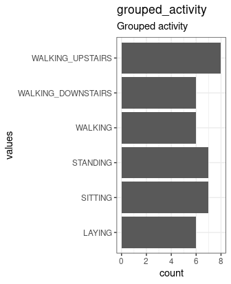

Set up Code book options


```r
knitr::opts_chunk$set(
  warning = TRUE, # show warnings during codebook generation
  message = TRUE, # show messages during codebook generation
  error = TRUE, # do not interrupt codebook generation in case of errors,
                # usually better for debugging
  echo = TRUE  # show R code
)
ggplot2::theme_set(ggplot2::theme_bw())
```

Code book preparation


```r
library(codebook)

codebook_data <- rio::import("codebook_source/accellerometer_grouped.rds")

# omit the following lines, if your missing values are already properly labelled
codebook_data <- detect_missing(codebook_data,
    only_labelled = TRUE, # only labelled values are autodetected as
                                   # missing
    negative_values_are_missing = FALSE, # negative values are missing values
    ninety_nine_problems = TRUE,   # 99/999 are missing values, if they
                                   # are more than 5 MAD from the median
    )

codebook_data <- detect_scales(codebook_data)
```


Create codebook


```r
codebook(codebook_data)
```

```
## No missing values.
```


### Metadata

#### Description
__Dataset name__: Grouped Accelerometer Standard Deviation and Mean Data by Student and Activity

This data set contains the standard deviation and mean of the original data. See the README.txt found in the original data, "sample_data/getdata_projectfiles_UCI_HAR_Dataset/UCI HAR Dataset/README.txt", for more information.

<details>
<summary title="Expand this section to see some additional metadata in a structured format that is useful for search engines">Metadata for search engines</summary>


- __Spatial Coverage__: Online
- __Citation__: Davide Anguita, Alessandro Ghio, Luca Oneto, Xavier Parra and Jorge L. Reyes-Ortiz. Human Activity Recognition on Smartphones using a Multiclass Hardware-Friendly Support Vector Machine. International Workshop of Ambient Assisted Living (IWAAL 2012). Vitoria-Gasteiz, Spain. Dec 2012
- __URL__: [https://github.com/rodelor97/GettingCleaningDataWeek4Project](https://github.com/rodelor97/GettingCleaningDataWeek4Project)

- __Date published__: 2021-01-23

- __Creator__:

| name|value              |
|----:|:------------------|
|    1|Robert de Lorimier |


<table class="kable_wrapper">
<tbody>
  <tr>
   <td> 

|x                                                                               |
|:-------------------------------------------------------------------------------|
|grouped_activity                                                                |
|grouped_subject                                                                 |
|grouped_studentactivity_mean_of_ timeof_body_accel_mean_x                       |
|grouped_studentactivity_mean_of_ timeof_body_accel_mean_y                       |
|grouped_studentactivity_mean_of_ timeof_body_accel_mean_z                       |
|grouped_studentactivity_mean_of_ timeof_body_accel_std_x                        |
|grouped_studentactivity_mean_of_ timeof_body_accel_std_y                        |
|grouped_studentactivity_mean_of_ timeof_body_accel_std_z                        |
|grouped_studentactivity_mean_of_ timeof_gravity_accel_mean_x                    |
|grouped_studentactivity_mean_of_ timeof_gravity_accel_mean_y                    |
|grouped_studentactivity_mean_of_ timeof_gravity_accel_mean_z                    |
|grouped_studentactivity_mean_of_ timeof_gravity_accel_std_x                     |
|grouped_studentactivity_mean_of_ timeof_gravity_accel_std_y                     |
|grouped_studentactivity_mean_of_ timeof_gravity_accel_std_z                     |
|grouped_studentactivity_mean_of_ timeof_body_accel_jerk_mean_x                  |
|grouped_studentactivity_mean_of_ timeof_body_accel_jerk_mean_y                  |
|grouped_studentactivity_mean_of_ timeof_body_accel_jerk_mean_z                  |
|grouped_studentactivity_mean_of_ timeof_body_accel_jerk_std_x                   |
|grouped_studentactivity_mean_of_ timeof_body_accel_jerk_std_y                   |
|grouped_studentactivity_mean_of_ timeof_body_accel_jerk_std_z                   |
|grouped_studentactivity_mean_of_ timeof_body_gyro_mean_x                        |
|grouped_studentactivity_mean_of_ timeof_body_gyro_mean_y                        |
|grouped_studentactivity_mean_of_ timeof_body_gyro_mean_z                        |
|grouped_studentactivity_mean_of_ timeof_body_gyro_std_x                         |
|grouped_studentactivity_mean_of_ timeof_body_gyro_std_y                         |
|grouped_studentactivity_mean_of_ timeof_body_gyro_std_z                         |
|grouped_studentactivity_mean_of_ timeof_body_gyro_jerk_mean_x                   |
|grouped_studentactivity_mean_of_ timeof_body_gyro_jerk_mean_y                   |
|grouped_studentactivity_mean_of_ timeof_body_gyro_jerk_mean_z                   |
|grouped_studentactivity_mean_of_ timeof_body_gyro_jerk_std_x                    |
|grouped_studentactivity_mean_of_ timeof_body_gyro_jerk_std_y                    |
|grouped_studentactivity_mean_of_ timeof_body_gyro_jerk_std_z                    |
|grouped_studentactivity_mean_of_ timeof_body_accel_magn_mean                    |
|grouped_studentactivity_mean_of_ timeof_body_accel_magn_std                     |
|grouped_studentactivity_mean_of_ timeof_gravity_accel_magn_mean                 |
|grouped_studentactivity_mean_of_ timeof_gravity_accel_magn_std                  |
|grouped_studentactivity_mean_of_ timeof_body_accel_jerk_magn_mean               |
|grouped_studentactivity_mean_of_ timeof_body_accel_jerk_magn_std                |
|grouped_studentactivity_mean_of_ timeof_body_gyro_magn_mean                     |
|grouped_studentactivity_mean_of_ timeof_body_gyro_magn_std                      |
|grouped_studentactivity_mean_of_ timeof_body_gyro_jerk_magn_mean                |
|grouped_studentactivity_mean_of_ timeof_body_gyro_jerk_magn_std                 |
|grouped_studentactivity_mean_of_ frequ_body_accel_mean_x                        |
|grouped_studentactivity_mean_of_ frequ_body_accel_mean_y                        |
|grouped_studentactivity_mean_of_ frequ_body_accel_mean_z                        |
|grouped_studentactivity_mean_of_ frequ_body_accel_std_x                         |
|grouped_studentactivity_mean_of_ frequ_body_accel_std_y                         |
|grouped_studentactivity_mean_of_ frequ_body_accel_std_z                         |
|grouped_studentactivity_mean_of_ frequ_body_accel_mean_freq_x                   |
|grouped_studentactivity_mean_of_ frequ_body_accel_mean_freq_y                   |
|grouped_studentactivity_mean_of_ frequ_body_accel_mean_freq_z                   |
|grouped_studentactivity_mean_of_ frequ_body_accel_jerk_mean_x                   |
|grouped_studentactivity_mean_of_ frequ_body_accel_jerk_mean_y                   |
|grouped_studentactivity_mean_of_ frequ_body_accel_jerk_mean_z                   |
|grouped_studentactivity_mean_of_ frequ_body_accel_jerk_std_x                    |
|grouped_studentactivity_mean_of_ frequ_body_accel_jerk_std_y                    |
|grouped_studentactivity_mean_of_ frequ_body_accel_jerk_std_z                    |
|grouped_studentactivity_mean_of_ frequ_body_accel_jerk_mean_freq_x              |
|grouped_studentactivity_mean_of_ frequ_body_accel_jerk_mean_freq_y              |
|grouped_studentactivity_mean_of_ frequ_body_accel_jerk_mean_freq_z              |
|grouped_studentactivity_mean_of_ frequ_body_gyro_mean_x                         |
|grouped_studentactivity_mean_of_ frequ_body_gyro_mean_y                         |
|grouped_studentactivity_mean_of_ frequ_body_gyro_mean_z                         |
|grouped_studentactivity_mean_of_ frequ_body_gyro_std_x                          |
|grouped_studentactivity_mean_of_ frequ_body_gyro_std_y                          |
|grouped_studentactivity_mean_of_ frequ_body_gyro_std_z                          |
|grouped_studentactivity_mean_of_ frequ_body_gyro_mean_freq_x                    |
|grouped_studentactivity_mean_of_ frequ_body_gyro_mean_freq_y                    |
|grouped_studentactivity_mean_of_ frequ_body_gyro_mean_freq_z                    |
|grouped_studentactivity_mean_of_ frequ_body_accel_magn_mean                     |
|grouped_studentactivity_mean_of_ frequ_body_accel_magn_std                      |
|grouped_studentactivity_mean_of_ frequ_body_accel_magn_mean_freq                |
|grouped_studentactivity_mean_of_ frequ_body_body_accel_jerk_magn_mean           |
|grouped_studentactivity_mean_of_ frequ_body_body_accel_jerk_magn_std            |
|grouped_studentactivity_mean_of_ frequ_body_body_accel_jerk_magn_mean_freq      |
|grouped_studentactivity_mean_of_ frequ_body_body_gyro_magn_mean                 |
|grouped_studentactivity_mean_of_ frequ_body_body_gyro_magn_std                  |
|grouped_studentactivity_mean_of_ frequ_body_body_gyro_magn_mean_freq            |
|grouped_studentactivity_mean_of_ frequ_body_body_gyro_jerk_magn_mean            |
|grouped_studentactivity_mean_of_ frequ_body_body_gyro_jerk_magn_std             |
|grouped_studentactivity_mean_of_ frequ_body_body_gyro_jerk_magn_mean_freq       |
|grouped_studentactivity_mean_of_ angle_timeof_body_accel_mean_gravity           |
|grouped_studentactivity_mean_of_ angle_timeof_body_accel_jerk_mean_gravity_mean |
|grouped_studentactivity_mean_of_ angle_timeof_body_gyro_mean_gravity_mean       |
|grouped_studentactivity_mean_of_ angle_timeof_body_gyro_jerk_mean_gravity_mean  |
|grouped_studentactivity_mean_of_ angle_x_gravity_mean                           |

 </td>
  </tr>
</tbody>
</table>

</details>


#Variables


### grouped_activity {#grouped_activity .tabset}

Grouped activity

#### Distribution {#grouped_activity_distribution}



0 missing values.

#### Summary statistics {#grouped_activity_summary}

|name             |label            |data_type | n_missing| complete_rate| n_unique| empty|min |max | whitespace|
|:----------------|:----------------|:---------|---------:|-------------:|--------:|-----:|:---|:---|----------:|
|grouped_activity |Grouped activity |character |         0|             1|        6|     0|6   |18  |          0|


### grouped_subject {#grouped_subject .tabset}

Grouped subject

#### Distribution {#grouped_subject_distribution}


0 missing values.

#### Summary statistics {#grouped_subject_summary}

|name            |label           |data_type | n_missing| complete_rate|min |median |max |   mean|       sd|hist  |
|:---------------|:---------------|:---------|---------:|-------------:|:---|:------|:---|------:|--------:|:-----|
|grouped_subject |Grouped subject |numeric   |         0|             1|1   |16     |30  | 15.375| 8.347232|▇▇▇▇▆ |


### grouped_studentactivity_mean_of_ timeof_body_accel_mean_x {#grouped_studentactivity_mean_of__timeof_body_accel_mean_x .tabset}

The mean of data grouped by student and activity for time domains signal (50Hz const rate), body acceleration mean X axis,

#### Distribution {#grouped_studentactivity_mean_of__timeof_body_accel_mean_x_distribution}


0 missing values.

#### Summary statistics {#grouped_studentactivity_mean_of__timeof_body_accel_mean_x_summary}

|name                                                      |label                                                                                                                      |data_type | n_missing| complete_rate|min  |median |max  |      mean|        sd|hist  |
|:---------------------------------------------------------|:--------------------------------------------------------------------------------------------------------------------------|:---------|---------:|-------------:|:----|:------|:----|---------:|---------:|:-----|
|grouped_studentactivity_mean_of_ timeof_body_accel_mean_x |The mean of data grouped by student and activity for time domains signal (50Hz const rate), body acceleration mean X axis, |numeric   |         0|             1|0.27 |0.28   |0.28 | 0.2743787| 0.0039049|▂▅▃▇▇ |


### grouped_studentactivity_mean_of_ timeof_body_accel_mean_y {#grouped_studentactivity_mean_of__timeof_body_accel_mean_y .tabset}

The mean of data grouped by student and activity for time domains signal (50Hz const rate), body acceleration mean Y axis,

#### Distribution {#grouped_studentactivity_mean_of__timeof_body_accel_mean_y_distribution}


0 missing values.

#### Summary statistics {#grouped_studentactivity_mean_of__timeof_body_accel_mean_y_summary}

|name                                                      |label                                                                                                                      |data_type | n_missing| complete_rate|min    |median |max    |       mean|        sd|hist  |
|:---------------------------------------------------------|:--------------------------------------------------------------------------------------------------------------------------|:---------|---------:|-------------:|:------|:------|:------|----------:|---------:|:-----|
|grouped_studentactivity_mean_of_ timeof_body_accel_mean_y |The mean of data grouped by student and activity for time domains signal (50Hz const rate), body acceleration mean Y axis, |numeric   |         0|             1|-0.021 |-0.018 |-0.013 | -0.0174593| 0.0017419|▂▇▇▃▂ |


### grouped_studentactivity_mean_of_ timeof_body_accel_mean_z {#grouped_studentactivity_mean_of__timeof_body_accel_mean_z .tabset}

The mean of data grouped by student and activity for time domains signal (50Hz const rate), body acceleration mean Z axis,

#### Distribution {#grouped_studentactivity_mean_of__timeof_body_accel_mean_z_distribution}


0 missing values.

#### Summary statistics {#grouped_studentactivity_mean_of__timeof_body_accel_mean_z_summary}

|name                                                      |label                                                                                                                      |data_type | n_missing| complete_rate|min   |median |max  |       mean|        sd|hist  |
|:---------------------------------------------------------|:--------------------------------------------------------------------------------------------------------------------------|:---------|---------:|-------------:|:-----|:------|:----|----------:|---------:|:-----|
|grouped_studentactivity_mean_of_ timeof_body_accel_mean_z |The mean of data grouped by student and activity for time domains signal (50Hz const rate), body acceleration mean Z axis, |numeric   |         0|             1|-0.12 |-0.11  |-0.1 | -0.1087596| 0.0037075|▁▂▇▃▁ |


### grouped_studentactivity_mean_of_ timeof_body_accel_std_x {#grouped_studentactivity_mean_of__timeof_body_accel_std_x .tabset}

The mean of data grouped by student and activity for time domains signal (50Hz const rate), body acceleration standard deviation X axis,

#### Distribution {#grouped_studentactivity_mean_of__timeof_body_accel_std_x_distribution}


0 missing values.

#### Summary statistics {#grouped_studentactivity_mean_of__timeof_body_accel_std_x_summary}

|name                                                     |label                                                                                                                                    |data_type | n_missing| complete_rate|min   |median |max   |       mean|        sd|hist  |
|:--------------------------------------------------------|:----------------------------------------------------------------------------------------------------------------------------------------|:---------|---------:|-------------:|:-----|:------|:-----|----------:|---------:|:-----|
|grouped_studentactivity_mean_of_ timeof_body_accel_std_x |The mean of data grouped by student and activity for time domains signal (50Hz const rate), body acceleration standard deviation X axis, |numeric   |         0|             1|-0.99 |-0.62  |-0.13 | -0.6281165| 0.1688722|▂▃▇▁▁ |


### grouped_studentactivity_mean_of_ timeof_body_accel_std_y {#grouped_studentactivity_mean_of__timeof_body_accel_std_y .tabset}

The mean of data grouped by student and activity for time domains signal (50Hz const rate), body acceleration standard deviation Y axis,

#### Distribution {#grouped_studentactivity_mean_of__timeof_body_accel_std_y_distribution}


0 missing values.

#### Summary statistics {#grouped_studentactivity_mean_of__timeof_body_accel_std_y_summary}

|name                                                     |label                                                                                                                                    |data_type | n_missing| complete_rate|min   |median |max  |       mean|        sd|hist  |
|:--------------------------------------------------------|:----------------------------------------------------------------------------------------------------------------------------------------|:---------|---------:|-------------:|:-----|:------|:----|----------:|---------:|:-----|
|grouped_studentactivity_mean_of_ timeof_body_accel_std_y |The mean of data grouped by student and activity for time domains signal (50Hz const rate), body acceleration standard deviation Y axis, |numeric   |         0|             1|-0.97 |-0.53  |0.12 | -0.5310773| 0.2118708|▂▆▇▁▁ |


### grouped_studentactivity_mean_of_ timeof_body_accel_std_z {#grouped_studentactivity_mean_of__timeof_body_accel_std_z .tabset}

The mean of data grouped by student and activity for time domains signal (50Hz const rate), body acceleration standard deviation Z axis,

#### Distribution {#grouped_studentactivity_mean_of__timeof_body_accel_std_z_distribution}


0 missing values.

#### Summary statistics {#grouped_studentactivity_mean_of__timeof_body_accel_std_z_summary}

|name                                                     |label                                                                                                                                    |data_type | n_missing| complete_rate|min   |median |max    |       mean|        sd|hist  |
|:--------------------------------------------------------|:----------------------------------------------------------------------------------------------------------------------------------------|:---------|---------:|-------------:|:-----|:------|:------|----------:|---------:|:-----|
|grouped_studentactivity_mean_of_ timeof_body_accel_std_z |The mean of data grouped by student and activity for time domains signal (50Hz const rate), body acceleration standard deviation Z axis, |numeric   |         0|             1|-0.98 |-0.65  |-0.083 | -0.6451814| 0.1710591|▂▇▆▁▁ |


### grouped_studentactivity_mean_of_ timeof_gravity_accel_mean_x {#grouped_studentactivity_mean_of__timeof_gravity_accel_mean_x .tabset}

The mean of data grouped by student and activity for time domains signal (50Hz const rate), gravity acceleration mean X axis,

#### Distribution {#grouped_studentactivity_mean_of__timeof_gravity_accel_mean_x_distribution}


0 missing values.

#### Summary statistics {#grouped_studentactivity_mean_of__timeof_gravity_accel_mean_x_summary}

|name                                                         |label                                                                                                                         |data_type | n_missing| complete_rate|min  |median |max  |      mean|        sd|hist  |
|:------------------------------------------------------------|:-----------------------------------------------------------------------------------------------------------------------------|:---------|---------:|-------------:|:----|:------|:----|---------:|---------:|:-----|
|grouped_studentactivity_mean_of_ timeof_gravity_accel_mean_x |The mean of data grouped by student and activity for time domains signal (50Hz const rate), gravity acceleration mean X axis, |numeric   |         0|             1|0.48 |0.67   |0.96 | 0.6789863| 0.0849809|▁▆▇▁▁ |


### grouped_studentactivity_mean_of_ timeof_gravity_accel_mean_y {#grouped_studentactivity_mean_of__timeof_gravity_accel_mean_y .tabset}

The mean of data grouped by student and activity for time domains signal (50Hz const rate), gravity acceleration mean Y axis,

#### Distribution {#grouped_studentactivity_mean_of__timeof_gravity_accel_mean_y_distribution}


0 missing values.

#### Summary statistics {#grouped_studentactivity_mean_of__timeof_gravity_accel_mean_y_summary}

|name                                                         |label                                                                                                                         |data_type | n_missing| complete_rate|min   |median |max  |      mean|        sd|hist  |
|:------------------------------------------------------------|:-----------------------------------------------------------------------------------------------------------------------------|:---------|---------:|-------------:|:-----|:------|:----|---------:|---------:|:-----|
|grouped_studentactivity_mean_of_ timeof_gravity_accel_mean_y |The mean of data grouped by student and activity for time domains signal (50Hz const rate), gravity acceleration mean Y axis, |numeric   |         0|             1|-0.18 |0.019  |0.28 | 0.0043717| 0.1029381|▃▆▇▃▁ |


### grouped_studentactivity_mean_of_ timeof_gravity_accel_mean_z {#grouped_studentactivity_mean_of__timeof_gravity_accel_mean_z .tabset}

The mean of data grouped by student and activity for time domains signal (50Hz const rate), gravity acceleration mean Z axis,

#### Distribution {#grouped_studentactivity_mean_of__timeof_gravity_accel_mean_z_distribution}


0 missing values.

#### Summary statistics {#grouped_studentactivity_mean_of__timeof_gravity_accel_mean_z_summary}

|name                                                         |label                                                                                                                         |data_type | n_missing| complete_rate|min   |median |max  |      mean|        sd|hist  |
|:------------------------------------------------------------|:-----------------------------------------------------------------------------------------------------------------------------|:---------|---------:|-------------:|:-----|:------|:----|---------:|---------:|:-----|
|grouped_studentactivity_mean_of_ timeof_gravity_accel_mean_z |The mean of data grouped by student and activity for time domains signal (50Hz const rate), gravity acceleration mean Z axis, |numeric   |         0|             1|-0.28 |0.092  |0.24 | 0.0862523| 0.1130867|▁▁▂▇▅ |


### grouped_studentactivity_mean_of_ timeof_gravity_accel_std_x {#grouped_studentactivity_mean_of__timeof_gravity_accel_std_x .tabset}

The mean of data grouped by student and activity for time domains signal (50Hz const rate), gravity acceleration standard deviation X axis,

#### Distribution {#grouped_studentactivity_mean_of__timeof_gravity_accel_std_x_distribution}


0 missing values.

#### Summary statistics {#grouped_studentactivity_mean_of__timeof_gravity_accel_std_x_summary}

|name                                                        |label                                                                                                                                       |data_type | n_missing| complete_rate|min |median |max   |       mean|       sd|hist  |
|:-----------------------------------------------------------|:-------------------------------------------------------------------------------------------------------------------------------------------|:---------|---------:|-------------:|:---|:------|:-----|----------:|--------:|:-----|
|grouped_studentactivity_mean_of_ timeof_gravity_accel_std_x |The mean of data grouped by student and activity for time domains signal (50Hz const rate), gravity acceleration standard deviation X axis, |numeric   |         0|             1|-1  |-0.97  |-0.93 | -0.9659325| 0.011541|▂▅▇▃▁ |


### grouped_studentactivity_mean_of_ timeof_gravity_accel_std_y {#grouped_studentactivity_mean_of__timeof_gravity_accel_std_y .tabset}

The mean of data grouped by student and activity for time domains signal (50Hz const rate), gravity acceleration standard deviation Y axis,

#### Distribution {#grouped_studentactivity_mean_of__timeof_gravity_accel_std_y_distribution}


0 missing values.

#### Summary statistics {#grouped_studentactivity_mean_of__timeof_gravity_accel_std_y_summary}

|name                                                        |label                                                                                                                                       |data_type | n_missing| complete_rate|min   |median |max  |      mean|        sd|hist  |
|:-----------------------------------------------------------|:-------------------------------------------------------------------------------------------------------------------------------------------|:---------|---------:|-------------:|:-----|:------|:----|---------:|---------:|:-----|
|grouped_studentactivity_mean_of_ timeof_gravity_accel_std_y |The mean of data grouped by student and activity for time domains signal (50Hz const rate), gravity acceleration standard deviation Y axis, |numeric   |         0|             1|-0.98 |-0.96  |-0.9 | -0.955658| 0.0134074|▂▇▂▁▁ |


### grouped_studentactivity_mean_of_ timeof_gravity_accel_std_z {#grouped_studentactivity_mean_of__timeof_gravity_accel_std_z .tabset}

The mean of data grouped by student and activity for time domains signal (50Hz const rate), gravity acceleration standard deviation Z axis,

#### Distribution {#grouped_studentactivity_mean_of__timeof_gravity_accel_std_z_distribution}


0 missing values.

#### Summary statistics {#grouped_studentactivity_mean_of__timeof_gravity_accel_std_z_summary}

|name                                                        |label                                                                                                                                       |data_type | n_missing| complete_rate|min   |median |max   |       mean|        sd|hist  |
|:-----------------------------------------------------------|:-------------------------------------------------------------------------------------------------------------------------------------------|:---------|---------:|-------------:|:-----|:------|:-----|----------:|---------:|:-----|
|grouped_studentactivity_mean_of_ timeof_gravity_accel_std_z |The mean of data grouped by student and activity for time domains signal (50Hz const rate), gravity acceleration standard deviation Z axis, |numeric   |         0|             1|-0.97 |-0.94  |-0.88 | -0.9420149| 0.0182392|▅▇▅▁▁ |


### grouped_studentactivity_mean_of_ timeof_body_accel_jerk_mean_x {#grouped_studentactivity_mean_of__timeof_body_accel_jerk_mean_x .tabset}

The mean of data grouped by student and activity for time domains signal (50Hz const rate), body acceleration jerk mean X axis,

#### Distribution {#grouped_studentactivity_mean_of__timeof_body_accel_jerk_mean_x_distribution}


0 missing values.

#### Summary statistics {#grouped_studentactivity_mean_of__timeof_body_accel_jerk_mean_x_summary}

|name                                                           |label                                                                                                                           |data_type | n_missing| complete_rate|min   |median |max   |      mean|        sd|hist  |
|:--------------------------------------------------------------|:-------------------------------------------------------------------------------------------------------------------------------|:---------|---------:|-------------:|:-----|:------|:-----|---------:|---------:|:-----|
|grouped_studentactivity_mean_of_ timeof_body_accel_jerk_mean_x |The mean of data grouped by student and activity for time domains signal (50Hz const rate), body acceleration jerk mean X axis, |numeric   |         0|             1|0.057 |0.078  |0.087 | 0.0781339| 0.0054208|▁▁▂▇▅ |


### grouped_studentactivity_mean_of_ timeof_body_accel_jerk_mean_y {#grouped_studentactivity_mean_of__timeof_body_accel_jerk_mean_y .tabset}

The mean of data grouped by student and activity for time domains signal (50Hz const rate), body acceleration jerk mean Y axis,

#### Distribution {#grouped_studentactivity_mean_of__timeof_body_accel_jerk_mean_y_distribution}


0 missing values.

#### Summary statistics {#grouped_studentactivity_mean_of__timeof_body_accel_jerk_mean_y_summary}

|name                                                           |label                                                                                                                           |data_type | n_missing| complete_rate|min     |median |max  |      mean|        sd|hist  |
|:--------------------------------------------------------------|:-------------------------------------------------------------------------------------------------------------------------------|:---------|---------:|-------------:|:-------|:------|:----|---------:|---------:|:-----|
|grouped_studentactivity_mean_of_ timeof_body_accel_jerk_mean_y |The mean of data grouped by student and activity for time domains signal (50Hz const rate), body acceleration jerk mean Y axis, |numeric   |         0|             1|-0.0031 |0.0072 |0.02 | 0.0074545| 0.0054544|▃▇▇▃▂ |


### grouped_studentactivity_mean_of_ timeof_body_accel_jerk_mean_z {#grouped_studentactivity_mean_of__timeof_body_accel_jerk_mean_z .tabset}

The mean of data grouped by student and activity for time domains signal (50Hz const rate), body acceleration jerk mean Z axis,

#### Distribution {#grouped_studentactivity_mean_of__timeof_body_accel_jerk_mean_z_distribution}


0 missing values.

#### Summary statistics {#grouped_studentactivity_mean_of__timeof_body_accel_jerk_mean_z_summary}

|name                                                           |label                                                                                                                           |data_type | n_missing| complete_rate|min   |median |max   |       mean|        sd|hist  |
|:--------------------------------------------------------------|:-------------------------------------------------------------------------------------------------------------------------------|:---------|---------:|-------------:|:-----|:------|:-----|----------:|---------:|:-----|
|grouped_studentactivity_mean_of_ timeof_body_accel_jerk_mean_z |The mean of data grouped by student and activity for time domains signal (50Hz const rate), body acceleration jerk mean Z axis, |numeric   |         0|             1|-0.02 |-0.004 |0.016 | -0.0044584| 0.0059262|▁▅▇▁▁ |


### grouped_studentactivity_mean_of_ timeof_body_accel_jerk_std_x {#grouped_studentactivity_mean_of__timeof_body_accel_jerk_std_x .tabset}

The mean of data grouped by student and activity for time domains signal (50Hz const rate), body acceleration jerk standard deviation X axis,

#### Distribution {#grouped_studentactivity_mean_of__timeof_body_accel_jerk_std_x_distribution}


0 missing values.

#### Summary statistics {#grouped_studentactivity_mean_of__timeof_body_accel_jerk_std_x_summary}

|name                                                          |label                                                                                                                                         |data_type | n_missing| complete_rate|min   |median |max   |       mean|        sd|hist  |
|:-------------------------------------------------------------|:---------------------------------------------------------------------------------------------------------------------------------------------|:---------|---------:|-------------:|:-----|:------|:-----|----------:|---------:|:-----|
|grouped_studentactivity_mean_of_ timeof_body_accel_jerk_std_x |The mean of data grouped by student and activity for time domains signal (50Hz const rate), body acceleration jerk standard deviation X axis, |numeric   |         0|             1|-0.99 |-0.64  |-0.17 | -0.6554746| 0.1642441|▂▃▇▁▁ |


### grouped_studentactivity_mean_of_ timeof_body_accel_jerk_std_y {#grouped_studentactivity_mean_of__timeof_body_accel_jerk_std_y .tabset}

The mean of data grouped by student and activity for time domains signal (50Hz const rate), body acceleration jerk standard deviation Y axis,

#### Distribution {#grouped_studentactivity_mean_of__timeof_body_accel_jerk_std_y_distribution}


0 missing values.

#### Summary statistics {#grouped_studentactivity_mean_of__timeof_body_accel_jerk_std_y_summary}

|name                                                          |label                                                                                                                                         |data_type | n_missing| complete_rate|min   |median |max    |       mean|        sd|hist  |
|:-------------------------------------------------------------|:---------------------------------------------------------------------------------------------------------------------------------------------|:---------|---------:|-------------:|:-----|:------|:------|----------:|---------:|:-----|
|grouped_studentactivity_mean_of_ timeof_body_accel_jerk_std_y |The mean of data grouped by student and activity for time domains signal (50Hz const rate), body acceleration jerk standard deviation Y axis, |numeric   |         0|             1|-0.99 |-0.62  |0.0041 | -0.6208116| 0.1873311|▂▇▅▁▁ |


### grouped_studentactivity_mean_of_ timeof_body_accel_jerk_std_z {#grouped_studentactivity_mean_of__timeof_body_accel_jerk_std_z .tabset}

The mean of data grouped by student and activity for time domains signal (50Hz const rate), body acceleration jerk standard deviation Z axis,

#### Distribution {#grouped_studentactivity_mean_of__timeof_body_accel_jerk_std_z_distribution}


0 missing values.

#### Summary statistics {#grouped_studentactivity_mean_of__timeof_body_accel_jerk_std_z_summary}

|name                                                          |label                                                                                                                                         |data_type | n_missing| complete_rate|min   |median |max   |      mean|       sd|hist  |
|:-------------------------------------------------------------|:---------------------------------------------------------------------------------------------------------------------------------------------|:---------|---------:|-------------:|:-----|:------|:-----|---------:|--------:|:-----|
|grouped_studentactivity_mean_of_ timeof_body_accel_jerk_std_z |The mean of data grouped by student and activity for time domains signal (50Hz const rate), body acceleration jerk standard deviation Z axis, |numeric   |         0|             1|-0.99 |-0.78  |-0.39 | -0.778499| 0.119344|▂▇▅▁▁ |


### grouped_studentactivity_mean_of_ timeof_body_gyro_mean_x {#grouped_studentactivity_mean_of__timeof_body_gyro_mean_x .tabset}

The mean of data grouped by student and activity for time domains signal (50Hz const rate), body gyroscope 3-axial raw signal mean X axis,

#### Distribution {#grouped_studentactivity_mean_of__timeof_body_gyro_mean_x_distribution}


0 missing values.

#### Summary statistics {#grouped_studentactivity_mean_of__timeof_body_gyro_mean_x_summary}

|name                                                     |label                                                                                                                                      |data_type | n_missing| complete_rate|min   |median |max    |       mean|        sd|hist  |
|:--------------------------------------------------------|:------------------------------------------------------------------------------------------------------------------------------------------|:---------|---------:|-------------:|:-----|:------|:------|----------:|---------:|:-----|
|grouped_studentactivity_mean_of_ timeof_body_gyro_mean_x |The mean of data grouped by student and activity for time domains signal (50Hz const rate), body gyroscope 3-axial raw signal mean X axis, |numeric   |         0|             1|-0.07 |-0.028 |0.0078 | -0.0314277| 0.0206417|▅▁▇▆▂ |


### grouped_studentactivity_mean_of_ timeof_body_gyro_mean_y {#grouped_studentactivity_mean_of__timeof_body_gyro_mean_y .tabset}

The mean of data grouped by student and activity for time domains signal (50Hz const rate), body gyroscope 3-axial raw signal mean Y axis,

#### Distribution {#grouped_studentactivity_mean_of__timeof_body_gyro_mean_y_distribution}


0 missing values.

#### Summary statistics {#grouped_studentactivity_mean_of__timeof_body_gyro_mean_y_summary}

|name                                                     |label                                                                                                                                      |data_type | n_missing| complete_rate|min  |median |max    |       mean|        sd|hist  |
|:--------------------------------------------------------|:------------------------------------------------------------------------------------------------------------------------------------------|:---------|---------:|-------------:|:----|:------|:------|----------:|---------:|:-----|
|grouped_studentactivity_mean_of_ timeof_body_gyro_mean_y |The mean of data grouped by student and activity for time domains signal (50Hz const rate), body gyroscope 3-axial raw signal mean Y axis, |numeric   |         0|             1|-0.1 |-0.077 |-0.042 | -0.0750308| 0.0132502|▂▇▇▂▂ |


### grouped_studentactivity_mean_of_ timeof_body_gyro_mean_z {#grouped_studentactivity_mean_of__timeof_body_gyro_mean_z .tabset}

The mean of data grouped by student and activity for time domains signal (50Hz const rate), body gyroscope 3-axial raw signal mean Z axis,

#### Distribution {#grouped_studentactivity_mean_of__timeof_body_gyro_mean_z_distribution}


0 missing values.

#### Summary statistics {#grouped_studentactivity_mean_of__timeof_body_gyro_mean_z_summary}

|name                                                     |label                                                                                                                                      |data_type | n_missing| complete_rate|min   |median |max  |      mean|       sd|hist  |
|:--------------------------------------------------------|:------------------------------------------------------------------------------------------------------------------------------------------|:---------|---------:|-------------:|:-----|:------|:----|---------:|--------:|:-----|
|grouped_studentactivity_mean_of_ timeof_body_gyro_mean_z |The mean of data grouped by student and activity for time domains signal (50Hz const rate), body gyroscope 3-axial raw signal mean Z axis, |numeric   |         0|             1|0.048 |0.088  |0.12 | 0.0884412| 0.012062|▁▂▇▇▂ |


### grouped_studentactivity_mean_of_ timeof_body_gyro_std_x {#grouped_studentactivity_mean_of__timeof_body_gyro_std_x .tabset}

The mean of data grouped by student and activity for time domains signal (50Hz const rate), body gyroscope 3-axial raw signal standard deviation X axis,

#### Distribution {#grouped_studentactivity_mean_of__timeof_body_gyro_std_x_distribution}


0 missing values.

#### Summary statistics {#grouped_studentactivity_mean_of__timeof_body_gyro_std_x_summary}

|name                                                    |label                                                                                                                                                    |data_type | n_missing| complete_rate|min   |median |max   |       mean|        sd|hist  |
|:-------------------------------------------------------|:--------------------------------------------------------------------------------------------------------------------------------------------------------|:---------|---------:|-------------:|:-----|:------|:-----|----------:|---------:|:-----|
|grouped_studentactivity_mean_of_ timeof_body_gyro_std_x |The mean of data grouped by student and activity for time domains signal (50Hz const rate), body gyroscope 3-axial raw signal standard deviation X axis, |numeric   |         0|             1|-0.99 |-0.72  |-0.35 | -0.7344581| 0.1182454|▂▆▇▁▁ |


### grouped_studentactivity_mean_of_ timeof_body_gyro_std_y {#grouped_studentactivity_mean_of__timeof_body_gyro_std_y .tabset}

The mean of data grouped by student and activity for time domains signal (50Hz const rate), body gyroscope 3-axial raw signal standard deviation Y axis,

#### Distribution {#grouped_studentactivity_mean_of__timeof_body_gyro_std_y_distribution}


0 missing values.

#### Summary statistics {#grouped_studentactivity_mean_of__timeof_body_gyro_std_y_summary}

|name                                                    |label                                                                                                                                                    |data_type | n_missing| complete_rate|min   |median |max   |      mean|        sd|hist  |
|:-------------------------------------------------------|:--------------------------------------------------------------------------------------------------------------------------------------------------------|:---------|---------:|-------------:|:-----|:------|:-----|---------:|---------:|:-----|
|grouped_studentactivity_mean_of_ timeof_body_gyro_std_y |The mean of data grouped by student and activity for time domains signal (50Hz const rate), body gyroscope 3-axial raw signal standard deviation Y axis, |numeric   |         0|             1|-0.99 |-0.73  |-0.22 | -0.702843| 0.1716727|▂▇▃▂▁ |


### grouped_studentactivity_mean_of_ timeof_body_gyro_std_z {#grouped_studentactivity_mean_of__timeof_body_gyro_std_z .tabset}

The mean of data grouped by student and activity for time domains signal (50Hz const rate), body gyroscope 3-axial raw signal standard deviation Z axis,

#### Distribution {#grouped_studentactivity_mean_of__timeof_body_gyro_std_z_distribution}


0 missing values.

#### Summary statistics {#grouped_studentactivity_mean_of__timeof_body_gyro_std_z_summary}

|name                                                    |label                                                                                                                                                    |data_type | n_missing| complete_rate|min   |median |max   |       mean|        sd|hist  |
|:-------------------------------------------------------|:--------------------------------------------------------------------------------------------------------------------------------------------------------|:---------|---------:|-------------:|:-----|:------|:-----|----------:|---------:|:-----|
|grouped_studentactivity_mean_of_ timeof_body_gyro_std_z |The mean of data grouped by student and activity for time domains signal (50Hz const rate), body gyroscope 3-axial raw signal standard deviation Z axis, |numeric   |         0|             1|-0.99 |-0.69  |-0.17 | -0.6712968| 0.1642847|▂▇▆▁▁ |


### grouped_studentactivity_mean_of_ timeof_body_gyro_jerk_mean_x {#grouped_studentactivity_mean_of__timeof_body_gyro_jerk_mean_x .tabset}

The mean of data grouped by student and activity for time domains signal (50Hz const rate), body gyroscope 3-axial raw signal jerk mean X axis,

#### Distribution {#grouped_studentactivity_mean_of__timeof_body_gyro_jerk_mean_x_distribution}


0 missing values.

#### Summary statistics {#grouped_studentactivity_mean_of__timeof_body_gyro_jerk_mean_x_summary}

|name                                                          |label                                                                                                                                           |data_type | n_missing| complete_rate|min   |median |max    |       mean|        sd|hist  |
|:-------------------------------------------------------------|:-----------------------------------------------------------------------------------------------------------------------------------------------|:---------|---------:|-------------:|:-----|:------|:------|----------:|---------:|:-----|
|grouped_studentactivity_mean_of_ timeof_body_gyro_jerk_mean_x |The mean of data grouped by student and activity for time domains signal (50Hz const rate), body gyroscope 3-axial raw signal jerk mean X axis, |numeric   |         0|             1|-0.11 |-0.098 |-0.059 | -0.0963073| 0.0112761|▅▇▃▁▁ |


### grouped_studentactivity_mean_of_ timeof_body_gyro_jerk_mean_y {#grouped_studentactivity_mean_of__timeof_body_gyro_jerk_mean_y .tabset}

The mean of data grouped by student and activity for time domains signal (50Hz const rate), body gyroscope 3-axial raw signal jerk mean Y axis,

#### Distribution {#grouped_studentactivity_mean_of__timeof_body_gyro_jerk_mean_y_distribution}


0 missing values.

#### Summary statistics {#grouped_studentactivity_mean_of__timeof_body_gyro_jerk_mean_y_summary}

|name                                                          |label                                                                                                                                           |data_type | n_missing| complete_rate|min   |median |max    |       mean|        sd|hist  |
|:-------------------------------------------------------------|:-----------------------------------------------------------------------------------------------------------------------------------------------|:---------|---------:|-------------:|:-----|:------|:------|----------:|---------:|:-----|
|grouped_studentactivity_mean_of_ timeof_body_gyro_jerk_mean_y |The mean of data grouped by student and activity for time domains signal (50Hz const rate), body gyroscope 3-axial raw signal jerk mean Y axis, |numeric   |         0|             1|-0.05 |-0.041 |-0.037 | -0.0421732| 0.0031305|▂▂▆▇▆ |


### grouped_studentactivity_mean_of_ timeof_body_gyro_jerk_mean_z {#grouped_studentactivity_mean_of__timeof_body_gyro_jerk_mean_z .tabset}

The mean of data grouped by student and activity for time domains signal (50Hz const rate), body gyroscope 3-axial raw signal jerk mean Z axis,

#### Distribution {#grouped_studentactivity_mean_of__timeof_body_gyro_jerk_mean_z_distribution}


0 missing values.

#### Summary statistics {#grouped_studentactivity_mean_of__timeof_body_gyro_jerk_mean_z_summary}

|name                                                          |label                                                                                                                                           |data_type | n_missing| complete_rate|min    |median |max    |      mean|        sd|hist  |
|:-------------------------------------------------------------|:-----------------------------------------------------------------------------------------------------------------------------------------------|:---------|---------:|-------------:|:------|:------|:------|---------:|---------:|:-----|
|grouped_studentactivity_mean_of_ timeof_body_gyro_jerk_mean_z |The mean of data grouped by student and activity for time domains signal (50Hz const rate), body gyroscope 3-axial raw signal jerk mean Z axis, |numeric   |         0|             1|-0.064 |-0.055 |-0.042 | -0.054676| 0.0047822|▃▇▇▃▁ |


### grouped_studentactivity_mean_of_ timeof_body_gyro_jerk_std_x {#grouped_studentactivity_mean_of__timeof_body_gyro_jerk_std_x .tabset}

The mean of data grouped by student and activity for time domains signal (50Hz const rate), body gyroscope 3-axial raw signal jerk standard deviation X axis,

#### Distribution {#grouped_studentactivity_mean_of__timeof_body_gyro_jerk_std_x_distribution}


0 missing values.

#### Summary statistics {#grouped_studentactivity_mean_of__timeof_body_gyro_jerk_std_x_summary}

|name                                                         |label                                                                                                                                                         |data_type | n_missing| complete_rate|min   |median |max    |       mean|        sd|hist  |
|:------------------------------------------------------------|:-------------------------------------------------------------------------------------------------------------------------------------------------------------|:---------|---------:|-------------:|:-----|:------|:------|----------:|---------:|:-----|
|grouped_studentactivity_mean_of_ timeof_body_gyro_jerk_std_x |The mean of data grouped by student and activity for time domains signal (50Hz const rate), body gyroscope 3-axial raw signal jerk standard deviation X axis, |numeric   |         0|             1|-0.99 |-0.74  |-0.034 | -0.7382311| 0.1546973|▂▇▁▁▁ |


### grouped_studentactivity_mean_of_ timeof_body_gyro_jerk_std_y {#grouped_studentactivity_mean_of__timeof_body_gyro_jerk_std_y .tabset}

The mean of data grouped by student and activity for time domains signal (50Hz const rate), body gyroscope 3-axial raw signal jerk standard deviation Y axis,

#### Distribution {#grouped_studentactivity_mean_of__timeof_body_gyro_jerk_std_y_distribution}


0 missing values.

#### Summary statistics {#grouped_studentactivity_mean_of__timeof_body_gyro_jerk_std_y_summary}

|name                                                         |label                                                                                                                                                         |data_type | n_missing| complete_rate|min   |median |max  |       mean|        sd|hist  |
|:------------------------------------------------------------|:-------------------------------------------------------------------------------------------------------------------------------------------------------------|:---------|---------:|-------------:|:-----|:------|:----|----------:|---------:|:-----|
|grouped_studentactivity_mean_of_ timeof_body_gyro_jerk_std_y |The mean of data grouped by student and activity for time domains signal (50Hz const rate), body gyroscope 3-axial raw signal jerk standard deviation Y axis, |numeric   |         0|             1|-0.99 |-0.81  |-0.3 | -0.7975287| 0.1346078|▅▇▂▁▁ |


### grouped_studentactivity_mean_of_ timeof_body_gyro_jerk_std_z {#grouped_studentactivity_mean_of__timeof_body_gyro_jerk_std_z .tabset}

The mean of data grouped by student and activity for time domains signal (50Hz const rate), body gyroscope 3-axial raw signal jerk standard deviation Z axis,

#### Distribution {#grouped_studentactivity_mean_of__timeof_body_gyro_jerk_std_z_distribution}


0 missing values.

#### Summary statistics {#grouped_studentactivity_mean_of__timeof_body_gyro_jerk_std_z_summary}

|name                                                         |label                                                                                                                                                         |data_type | n_missing| complete_rate|min   |median |max    |       mean|        sd|hist  |
|:------------------------------------------------------------|:-------------------------------------------------------------------------------------------------------------------------------------------------------------|:---------|---------:|-------------:|:-----|:------|:------|----------:|---------:|:-----|
|grouped_studentactivity_mean_of_ timeof_body_gyro_jerk_std_z |The mean of data grouped by student and activity for time domains signal (50Hz const rate), body gyroscope 3-axial raw signal jerk standard deviation Z axis, |numeric   |         0|             1|-0.99 |-0.76  |-0.051 | -0.7439463| 0.1596695|▃▇▁▁▁ |


### grouped_studentactivity_mean_of_ timeof_body_accel_magn_mean {#grouped_studentactivity_mean_of__timeof_body_accel_magn_mean .tabset}

The mean of data grouped by student and activity for time domains signal (50Hz const rate), body acceleration euclidean norm magnitude mean

#### Distribution {#grouped_studentactivity_mean_of__timeof_body_accel_magn_mean_distribution}


0 missing values.

#### Summary statistics {#grouped_studentactivity_mean_of__timeof_body_accel_magn_mean_summary}

|name                                                         |label                                                                                                                                       |data_type | n_missing| complete_rate|min   |median |max    |      mean|        sd|hist  |
|:------------------------------------------------------------|:-------------------------------------------------------------------------------------------------------------------------------------------|:---------|---------:|-------------:|:-----|:------|:------|---------:|---------:|:-----|
|grouped_studentactivity_mean_of_ timeof_body_accel_magn_mean |The mean of data grouped by student and activity for time domains signal (50Hz const rate), body acceleration euclidean norm magnitude mean |numeric   |         0|             1|-0.98 |-0.54  |-0.055 | -0.573165| 0.1848734|▂▂▇▁▁ |


### grouped_studentactivity_mean_of_ timeof_body_accel_magn_std {#grouped_studentactivity_mean_of__timeof_body_accel_magn_std .tabset}

The mean of data grouped by student and activity for time domains signal (50Hz const rate), body acceleration euclidean norm magnitude standard deviation

#### Distribution {#grouped_studentactivity_mean_of__timeof_body_accel_magn_std_distribution}


0 missing values.

#### Summary statistics {#grouped_studentactivity_mean_of__timeof_body_accel_magn_std_summary}

|name                                                        |label                                                                                                                                                     |data_type | n_missing| complete_rate|min   |median |max  |       mean|        sd|hist  |
|:-----------------------------------------------------------|:---------------------------------------------------------------------------------------------------------------------------------------------------------|:---------|---------:|-------------:|:-----|:------|:----|----------:|---------:|:-----|
|grouped_studentactivity_mean_of_ timeof_body_accel_magn_std |The mean of data grouped by student and activity for time domains signal (50Hz const rate), body acceleration euclidean norm magnitude standard deviation |numeric   |         0|             1|-0.97 |-0.6   |-0.1 | -0.6124787| 0.1677224|▂▃▇▁▁ |


### grouped_studentactivity_mean_of_ timeof_gravity_accel_magn_mean {#grouped_studentactivity_mean_of__timeof_gravity_accel_magn_mean .tabset}

The mean of data grouped by student and activity for time domains signal (50Hz const rate), gravity acceleration euclidean norm magnitude mean

#### Distribution {#grouped_studentactivity_mean_of__timeof_gravity_accel_magn_mean_distribution}


0 missing values.

#### Summary statistics {#grouped_studentactivity_mean_of__timeof_gravity_accel_magn_mean_summary}

|name                                                            |label                                                                                                                                          |data_type | n_missing| complete_rate|min   |median |max    |      mean|        sd|hist  |
|:---------------------------------------------------------------|:----------------------------------------------------------------------------------------------------------------------------------------------|:---------|---------:|-------------:|:-----|:------|:------|---------:|---------:|:-----|
|grouped_studentactivity_mean_of_ timeof_gravity_accel_magn_mean |The mean of data grouped by student and activity for time domains signal (50Hz const rate), gravity acceleration euclidean norm magnitude mean |numeric   |         0|             1|-0.98 |-0.54  |-0.055 | -0.573165| 0.1848734|▂▂▇▁▁ |


### grouped_studentactivity_mean_of_ timeof_gravity_accel_magn_std {#grouped_studentactivity_mean_of__timeof_gravity_accel_magn_std .tabset}

The mean of data grouped by student and activity for time domains signal (50Hz const rate), gravity acceleration euclidean norm magnitude standard deviation

#### Distribution {#grouped_studentactivity_mean_of__timeof_gravity_accel_magn_std_distribution}


0 missing values.

#### Summary statistics {#grouped_studentactivity_mean_of__timeof_gravity_accel_magn_std_summary}

|name                                                           |label                                                                                                                                                        |data_type | n_missing| complete_rate|min   |median |max  |       mean|        sd|hist  |
|:--------------------------------------------------------------|:------------------------------------------------------------------------------------------------------------------------------------------------------------|:---------|---------:|-------------:|:-----|:------|:----|----------:|---------:|:-----|
|grouped_studentactivity_mean_of_ timeof_gravity_accel_magn_std |The mean of data grouped by student and activity for time domains signal (50Hz const rate), gravity acceleration euclidean norm magnitude standard deviation |numeric   |         0|             1|-0.97 |-0.6   |-0.1 | -0.6124787| 0.1677224|▂▃▇▁▁ |


### grouped_studentactivity_mean_of_ timeof_body_accel_jerk_magn_mean {#grouped_studentactivity_mean_of__timeof_body_accel_jerk_magn_mean .tabset}

The mean of data grouped by student and activity for time domains signal (50Hz const rate), body acceleration jerk euclidean norm magnitude mean

#### Distribution {#grouped_studentactivity_mean_of__timeof_body_accel_jerk_magn_mean_distribution}


0 missing values.

#### Summary statistics {#grouped_studentactivity_mean_of__timeof_body_accel_jerk_magn_mean_summary}

|name                                                              |label                                                                                                                                            |data_type | n_missing| complete_rate|min   |median |max   |       mean|        sd|hist  |
|:-----------------------------------------------------------------|:------------------------------------------------------------------------------------------------------------------------------------------------|:---------|---------:|-------------:|:-----|:------|:-----|----------:|---------:|:-----|
|grouped_studentactivity_mean_of_ timeof_body_accel_jerk_magn_mean |The mean of data grouped by student and activity for time domains signal (50Hz const rate), body acceleration jerk euclidean norm magnitude mean |numeric   |         0|             1|-0.99 |-0.66  |-0.15 | -0.6654239| 0.1608982|▂▇▇▂▁ |


### grouped_studentactivity_mean_of_ timeof_body_accel_jerk_magn_std {#grouped_studentactivity_mean_of__timeof_body_accel_jerk_magn_std .tabset}

The mean of data grouped by student and activity for time domains signal (50Hz const rate), body acceleration jerk euclidean norm magnitude standard deviation

#### Distribution {#grouped_studentactivity_mean_of__timeof_body_accel_jerk_magn_std_distribution}


0 missing values.

#### Summary statistics {#grouped_studentactivity_mean_of__timeof_body_accel_jerk_magn_std_summary}

|name                                                             |label                                                                                                                                                          |data_type | n_missing| complete_rate|min   |median |max    |       mean|        sd|hist  |
|:----------------------------------------------------------------|:--------------------------------------------------------------------------------------------------------------------------------------------------------------|:---------|---------:|-------------:|:-----|:------|:------|----------:|---------:|:-----|
|grouped_studentactivity_mean_of_ timeof_body_accel_jerk_magn_std |The mean of data grouped by student and activity for time domains signal (50Hz const rate), body acceleration jerk euclidean norm magnitude standard deviation |numeric   |         0|             1|-0.99 |-0.63  |-0.088 | -0.6435118| 0.1723774|▂▆▇▁▁ |


### grouped_studentactivity_mean_of_ timeof_body_gyro_magn_mean {#grouped_studentactivity_mean_of__timeof_body_gyro_magn_mean .tabset}

The mean of data grouped by student and activity for time domains signal (50Hz const rate), body gyroscope 3-axial raw signal euclidean norm magnitude mean

#### Distribution {#grouped_studentactivity_mean_of__timeof_body_gyro_magn_mean_distribution}


0 missing values.

#### Summary statistics {#grouped_studentactivity_mean_of__timeof_body_gyro_magn_mean_summary}

|name                                                        |label                                                                                                                                                       |data_type | n_missing| complete_rate|min   |median |max   |       mean|        sd|hist  |
|:-----------------------------------------------------------|:-----------------------------------------------------------------------------------------------------------------------------------------------------------|:---------|---------:|-------------:|:-----|:------|:-----|----------:|---------:|:-----|
|grouped_studentactivity_mean_of_ timeof_body_gyro_magn_mean |The mean of data grouped by student and activity for time domains signal (50Hz const rate), body gyroscope 3-axial raw signal euclidean norm magnitude mean |numeric   |         0|             1|-0.98 |-0.62  |-0.18 | -0.6271788| 0.1698951|▂▃▇▂▁ |


### grouped_studentactivity_mean_of_ timeof_body_gyro_magn_std {#grouped_studentactivity_mean_of__timeof_body_gyro_magn_std .tabset}

The mean of data grouped by student and activity for time domains signal (50Hz const rate), body gyroscope 3-axial raw signal euclidean norm magnitude standard deviation

#### Distribution {#grouped_studentactivity_mean_of__timeof_body_gyro_magn_std_distribution}


0 missing values.

#### Summary statistics {#grouped_studentactivity_mean_of__timeof_body_gyro_magn_std_summary}

|name                                                       |label                                                                                                                                                                     |data_type | n_missing| complete_rate|min   |median |max  |       mean|        sd|hist  |
|:----------------------------------------------------------|:-------------------------------------------------------------------------------------------------------------------------------------------------------------------------|:---------|---------:|-------------:|:-----|:------|:----|----------:|---------:|:-----|
|grouped_studentactivity_mean_of_ timeof_body_gyro_magn_std |The mean of data grouped by student and activity for time domains signal (50Hz const rate), body gyroscope 3-axial raw signal euclidean norm magnitude standard deviation |numeric   |         0|             1|-0.98 |-0.68  |-0.2 | -0.6787973| 0.1555972|▂▇▇▁▁ |


### grouped_studentactivity_mean_of_ timeof_body_gyro_jerk_magn_mean {#grouped_studentactivity_mean_of__timeof_body_gyro_jerk_magn_mean .tabset}

The mean of data grouped by student and activity for time domains signal (50Hz const rate), body gyroscope 3-axial raw signal jerk euclidean norm magnitude mean

#### Distribution {#grouped_studentactivity_mean_of__timeof_body_gyro_jerk_magn_mean_distribution}


0 missing values.

#### Summary statistics {#grouped_studentactivity_mean_of__timeof_body_gyro_jerk_magn_mean_summary}

|name                                                             |label                                                                                                                                                            |data_type | n_missing| complete_rate|min   |median |max  |       mean|        sd|hist  |
|:----------------------------------------------------------------|:----------------------------------------------------------------------------------------------------------------------------------------------------------------|:---------|---------:|-------------:|:-----|:------|:----|----------:|---------:|:-----|
|grouped_studentactivity_mean_of_ timeof_body_gyro_jerk_magn_mean |The mean of data grouped by student and activity for time domains signal (50Hz const rate), body gyroscope 3-axial raw signal jerk euclidean norm magnitude mean |numeric   |         0|             1|-0.99 |-0.78  |-0.2 | -0.7715529| 0.1370686|▃▇▂▁▁ |


### grouped_studentactivity_mean_of_ timeof_body_gyro_jerk_magn_std {#grouped_studentactivity_mean_of__timeof_body_gyro_jerk_magn_std .tabset}

The mean of data grouped by student and activity for time domains signal (50Hz const rate), body gyroscope 3-axial raw signal jerk euclidean norm magnitude standard deviation

#### Distribution {#grouped_studentactivity_mean_of__timeof_body_gyro_jerk_magn_std_distribution}


0 missing values.

#### Summary statistics {#grouped_studentactivity_mean_of__timeof_body_gyro_jerk_magn_std_summary}

|name                                                            |label                                                                                                                                                                          |data_type | n_missing| complete_rate|min   |median |max   |       mean|        sd|hist  |
|:---------------------------------------------------------------|:------------------------------------------------------------------------------------------------------------------------------------------------------------------------------|:---------|---------:|-------------:|:-----|:------|:-----|----------:|---------:|:-----|
|grouped_studentactivity_mean_of_ timeof_body_gyro_jerk_magn_std |The mean of data grouped by student and activity for time domains signal (50Hz const rate), body gyroscope 3-axial raw signal jerk euclidean norm magnitude standard deviation |numeric   |         0|             1|-0.99 |-0.8   |-0.24 | -0.7867377| 0.1346049|▃▇▂▁▁ |


### grouped_studentactivity_mean_of_ frequ_body_accel_mean_x {#grouped_studentactivity_mean_of__frequ_body_accel_mean_x .tabset}

The mean of data grouped by student and activity for fast fourier tranform frequecy signal, body acceleration mean X axis,

#### Distribution {#grouped_studentactivity_mean_of__frequ_body_accel_mean_x_distribution}


0 missing values.

#### Summary statistics {#grouped_studentactivity_mean_of__frequ_body_accel_mean_x_summary}

|name                                                     |label                                                                                                                      |data_type | n_missing| complete_rate|min   |median |max   |       mean|        sd|hist  |
|:--------------------------------------------------------|:--------------------------------------------------------------------------------------------------------------------------|:---------|---------:|-------------:|:-----|:------|:-----|----------:|---------:|:-----|
|grouped_studentactivity_mean_of_ frequ_body_accel_mean_x |The mean of data grouped by student and activity for fast fourier tranform frequecy signal, body acceleration mean X axis, |numeric   |         0|             1|-0.99 |-0.62  |-0.13 | -0.6416537| 0.1653773|▂▃▇▁▁ |


### grouped_studentactivity_mean_of_ frequ_body_accel_mean_y {#grouped_studentactivity_mean_of__frequ_body_accel_mean_y .tabset}

The mean of data grouped by student and activity for fast fourier tranform frequecy signal, body acceleration mean Y axis,

#### Distribution {#grouped_studentactivity_mean_of__frequ_body_accel_mean_y_distribution}


0 missing values.

#### Summary statistics {#grouped_studentactivity_mean_of__frequ_body_accel_mean_y_summary}

|name                                                     |label                                                                                                                      |data_type | n_missing| complete_rate|min   |median |max |       mean|        sd|hist  |
|:--------------------------------------------------------|:--------------------------------------------------------------------------------------------------------------------------|:---------|---------:|-------------:|:-----|:------|:---|----------:|---------:|:-----|
|grouped_studentactivity_mean_of_ frequ_body_accel_mean_y |The mean of data grouped by student and activity for fast fourier tranform frequecy signal, body acceleration mean Y axis, |numeric   |         0|             1|-0.98 |-0.56  |0.1 | -0.5558734| 0.2049182|▂▇▆▁▁ |


### grouped_studentactivity_mean_of_ frequ_body_accel_mean_z {#grouped_studentactivity_mean_of__frequ_body_accel_mean_z .tabset}

The mean of data grouped by student and activity for fast fourier tranform frequecy signal, body acceleration mean Z axis,

#### Distribution {#grouped_studentactivity_mean_of__frequ_body_accel_mean_z_distribution}


0 missing values.

#### Summary statistics {#grouped_studentactivity_mean_of__frequ_body_accel_mean_z_summary}

|name                                                     |label                                                                                                                      |data_type | n_missing| complete_rate|min   |median |max   |       mean|        sd|hist  |
|:--------------------------------------------------------|:--------------------------------------------------------------------------------------------------------------------------|:---------|---------:|-------------:|:-----|:------|:-----|----------:|---------:|:-----|
|grouped_studentactivity_mean_of_ frequ_body_accel_mean_z |The mean of data grouped by student and activity for fast fourier tranform frequecy signal, body acceleration mean Z axis, |numeric   |         0|             1|-0.98 |-0.69  |-0.27 | -0.6907446| 0.1514694|▂▇▇▂▁ |


### grouped_studentactivity_mean_of_ frequ_body_accel_std_x {#grouped_studentactivity_mean_of__frequ_body_accel_std_x .tabset}

The mean of data grouped by student and activity for fast fourier tranform frequecy signal, body acceleration standard deviation X axis,

#### Distribution {#grouped_studentactivity_mean_of__frequ_body_accel_std_x_distribution}


0 missing values.

#### Summary statistics {#grouped_studentactivity_mean_of__frequ_body_accel_std_x_summary}

|name                                                    |label                                                                                                                                    |data_type | n_missing| complete_rate|min   |median |max   |       mean|        sd|hist  |
|:-------------------------------------------------------|:----------------------------------------------------------------------------------------------------------------------------------------|:---------|---------:|-------------:|:-----|:------|:-----|----------:|---------:|:-----|
|grouped_studentactivity_mean_of_ frequ_body_accel_std_x |The mean of data grouped by student and activity for fast fourier tranform frequecy signal, body acceleration standard deviation X axis, |numeric   |         0|             1|-0.99 |-0.62  |-0.13 | -0.6241736| 0.1703561|▂▃▇▁▁ |


### grouped_studentactivity_mean_of_ frequ_body_accel_std_y {#grouped_studentactivity_mean_of__frequ_body_accel_std_y .tabset}

The mean of data grouped by student and activity for fast fourier tranform frequecy signal, body acceleration standard deviation Y axis,

#### Distribution {#grouped_studentactivity_mean_of__frequ_body_accel_std_y_distribution}


0 missing values.

#### Summary statistics {#grouped_studentactivity_mean_of__frequ_body_accel_std_y_summary}

|name                                                    |label                                                                                                                                    |data_type | n_missing| complete_rate|min   |median |max   |       mean|        sd|hist  |
|:-------------------------------------------------------|:----------------------------------------------------------------------------------------------------------------------------------------|:---------|---------:|-------------:|:-----|:------|:-----|----------:|---------:|:-----|
|grouped_studentactivity_mean_of_ frequ_body_accel_std_y |The mean of data grouped by student and activity for fast fourier tranform frequecy signal, body acceleration standard deviation Y axis, |numeric   |         0|             1|-0.97 |-0.54  |0.059 | -0.5491777| 0.2021521|▂▆▇▁▁ |


### grouped_studentactivity_mean_of_ frequ_body_accel_std_z {#grouped_studentactivity_mean_of__frequ_body_accel_std_z .tabset}

The mean of data grouped by student and activity for fast fourier tranform frequecy signal, body acceleration standard deviation Z axis,

#### Distribution {#grouped_studentactivity_mean_of__frequ_body_accel_std_z_distribution}


0 missing values.

#### Summary statistics {#grouped_studentactivity_mean_of__frequ_body_accel_std_z_summary}

|name                                                    |label                                                                                                                                    |data_type | n_missing| complete_rate|min   |median |max   |       mean|        sd|hist  |
|:-------------------------------------------------------|:----------------------------------------------------------------------------------------------------------------------------------------|:---------|---------:|-------------:|:-----|:------|:-----|----------:|---------:|:-----|
|grouped_studentactivity_mean_of_ frequ_body_accel_std_z |The mean of data grouped by student and activity for fast fourier tranform frequecy signal, body acceleration standard deviation Z axis, |numeric   |         0|             1|-0.97 |-0.65  |-0.06 | -0.6506194| 0.1688572|▂▇▅▁▁ |


### grouped_studentactivity_mean_of_ frequ_body_accel_mean_freq_x {#grouped_studentactivity_mean_of__frequ_body_accel_mean_freq_x .tabset}

The mean of data grouped by student and activity for fast fourier tranform frequecy signal, body acceleration mean freq X axis,

#### Distribution {#grouped_studentactivity_mean_of__frequ_body_accel_mean_freq_x_distribution}


0 missing values.

#### Summary statistics {#grouped_studentactivity_mean_of__frequ_body_accel_mean_freq_x_summary}

|name                                                          |label                                                                                                                           |data_type | n_missing| complete_rate|min   |median |max   |      mean|        sd|hist  |
|:-------------------------------------------------------------|:-------------------------------------------------------------------------------------------------------------------------------|:---------|---------:|-------------:|:-----|:------|:-----|---------:|---------:|:-----|
|grouped_studentactivity_mean_of_ frequ_body_accel_mean_freq_x |The mean of data grouped by student and activity for fast fourier tranform frequecy signal, body acceleration mean freq X axis, |numeric   |         0|             1|-0.35 |-0.22  |0.008 | -0.204185| 0.0829355|▂▇▃▁▂ |


### grouped_studentactivity_mean_of_ frequ_body_accel_mean_freq_y {#grouped_studentactivity_mean_of__frequ_body_accel_mean_freq_y .tabset}

The mean of data grouped by student and activity for fast fourier tranform frequecy signal, body acceleration mean freq Y axis,

#### Distribution {#grouped_studentactivity_mean_of__frequ_body_accel_mean_freq_y_distribution}


0 missing values.

#### Summary statistics {#grouped_studentactivity_mean_of__frequ_body_accel_mean_freq_y_summary}

|name                                                          |label                                                                                                                           |data_type | n_missing| complete_rate|min   |median |max  |      mean|        sd|hist  |
|:-------------------------------------------------------------|:-------------------------------------------------------------------------------------------------------------------------------|:---------|---------:|-------------:|:-----|:------|:----|---------:|---------:|:-----|
|grouped_studentactivity_mean_of_ frequ_body_accel_mean_freq_y |The mean of data grouped by student and activity for fast fourier tranform frequecy signal, body acceleration mean freq Y axis, |numeric   |         0|             1|-0.16 |0.037  |0.14 | 0.0217101| 0.0748057|▂▂▃▇▅ |


### grouped_studentactivity_mean_of_ frequ_body_accel_mean_freq_z {#grouped_studentactivity_mean_of__frequ_body_accel_mean_freq_z .tabset}

The mean of data grouped by student and activity for fast fourier tranform frequecy signal, body acceleration mean freq Z axis,

#### Distribution {#grouped_studentactivity_mean_of__frequ_body_accel_mean_freq_z_distribution}


0 missing values.

#### Summary statistics {#grouped_studentactivity_mean_of__frequ_body_accel_mean_freq_z_summary}

|name                                                          |label                                                                                                                           |data_type | n_missing| complete_rate|min   |median |max  |      mean|        sd|hist  |
|:-------------------------------------------------------------|:-------------------------------------------------------------------------------------------------------------------------------|:---------|---------:|-------------:|:-----|:------|:----|---------:|---------:|:-----|
|grouped_studentactivity_mean_of_ frequ_body_accel_mean_freq_z |The mean of data grouped by student and activity for fast fourier tranform frequecy signal, body acceleration mean freq Z axis, |numeric   |         0|             1|-0.14 |0.052  |0.28 | 0.0556469| 0.0842046|▂▆▇▃▁ |


### grouped_studentactivity_mean_of_ frequ_body_accel_jerk_mean_x {#grouped_studentactivity_mean_of__frequ_body_accel_jerk_mean_x .tabset}

The mean of data grouped by student and activity for fast fourier tranform frequecy signal, body acceleration jerk mean X axis,

#### Distribution {#grouped_studentactivity_mean_of__frequ_body_accel_jerk_mean_x_distribution}


0 missing values.

#### Summary statistics {#grouped_studentactivity_mean_of__frequ_body_accel_jerk_mean_x_summary}

|name                                                          |label                                                                                                                           |data_type | n_missing| complete_rate|min   |median |max   |      mean|        sd|hist  |
|:-------------------------------------------------------------|:-------------------------------------------------------------------------------------------------------------------------------|:---------|---------:|-------------:|:-----|:------|:-----|---------:|---------:|:-----|
|grouped_studentactivity_mean_of_ frequ_body_accel_jerk_mean_x |The mean of data grouped by student and activity for fast fourier tranform frequecy signal, body acceleration jerk mean X axis, |numeric   |         0|             1|-0.99 |-0.66  |-0.21 | -0.671908| 0.1565724|▂▃▇▁▁ |


### grouped_studentactivity_mean_of_ frequ_body_accel_jerk_mean_y {#grouped_studentactivity_mean_of__frequ_body_accel_jerk_mean_y .tabset}

The mean of data grouped by student and activity for fast fourier tranform frequecy signal, body acceleration jerk mean Y axis,

#### Distribution {#grouped_studentactivity_mean_of__frequ_body_accel_jerk_mean_y_distribution}


0 missing values.

#### Summary statistics {#grouped_studentactivity_mean_of__frequ_body_accel_jerk_mean_y_summary}

|name                                                          |label                                                                                                                           |data_type | n_missing| complete_rate|min   |median |max    |       mean|        sd|hist  |
|:-------------------------------------------------------------|:-------------------------------------------------------------------------------------------------------------------------------|:---------|---------:|-------------:|:-----|:------|:------|----------:|---------:|:-----|
|grouped_studentactivity_mean_of_ frequ_body_accel_jerk_mean_y |The mean of data grouped by student and activity for fast fourier tranform frequecy signal, body acceleration jerk mean Y axis, |numeric   |         0|             1|-0.99 |-0.64  |-0.087 | -0.6414498| 0.1741278|▂▇▆▁▁ |


### grouped_studentactivity_mean_of_ frequ_body_accel_jerk_mean_z {#grouped_studentactivity_mean_of__frequ_body_accel_jerk_mean_z .tabset}

The mean of data grouped by student and activity for fast fourier tranform frequecy signal, body acceleration jerk mean Z axis,

#### Distribution {#grouped_studentactivity_mean_of__frequ_body_accel_jerk_mean_z_distribution}


0 missing values.

#### Summary statistics {#grouped_studentactivity_mean_of__frequ_body_accel_jerk_mean_z_summary}

|name                                                          |label                                                                                                                           |data_type | n_missing| complete_rate|min   |median |max   |       mean|        sd|hist  |
|:-------------------------------------------------------------|:-------------------------------------------------------------------------------------------------------------------------------|:---------|---------:|-------------:|:-----|:------|:-----|----------:|---------:|:-----|
|grouped_studentactivity_mean_of_ frequ_body_accel_jerk_mean_z |The mean of data grouped by student and activity for fast fourier tranform frequecy signal, body acceleration jerk mean Z axis, |numeric   |         0|             1|-0.99 |-0.77  |-0.35 | -0.7604683| 0.1273091|▂▇▆▁▁ |


### grouped_studentactivity_mean_of_ frequ_body_accel_jerk_std_x {#grouped_studentactivity_mean_of__frequ_body_accel_jerk_std_x .tabset}

The mean of data grouped by student and activity for fast fourier tranform frequecy signal, body acceleration jerk standard deviation X axis,

#### Distribution {#grouped_studentactivity_mean_of__frequ_body_accel_jerk_std_x_distribution}


0 missing values.

#### Summary statistics {#grouped_studentactivity_mean_of__frequ_body_accel_jerk_std_x_summary}

|name                                                         |label                                                                                                                                         |data_type | n_missing| complete_rate|min   |median |max   |       mean|        sd|hist  |
|:------------------------------------------------------------|:---------------------------------------------------------------------------------------------------------------------------------------------|:---------|---------:|-------------:|:-----|:------|:-----|----------:|---------:|:-----|
|grouped_studentactivity_mean_of_ frequ_body_accel_jerk_std_x |The mean of data grouped by student and activity for fast fourier tranform frequecy signal, body acceleration jerk standard deviation X axis, |numeric   |         0|             1|-0.99 |-0.65  |-0.21 | -0.6697384| 0.1577809|▂▃▇▁▁ |


### grouped_studentactivity_mean_of_ frequ_body_accel_jerk_std_y {#grouped_studentactivity_mean_of__frequ_body_accel_jerk_std_y .tabset}

The mean of data grouped by student and activity for fast fourier tranform frequecy signal, body acceleration jerk standard deviation Y axis,

#### Distribution {#grouped_studentactivity_mean_of__frequ_body_accel_jerk_std_y_distribution}


0 missing values.

#### Summary statistics {#grouped_studentactivity_mean_of__frequ_body_accel_jerk_std_y_summary}

|name                                                         |label                                                                                                                                         |data_type | n_missing| complete_rate|min   |median |max   |       mean|        sd|hist  |
|:------------------------------------------------------------|:---------------------------------------------------------------------------------------------------------------------------------------------|:---------|---------:|-------------:|:-----|:------|:-----|----------:|---------:|:-----|
|grouped_studentactivity_mean_of_ frequ_body_accel_jerk_std_y |The mean of data grouped by student and activity for fast fourier tranform frequecy signal, body acceleration jerk standard deviation Y axis, |numeric   |         0|             1|-0.99 |-0.62  |0.035 | -0.6245683| 0.1894391|▂▇▅▁▁ |


### grouped_studentactivity_mean_of_ frequ_body_accel_jerk_std_z {#grouped_studentactivity_mean_of__frequ_body_accel_jerk_std_z .tabset}

The mean of data grouped by student and activity for fast fourier tranform frequecy signal, body acceleration jerk standard deviation Z axis,

#### Distribution {#grouped_studentactivity_mean_of__frequ_body_accel_jerk_std_z_distribution}


0 missing values.

#### Summary statistics {#grouped_studentactivity_mean_of__frequ_body_accel_jerk_std_z_summary}

|name                                                         |label                                                                                                                                         |data_type | n_missing| complete_rate|min   |median |max   |      mean|        sd|hist  |
|:------------------------------------------------------------|:---------------------------------------------------------------------------------------------------------------------------------------------|:---------|---------:|-------------:|:-----|:------|:-----|---------:|---------:|:-----|
|grouped_studentactivity_mean_of_ frequ_body_accel_jerk_std_z |The mean of data grouped by student and activity for fast fourier tranform frequecy signal, body acceleration jerk standard deviation Z axis, |numeric   |         0|             1|-0.99 |-0.8   |-0.42 | -0.795403| 0.1115195|▂▇▅▁▁ |


### grouped_studentactivity_mean_of_ frequ_body_accel_jerk_mean_freq_x {#grouped_studentactivity_mean_of__frequ_body_accel_jerk_mean_freq_x .tabset}

The mean of data grouped by student and activity for fast fourier tranform frequecy signal, body acceleration jerk mean freq X axis,

#### Distribution {#grouped_studentactivity_mean_of__frequ_body_accel_jerk_mean_freq_x_distribution}


0 missing values.

#### Summary statistics {#grouped_studentactivity_mean_of__frequ_body_accel_jerk_mean_freq_x_summary}

|name                                                               |label                                                                                                                                |data_type | n_missing| complete_rate|min   |median |max  |       mean|        sd|hist  |
|:------------------------------------------------------------------|:------------------------------------------------------------------------------------------------------------------------------------|:---------|---------:|-------------:|:-----|:------|:----|----------:|---------:|:-----|
|grouped_studentactivity_mean_of_ frequ_body_accel_jerk_mean_freq_x |The mean of data grouped by student and activity for fast fourier tranform frequecy signal, body acceleration jerk mean freq X axis, |numeric   |         0|             1|-0.27 |-0.041 |0.26 | -0.0300619| 0.1111773|▁▅▇▁▁ |


### grouped_studentactivity_mean_of_ frequ_body_accel_jerk_mean_freq_y {#grouped_studentactivity_mean_of__frequ_body_accel_jerk_mean_freq_y .tabset}

The mean of data grouped by student and activity for fast fourier tranform frequecy signal, body acceleration jerk mean freq Y axis,

#### Distribution {#grouped_studentactivity_mean_of__frequ_body_accel_jerk_mean_freq_y_distribution}


0 missing values.

#### Summary statistics {#grouped_studentactivity_mean_of__frequ_body_accel_jerk_mean_freq_y_summary}

|name                                                               |label                                                                                                                                |data_type | n_missing| complete_rate|min  |median |max   |       mean|        sd|hist  |
|:------------------------------------------------------------------|:------------------------------------------------------------------------------------------------------------------------------------|:---------|---------:|-------------:|:----|:------|:-----|----------:|---------:|:-----|
|grouped_studentactivity_mean_of_ frequ_body_accel_jerk_mean_freq_y |The mean of data grouped by student and activity for fast fourier tranform frequecy signal, body acceleration jerk mean freq Y axis, |numeric   |         0|             1|-0.4 |-0.2   |0.088 | -0.2012586| 0.0941605|▂▆▇▁▁ |


### grouped_studentactivity_mean_of_ frequ_body_accel_jerk_mean_freq_z {#grouped_studentactivity_mean_of__frequ_body_accel_jerk_mean_freq_z .tabset}

The mean of data grouped by student and activity for fast fourier tranform frequecy signal, body acceleration jerk mean freq Z axis,

#### Distribution {#grouped_studentactivity_mean_of__frequ_body_accel_jerk_mean_freq_z_distribution}


0 missing values.

#### Summary statistics {#grouped_studentactivity_mean_of__frequ_body_accel_jerk_mean_freq_z_summary}

|name                                                               |label                                                                                                                                |data_type | n_missing| complete_rate|min  |median |max  |       mean|        sd|hist  |
|:------------------------------------------------------------------|:------------------------------------------------------------------------------------------------------------------------------------|:---------|---------:|-------------:|:----|:------|:----|----------:|---------:|:-----|
|grouped_studentactivity_mean_of_ frequ_body_accel_jerk_mean_freq_z |The mean of data grouped by student and activity for fast fourier tranform frequecy signal, body acceleration jerk mean freq Z axis, |numeric   |         0|             1|-0.3 |-0.11  |0.14 | -0.1041605| 0.0930597|▂▅▇▃▂ |


### grouped_studentactivity_mean_of_ frequ_body_gyro_mean_x {#grouped_studentactivity_mean_of__frequ_body_gyro_mean_x .tabset}

The mean of data grouped by student and activity for fast fourier tranform frequecy signal, body gyroscope 3-axial raw signal mean X axis,

#### Distribution {#grouped_studentactivity_mean_of__frequ_body_gyro_mean_x_distribution}


0 missing values.

#### Summary statistics {#grouped_studentactivity_mean_of__frequ_body_gyro_mean_x_summary}

|name                                                    |label                                                                                                                                      |data_type | n_missing| complete_rate|min   |median |max    |       mean|        sd|hist  |
|:-------------------------------------------------------|:------------------------------------------------------------------------------------------------------------------------------------------|:---------|---------:|-------------:|:-----|:------|:------|----------:|---------:|:-----|
|grouped_studentactivity_mean_of_ frequ_body_gyro_mean_x |The mean of data grouped by student and activity for fast fourier tranform frequecy signal, body gyroscope 3-axial raw signal mean X axis, |numeric   |         0|             1|-0.99 |-0.67  |-0.079 | -0.6839877| 0.1554216|▂▇▂▁▁ |


### grouped_studentactivity_mean_of_ frequ_body_gyro_mean_y {#grouped_studentactivity_mean_of__frequ_body_gyro_mean_y .tabset}

The mean of data grouped by student and activity for fast fourier tranform frequecy signal, body gyroscope 3-axial raw signal mean Y axis,

#### Distribution {#grouped_studentactivity_mean_of__frequ_body_gyro_mean_y_distribution}


0 missing values.

#### Summary statistics {#grouped_studentactivity_mean_of__frequ_body_gyro_mean_y_summary}

|name                                                    |label                                                                                                                                      |data_type | n_missing| complete_rate|min   |median |max   |       mean|        sd|hist  |
|:-------------------------------------------------------|:------------------------------------------------------------------------------------------------------------------------------------------|:---------|---------:|-------------:|:-----|:------|:-----|----------:|---------:|:-----|
|grouped_studentactivity_mean_of_ frequ_body_gyro_mean_y |The mean of data grouped by student and activity for fast fourier tranform frequecy signal, body gyroscope 3-axial raw signal mean Y axis, |numeric   |         0|             1|-0.99 |-0.75  |-0.25 | -0.7239129| 0.1595433|▃▇▃▁▁ |


### grouped_studentactivity_mean_of_ frequ_body_gyro_mean_z {#grouped_studentactivity_mean_of__frequ_body_gyro_mean_z .tabset}

The mean of data grouped by student and activity for fast fourier tranform frequecy signal, body gyroscope 3-axial raw signal mean Z axis,

#### Distribution {#grouped_studentactivity_mean_of__frequ_body_gyro_mean_z_distribution}


0 missing values.

#### Summary statistics {#grouped_studentactivity_mean_of__frequ_body_gyro_mean_z_summary}

|name                                                    |label                                                                                                                                      |data_type | n_missing| complete_rate|min   |median |max    |       mean|        sd|hist  |
|:-------------------------------------------------------|:------------------------------------------------------------------------------------------------------------------------------------------|:---------|---------:|-------------:|:-----|:------|:------|----------:|---------:|:-----|
|grouped_studentactivity_mean_of_ frequ_body_gyro_mean_z |The mean of data grouped by student and activity for fast fourier tranform frequecy signal, body gyroscope 3-axial raw signal mean Z axis, |numeric   |         0|             1|-0.99 |-0.67  |-0.082 | -0.6579563| 0.1756924|▂▇▅▁▁ |


### grouped_studentactivity_mean_of_ frequ_body_gyro_std_x {#grouped_studentactivity_mean_of__frequ_body_gyro_std_x .tabset}

The mean of data grouped by student and activity for fast fourier tranform frequecy signal, body gyroscope 3-axial raw signal standard deviation X axis,

#### Distribution {#grouped_studentactivity_mean_of__frequ_body_gyro_std_x_distribution}


0 missing values.

#### Summary statistics {#grouped_studentactivity_mean_of__frequ_body_gyro_std_x_summary}

|name                                                   |label                                                                                                                                                    |data_type | n_missing| complete_rate|min   |median |max   |       mean|        sd|hist  |
|:------------------------------------------------------|:--------------------------------------------------------------------------------------------------------------------------------------------------------|:---------|---------:|-------------:|:-----|:------|:-----|----------:|---------:|:-----|
|grouped_studentactivity_mean_of_ frequ_body_gyro_std_x |The mean of data grouped by student and activity for fast fourier tranform frequecy signal, body gyroscope 3-axial raw signal standard deviation X axis, |numeric   |         0|             1|-0.99 |-0.74  |-0.45 | -0.7521477| 0.1069314|▂▃▇▁▁ |


### grouped_studentactivity_mean_of_ frequ_body_gyro_std_y {#grouped_studentactivity_mean_of__frequ_body_gyro_std_y .tabset}

The mean of data grouped by student and activity for fast fourier tranform frequecy signal, body gyroscope 3-axial raw signal standard deviation Y axis,

#### Distribution {#grouped_studentactivity_mean_of__frequ_body_gyro_std_y_distribution}


0 missing values.

#### Summary statistics {#grouped_studentactivity_mean_of__frequ_body_gyro_std_y_summary}

|name                                                   |label                                                                                                                                                    |data_type | n_missing| complete_rate|min   |median |max   |       mean|        sd|hist  |
|:------------------------------------------------------|:--------------------------------------------------------------------------------------------------------------------------------------------------------|:---------|---------:|-------------:|:-----|:------|:-----|----------:|---------:|:-----|
|grouped_studentactivity_mean_of_ frequ_body_gyro_std_y |The mean of data grouped by student and activity for fast fourier tranform frequecy signal, body gyroscope 3-axial raw signal standard deviation Y axis, |numeric   |         0|             1|-0.98 |-0.73  |-0.15 | -0.6953373| 0.1786708|▂▇▂▁▁ |


### grouped_studentactivity_mean_of_ frequ_body_gyro_std_z {#grouped_studentactivity_mean_of__frequ_body_gyro_std_z .tabset}

The mean of data grouped by student and activity for fast fourier tranform frequecy signal, body gyroscope 3-axial raw signal standard deviation Z axis,

#### Distribution {#grouped_studentactivity_mean_of__frequ_body_gyro_std_z_distribution}


0 missing values.

#### Summary statistics {#grouped_studentactivity_mean_of__frequ_body_gyro_std_z_summary}

|name                                                   |label                                                                                                                                                    |data_type | n_missing| complete_rate|min   |median |max   |       mean|        sd|hist  |
|:------------------------------------------------------|:--------------------------------------------------------------------------------------------------------------------------------------------------------|:---------|---------:|-------------:|:-----|:------|:-----|----------:|---------:|:-----|
|grouped_studentactivity_mean_of_ frequ_body_gyro_std_z |The mean of data grouped by student and activity for fast fourier tranform frequecy signal, body gyroscope 3-axial raw signal standard deviation Z axis, |numeric   |         0|             1|-0.99 |-0.72  |-0.23 | -0.7078588| 0.1461816|▂▇▅▁▁ |


### grouped_studentactivity_mean_of_ frequ_body_gyro_mean_freq_x {#grouped_studentactivity_mean_of__frequ_body_gyro_mean_freq_x .tabset}

The mean of data grouped by student and activity for fast fourier tranform frequecy signal, body gyroscope 3-axial raw signal mean freq X axis,

#### Distribution {#grouped_studentactivity_mean_of__frequ_body_gyro_mean_freq_x_distribution}


0 missing values.

#### Summary statistics {#grouped_studentactivity_mean_of__frequ_body_gyro_mean_freq_x_summary}

|name                                                         |label                                                                                                                                           |data_type | n_missing| complete_rate|min   |median |max  |       mean|       sd|hist  |
|:------------------------------------------------------------|:-----------------------------------------------------------------------------------------------------------------------------------------------|:---------|---------:|-------------:|:-----|:------|:----|----------:|--------:|:-----|
|grouped_studentactivity_mean_of_ frequ_body_gyro_mean_freq_x |The mean of data grouped by student and activity for fast fourier tranform frequecy signal, body gyroscope 3-axial raw signal mean freq X axis, |numeric   |         0|             1|-0.31 |-0.1   |0.12 | -0.1009106| 0.083553|▂▅▇▅▁ |


### grouped_studentactivity_mean_of_ frequ_body_gyro_mean_freq_y {#grouped_studentactivity_mean_of__frequ_body_gyro_mean_freq_y .tabset}

The mean of data grouped by student and activity for fast fourier tranform frequecy signal, body gyroscope 3-axial raw signal mean freq Y axis,

#### Distribution {#grouped_studentactivity_mean_of__frequ_body_gyro_mean_freq_y_distribution}


0 missing values.

#### Summary statistics {#grouped_studentactivity_mean_of__frequ_body_gyro_mean_freq_y_summary}

|name                                                         |label                                                                                                                                           |data_type | n_missing| complete_rate|min  |median |max   |       mean|       sd|hist  |
|:------------------------------------------------------------|:-----------------------------------------------------------------------------------------------------------------------------------------------|:---------|---------:|-------------:|:----|:------|:-----|----------:|--------:|:-----|
|grouped_studentactivity_mean_of_ frequ_body_gyro_mean_freq_y |The mean of data grouped by student and activity for fast fourier tranform frequecy signal, body gyroscope 3-axial raw signal mean freq Y axis, |numeric   |         0|             1|-0.4 |-0.16  |0.085 | -0.1727953| 0.116673|▃▃▆▇▁ |


### grouped_studentactivity_mean_of_ frequ_body_gyro_mean_freq_z {#grouped_studentactivity_mean_of__frequ_body_gyro_mean_freq_z .tabset}

The mean of data grouped by student and activity for fast fourier tranform frequecy signal, body gyroscope 3-axial raw signal mean freq Z axis,

#### Distribution {#grouped_studentactivity_mean_of__frequ_body_gyro_mean_freq_z_distribution}


0 missing values.

#### Summary statistics {#grouped_studentactivity_mean_of__frequ_body_gyro_mean_freq_z_summary}

|name                                                         |label                                                                                                                                           |data_type | n_missing| complete_rate|min   |median |max  |       mean|        sd|hist  |
|:------------------------------------------------------------|:-----------------------------------------------------------------------------------------------------------------------------------------------|:---------|---------:|-------------:|:-----|:------|:----|----------:|---------:|:-----|
|grouped_studentactivity_mean_of_ frequ_body_gyro_mean_freq_z |The mean of data grouped by student and activity for fast fourier tranform frequecy signal, body gyroscope 3-axial raw signal mean freq Z axis, |numeric   |         0|             1|-0.27 |-0.044 |0.27 | -0.0426206| 0.0965585|▂▅▇▁▁ |


### grouped_studentactivity_mean_of_ frequ_body_accel_magn_mean {#grouped_studentactivity_mean_of__frequ_body_accel_magn_mean .tabset}

The mean of data grouped by student and activity for fast fourier tranform frequecy signal, body acceleration euclidean norm magnitude mean

#### Distribution {#grouped_studentactivity_mean_of__frequ_body_accel_magn_mean_distribution}


0 missing values.

#### Summary statistics {#grouped_studentactivity_mean_of__frequ_body_accel_magn_mean_summary}

|name                                                        |label                                                                                                                                       |data_type | n_missing| complete_rate|min   |median |max    |       mean|        sd|hist  |
|:-----------------------------------------------------------|:-------------------------------------------------------------------------------------------------------------------------------------------|:---------|---------:|-------------:|:-----|:------|:------|----------:|---------:|:-----|
|grouped_studentactivity_mean_of_ frequ_body_accel_magn_mean |The mean of data grouped by student and activity for fast fourier tranform frequecy signal, body acceleration euclidean norm magnitude mean |numeric   |         0|             1|-0.98 |-0.59  |-0.056 | -0.6063487| 0.1773079|▂▅▇▁▁ |


### grouped_studentactivity_mean_of_ frequ_body_accel_magn_std {#grouped_studentactivity_mean_of__frequ_body_accel_magn_std .tabset}

The mean of data grouped by student and activity for fast fourier tranform frequecy signal, body acceleration euclidean norm magnitude standard deviation

#### Distribution {#grouped_studentactivity_mean_of__frequ_body_accel_magn_std_distribution}


0 missing values.

#### Summary statistics {#grouped_studentactivity_mean_of__frequ_body_accel_magn_std_summary}

|name                                                       |label                                                                                                                                                     |data_type | n_missing| complete_rate|min   |median |max   |       mean|       sd|hist  |
|:----------------------------------------------------------|:---------------------------------------------------------------------------------------------------------------------------------------------------------|:---------|---------:|-------------:|:-----|:------|:-----|----------:|--------:|:-----|
|grouped_studentactivity_mean_of_ frequ_body_accel_magn_std |The mean of data grouped by student and activity for fast fourier tranform frequecy signal, body acceleration euclidean norm magnitude standard deviation |numeric   |         0|             1|-0.97 |-0.67  |-0.27 | -0.6779137| 0.136277|▂▂▇▁▁ |


### grouped_studentactivity_mean_of_ frequ_body_accel_magn_mean_freq {#grouped_studentactivity_mean_of__frequ_body_accel_magn_mean_freq .tabset}

The mean of data grouped by student and activity for fast fourier tranform frequecy signal, body acceleration euclidean norm magnitude mean freq

#### Distribution {#grouped_studentactivity_mean_of__frequ_body_accel_magn_mean_freq_distribution}


0 missing values.

#### Summary statistics {#grouped_studentactivity_mean_of__frequ_body_accel_magn_mean_freq_summary}

|name                                                             |label                                                                                                                                            |data_type | n_missing| complete_rate|min    |median |max  |      mean|        sd|hist  |
|:----------------------------------------------------------------|:------------------------------------------------------------------------------------------------------------------------------------------------|:---------|---------:|-------------:|:------|:------|:----|---------:|---------:|:-----|
|grouped_studentactivity_mean_of_ frequ_body_accel_magn_mean_freq |The mean of data grouped by student and activity for fast fourier tranform frequecy signal, body acceleration euclidean norm magnitude mean freq |numeric   |         0|             1|-0.068 |0.085  |0.26 | 0.0842499| 0.0765423|▃▃▇▅▁ |


### grouped_studentactivity_mean_of_ frequ_body_body_accel_jerk_magn_mean {#grouped_studentactivity_mean_of__frequ_body_body_accel_jerk_magn_mean .tabset}

The mean of data grouped by student and activity for fast fourier tranform frequecy signal, body to body acceleration jerk euclidean norm magnitude mean

#### Distribution {#grouped_studentactivity_mean_of__frequ_body_body_accel_jerk_magn_mean_distribution}


0 missing values.

#### Summary statistics {#grouped_studentactivity_mean_of__frequ_body_body_accel_jerk_magn_mean_summary}

|name                                                                  |label                                                                                                                                                    |data_type | n_missing| complete_rate|min   |median |max    |       mean|      sd|hist  |
|:---------------------------------------------------------------------|:--------------------------------------------------------------------------------------------------------------------------------------------------------|:---------|---------:|-------------:|:-----|:------|:------|----------:|-------:|:-----|
|grouped_studentactivity_mean_of_ frequ_body_body_accel_jerk_magn_mean |The mean of data grouped by student and activity for fast fourier tranform frequecy signal, body to body acceleration jerk euclidean norm magnitude mean |numeric   |         0|             1|-0.99 |-0.62  |-0.076 | -0.6368899| 0.17595|▂▆▇▁▁ |


### grouped_studentactivity_mean_of_ frequ_body_body_accel_jerk_magn_std {#grouped_studentactivity_mean_of__frequ_body_body_accel_jerk_magn_std .tabset}

The mean of data grouped by student and activity for fast fourier tranform frequecy signal, body to body acceleration jerk euclidean norm magnitude standard deviation

#### Distribution {#grouped_studentactivity_mean_of__frequ_body_body_accel_jerk_magn_std_distribution}


0 missing values.

#### Summary statistics {#grouped_studentactivity_mean_of__frequ_body_body_accel_jerk_magn_std_summary}

|name                                                                 |label                                                                                                                                                                  |data_type | n_missing| complete_rate|min   |median |max   |       mean|        sd|hist  |
|:--------------------------------------------------------------------|:----------------------------------------------------------------------------------------------------------------------------------------------------------------------|:---------|---------:|-------------:|:-----|:------|:-----|----------:|---------:|:-----|
|grouped_studentactivity_mean_of_ frequ_body_body_accel_jerk_magn_std |The mean of data grouped by student and activity for fast fourier tranform frequecy signal, body to body acceleration jerk euclidean norm magnitude standard deviation |numeric   |         0|             1|-0.99 |-0.64  |-0.11 | -0.6550883| 0.1664638|▂▇▇▁▁ |


### grouped_studentactivity_mean_of_ frequ_body_body_accel_jerk_magn_mean_freq {#grouped_studentactivity_mean_of__frequ_body_body_accel_jerk_magn_mean_freq .tabset}

The mean of data grouped by student and activity for fast fourier tranform frequecy signal, body to body acceleration jerk euclidean norm magnitude mean freq

#### Distribution {#grouped_studentactivity_mean_of__frequ_body_body_accel_jerk_magn_mean_freq_distribution}


0 missing values.

#### Summary statistics {#grouped_studentactivity_mean_of__frequ_body_body_accel_jerk_magn_mean_freq_summary}

|name                                                                       |label                                                                                                                                                         |data_type | n_missing| complete_rate|min    |median |max |      mean|        sd|hist  |
|:--------------------------------------------------------------------------|:-------------------------------------------------------------------------------------------------------------------------------------------------------------|:---------|---------:|-------------:|:------|:------|:---|---------:|---------:|:-----|
|grouped_studentactivity_mean_of_ frequ_body_body_accel_jerk_magn_mean_freq |The mean of data grouped by student and activity for fast fourier tranform frequecy signal, body to body acceleration jerk euclidean norm magnitude mean freq |numeric   |         0|             1|-0.024 |0.18   |0.4 | 0.1815253| 0.0863648|▁▅▇▂▁ |


### grouped_studentactivity_mean_of_ frequ_body_body_gyro_magn_mean {#grouped_studentactivity_mean_of__frequ_body_body_gyro_magn_mean .tabset}

The mean of data grouped by student and activity for fast fourier tranform frequecy signal, body to body gyroscope 3-axial raw signal euclidean norm magnitude mean

#### Distribution {#grouped_studentactivity_mean_of__frequ_body_body_gyro_magn_mean_distribution}


0 missing values.

#### Summary statistics {#grouped_studentactivity_mean_of__frequ_body_body_gyro_magn_mean_summary}

|name                                                            |label                                                                                                                                                               |data_type | n_missing| complete_rate|min   |median |max   |       mean|        sd|hist  |
|:---------------------------------------------------------------|:-------------------------------------------------------------------------------------------------------------------------------------------------------------------|:---------|---------:|-------------:|:-----|:------|:-----|----------:|---------:|:-----|
|grouped_studentactivity_mean_of_ frequ_body_body_gyro_magn_mean |The mean of data grouped by student and activity for fast fourier tranform frequecy signal, body to body gyroscope 3-axial raw signal euclidean norm magnitude mean |numeric   |         0|             1|-0.99 |-0.73  |-0.16 | -0.7102797| 0.1542651|▂▇▃▁▁ |


### grouped_studentactivity_mean_of_ frequ_body_body_gyro_magn_std {#grouped_studentactivity_mean_of__frequ_body_body_gyro_magn_std .tabset}

The mean of data grouped by student and activity for fast fourier tranform frequecy signal, body to body gyroscope 3-axial raw signal euclidean norm magnitude standard deviation

#### Distribution {#grouped_studentactivity_mean_of__frequ_body_body_gyro_magn_std_distribution}


0 missing values.

#### Summary statistics {#grouped_studentactivity_mean_of__frequ_body_body_gyro_magn_std_summary}

|name                                                           |label                                                                                                                                                                             |data_type | n_missing| complete_rate|min   |median |max   |      mean|        sd|hist  |
|:--------------------------------------------------------------|:---------------------------------------------------------------------------------------------------------------------------------------------------------------------------------|:---------|---------:|-------------:|:-----|:------|:-----|---------:|---------:|:-----|
|grouped_studentactivity_mean_of_ frequ_body_body_gyro_magn_std |The mean of data grouped by student and activity for fast fourier tranform frequecy signal, body to body gyroscope 3-axial raw signal euclidean norm magnitude standard deviation |numeric   |         0|             1|-0.98 |-0.71  |-0.38 | -0.715579| 0.1305885|▂▅▇▂▁ |


### grouped_studentactivity_mean_of_ frequ_body_body_gyro_magn_mean_freq {#grouped_studentactivity_mean_of__frequ_body_body_gyro_magn_mean_freq .tabset}

The mean of data grouped by student and activity for fast fourier tranform frequecy signal, body to body gyroscope 3-axial raw signal euclidean norm magnitude mean freq

#### Distribution {#grouped_studentactivity_mean_of__frequ_body_body_gyro_magn_mean_freq_distribution}


0 missing values.

#### Summary statistics {#grouped_studentactivity_mean_of__frequ_body_body_gyro_magn_mean_freq_summary}

|name                                                                 |label                                                                                                                                                                    |data_type | n_missing| complete_rate|min   |median |max  |       mean|        sd|hist  |
|:--------------------------------------------------------------------|:------------------------------------------------------------------------------------------------------------------------------------------------------------------------|:---------|---------:|-------------:|:-----|:------|:----|----------:|---------:|:-----|
|grouped_studentactivity_mean_of_ frequ_body_body_gyro_magn_mean_freq |The mean of data grouped by student and activity for fast fourier tranform frequecy signal, body to body gyroscope 3-axial raw signal euclidean norm magnitude mean freq |numeric   |         0|             1|-0.31 |-0.04  |0.29 | -0.0454316| 0.1071721|▁▆▇▂▁ |


### grouped_studentactivity_mean_of_ frequ_body_body_gyro_jerk_magn_mean {#grouped_studentactivity_mean_of__frequ_body_body_gyro_jerk_magn_mean .tabset}

The mean of data grouped by student and activity for fast fourier tranform frequecy signal, body to body gyroscope 3-axial raw signal jerk euclidean norm magnitude mean

#### Distribution {#grouped_studentactivity_mean_of__frequ_body_body_gyro_jerk_magn_mean_distribution}


0 missing values.

#### Summary statistics {#grouped_studentactivity_mean_of__frequ_body_body_gyro_jerk_magn_mean_summary}

|name                                                                 |label                                                                                                                                                                    |data_type | n_missing| complete_rate|min   |median |max   |       mean|        sd|hist  |
|:--------------------------------------------------------------------|:------------------------------------------------------------------------------------------------------------------------------------------------------------------------|:---------|---------:|-------------:|:-----|:------|:-----|----------:|---------:|:-----|
|grouped_studentactivity_mean_of_ frequ_body_body_gyro_jerk_magn_mean |The mean of data grouped by student and activity for fast fourier tranform frequecy signal, body to body gyroscope 3-axial raw signal jerk euclidean norm magnitude mean |numeric   |         0|             1|-0.99 |-0.8   |-0.25 | -0.7885854| 0.1326521|▃▇▂▁▁ |


### grouped_studentactivity_mean_of_ frequ_body_body_gyro_jerk_magn_std {#grouped_studentactivity_mean_of__frequ_body_body_gyro_jerk_magn_std .tabset}

The mean of data grouped by student and activity for fast fourier tranform frequecy signal, body to body gyroscope 3-axial raw signal jerk euclidean norm magnitude standard deviation

#### Distribution {#grouped_studentactivity_mean_of__frequ_body_body_gyro_jerk_magn_std_distribution}


0 missing values.

#### Summary statistics {#grouped_studentactivity_mean_of__frequ_body_body_gyro_jerk_magn_std_summary}

|name                                                                |label                                                                                                                                                                                  |data_type | n_missing| complete_rate|min   |median |max   |       mean|       sd|hist  |
|:-------------------------------------------------------------------|:--------------------------------------------------------------------------------------------------------------------------------------------------------------------------------------|:---------|---------:|-------------:|:-----|:------|:-----|----------:|--------:|:-----|
|grouped_studentactivity_mean_of_ frequ_body_body_gyro_jerk_magn_std |The mean of data grouped by student and activity for fast fourier tranform frequecy signal, body to body gyroscope 3-axial raw signal jerk euclidean norm magnitude standard deviation |numeric   |         0|             1|-0.99 |-0.81  |-0.27 | -0.8001435| 0.127688|▅▇▂▁▁ |


### grouped_studentactivity_mean_of_ frequ_body_body_gyro_jerk_magn_mean_freq {#grouped_studentactivity_mean_of__frequ_body_body_gyro_jerk_magn_mean_freq .tabset}

The mean of data grouped by student and activity for fast fourier tranform frequecy signal, body to body gyroscope 3-axial raw signal jerk euclidean norm magnitude mean freq

#### Distribution {#grouped_studentactivity_mean_of__frequ_body_body_gyro_jerk_magn_mean_freq_distribution}


0 missing values.

#### Summary statistics {#grouped_studentactivity_mean_of__frequ_body_body_gyro_jerk_magn_mean_freq_summary}

|name                                                                      |label                                                                                                                                                                         |data_type | n_missing| complete_rate|min    |median |max  |      mean|        sd|hist  |
|:-------------------------------------------------------------------------|:-----------------------------------------------------------------------------------------------------------------------------------------------------------------------------|:---------|---------:|-------------:|:------|:------|:----|---------:|---------:|:-----|
|grouped_studentactivity_mean_of_ frequ_body_body_gyro_jerk_magn_mean_freq |The mean of data grouped by student and activity for fast fourier tranform frequecy signal, body to body gyroscope 3-axial raw signal jerk euclidean norm magnitude mean freq |numeric   |         0|             1|-0.008 |0.13   |0.33 | 0.1309218| 0.0773794|▅▇▇▅▁ |


### grouped_studentactivity_mean_of_ angle_timeof_body_accel_mean_gravity {#grouped_studentactivity_mean_of__angle_timeof_body_accel_mean_gravity .tabset}

The mean of data grouped by student and activity for angle of time domains signal (50Hz const rate), body acceleration mean gravity

#### Distribution {#grouped_studentactivity_mean_of__angle_timeof_body_accel_mean_gravity_distribution}


0 missing values.

#### Summary statistics {#grouped_studentactivity_mean_of__angle_timeof_body_accel_mean_gravity_summary}

|name                                                                  |label                                                                                                                               |data_type | n_missing| complete_rate|min    |median |max   |      mean|        sd|hist  |
|:---------------------------------------------------------------------|:-----------------------------------------------------------------------------------------------------------------------------------|:---------|---------:|-------------:|:------|:------|:-----|---------:|---------:|:-----|
|grouped_studentactivity_mean_of_ angle_timeof_body_accel_mean_gravity |The mean of data grouped by student and activity for angle of time domains signal (50Hz const rate), body acceleration mean gravity |numeric   |         0|             1|-0.042 |0.0067 |0.038 | 0.0072796| 0.0142482|▁▁▇▇▂ |


### grouped_studentactivity_mean_of_ angle_timeof_body_accel_jerk_mean_gravity_mean {#grouped_studentactivity_mean_of__angle_timeof_body_accel_jerk_mean_gravity_mean .tabset}

The mean of data grouped by student and activity for angle of time domains signal (50Hz const rate), body acceleration jerk mean gravity mean

#### Distribution {#grouped_studentactivity_mean_of__angle_timeof_body_accel_jerk_mean_gravity_mean_distribution}


0 missing values.

#### Summary statistics {#grouped_studentactivity_mean_of__angle_timeof_body_accel_jerk_mean_gravity_mean_summary}

|name                                                                            |label                                                                                                                                         |data_type | n_missing| complete_rate|min    |median |max   |      mean|        sd|hist  |
|:-------------------------------------------------------------------------------|:---------------------------------------------------------------------------------------------------------------------------------------------|:---------|---------:|-------------:|:------|:------|:-----|---------:|---------:|:-----|
|grouped_studentactivity_mean_of_ angle_timeof_body_accel_jerk_mean_gravity_mean |The mean of data grouped by student and activity for angle of time domains signal (50Hz const rate), body acceleration jerk mean gravity mean |numeric   |         0|             1|-0.045 |0.0056 |0.047 | 0.0032382| 0.0171724|▁▆▆▇▁ |


### grouped_studentactivity_mean_of_ angle_timeof_body_gyro_mean_gravity_mean {#grouped_studentactivity_mean_of__angle_timeof_body_gyro_mean_gravity_mean .tabset}

The mean of data grouped by student and activity for angle of time domains signal (50Hz const rate), body gyroscope 3-axial raw signal mean gravity mean

#### Distribution {#grouped_studentactivity_mean_of__angle_timeof_body_gyro_mean_gravity_mean_distribution}


0 missing values.

#### Summary statistics {#grouped_studentactivity_mean_of__angle_timeof_body_gyro_mean_gravity_mean_summary}

|name                                                                      |label                                                                                                                                                    |data_type | n_missing| complete_rate|min    |median |max  |     mean|        sd|hist  |
|:-------------------------------------------------------------------------|:--------------------------------------------------------------------------------------------------------------------------------------------------------|:---------|---------:|-------------:|:------|:------|:----|--------:|---------:|:-----|
|grouped_studentactivity_mean_of_ angle_timeof_body_gyro_mean_gravity_mean |The mean of data grouped by student and activity for angle of time domains signal (50Hz const rate), body gyroscope 3-axial raw signal mean gravity mean |numeric   |         0|             1|-0.066 |0.013  |0.12 | 0.021174| 0.0484675|▂▇▆▃▃ |


### grouped_studentactivity_mean_of_ angle_timeof_body_gyro_jerk_mean_gravity_mean {#grouped_studentactivity_mean_of__angle_timeof_body_gyro_jerk_mean_gravity_mean .tabset}

The mean of data grouped by student and activity for angle of time domains signal (50Hz const rate), body gyroscope 3-axial raw signal jerk mean gravity mean

#### Distribution {#grouped_studentactivity_mean_of__angle_timeof_body_gyro_jerk_mean_gravity_mean_distribution}


0 missing values.

#### Summary statistics {#grouped_studentactivity_mean_of__angle_timeof_body_gyro_jerk_mean_gravity_mean_summary}

|name                                                                           |label                                                                                                                                                         |data_type | n_missing| complete_rate|min   |median  |max   |       mean|        sd|hist  |
|:------------------------------------------------------------------------------|:-------------------------------------------------------------------------------------------------------------------------------------------------------------|:---------|---------:|-------------:|:-----|:-------|:-----|----------:|---------:|:-----|
|grouped_studentactivity_mean_of_ angle_timeof_body_gyro_jerk_mean_gravity_mean |The mean of data grouped by student and activity for angle of time domains signal (50Hz const rate), body gyroscope 3-axial raw signal jerk mean gravity mean |numeric   |         0|             1|-0.11 |-0.0073 |0.071 | -0.0109014| 0.0370032|▁▃▇▅▂ |


### grouped_studentactivity_mean_of_ angle_x_gravity_mean {#grouped_studentactivity_mean_of__angle_x_gravity_mean .tabset}

The mean of data grouped by student and activity for angle of X axis, gravity mean

#### Distribution {#grouped_studentactivity_mean_of__angle_x_gravity_mean_distribution}


0 missing values.

#### Summary statistics {#grouped_studentactivity_mean_of__angle_x_gravity_mean_summary}

|name                                                  |label                                                                              |data_type | n_missing| complete_rate|min   |median |max  |       mean|        sd|hist  |
|:-----------------------------------------------------|:----------------------------------------------------------------------------------|:---------|---------:|-------------:|:-----|:------|:----|----------:|---------:|:-----|
|grouped_studentactivity_mean_of_ angle_x_gravity_mean |The mean of data grouped by student and activity for angle of X axis, gravity mean |numeric   |         0|             1|-0.83 |-0.51  |-0.3 | -0.5065084| 0.0921115|▁▁▇▇▂ |


## Missingness report


## Codebook table

<!--html_preserve--><div id="htmlwidget-c5e14a5f3161445b69cf" style="width:100%;height:auto;" class="datatables html-widget"></div>
<script type="application/json" data-for="htmlwidget-c5e14a5f3161445b69cf">{"x":{"filter":"top","filterHTML":"<tr>\n  <td data-type=\"character\" style=\"vertical-align: top;\">\n    <div class=\"form-group has-feedback\" style=\"margin-bottom: auto;\">\n      <input type=\"search\" placeholder=\"All\" class=\"form-control\" style=\"width: 100%;\"/>\n      <span class=\"glyphicon glyphicon-remove-circle form-control-feedback\"><\/span>\n    <\/div>\n  <\/td>\n  <td data-type=\"character\" style=\"vertical-align: top;\">\n    <div class=\"form-group has-feedback\" style=\"margin-bottom: auto;\">\n      <input type=\"search\" placeholder=\"All\" class=\"form-control\" style=\"width: 100%;\"/>\n      <span class=\"glyphicon glyphicon-remove-circle form-control-feedback\"><\/span>\n    <\/div>\n  <\/td>\n  <td data-type=\"character\" style=\"vertical-align: top;\">\n    <div class=\"form-group has-feedback\" style=\"margin-bottom: auto;\">\n      <input type=\"search\" placeholder=\"All\" class=\"form-control\" style=\"width: 100%;\"/>\n      <span class=\"glyphicon glyphicon-remove-circle form-control-feedback\"><\/span>\n    <\/div>\n  <\/td>\n  <td data-type=\"disabled\" style=\"vertical-align: top;\">\n    <div class=\"form-group has-feedback\" style=\"margin-bottom: auto;\">\n      <input type=\"search\" placeholder=\"All\" class=\"form-control\" style=\"width: 100%;\"/>\n      <span class=\"glyphicon glyphicon-remove-circle form-control-feedback\"><\/span>\n    <\/div>\n  <\/td>\n  <td data-type=\"disabled\" style=\"vertical-align: top;\">\n    <div class=\"form-group has-feedback\" style=\"margin-bottom: auto;\">\n      <input type=\"search\" placeholder=\"All\" class=\"form-control\" style=\"width: 100%;\"/>\n      <span class=\"glyphicon glyphicon-remove-circle form-control-feedback\"><\/span>\n    <\/div>\n  <\/td>\n  <td data-type=\"disabled\" style=\"vertical-align: top;\">\n    <div class=\"form-group has-feedback\" style=\"margin-bottom: auto;\">\n      <input type=\"search\" placeholder=\"All\" class=\"form-control\" style=\"width: 100%;\"/>\n      <span class=\"glyphicon glyphicon-remove-circle form-control-feedback\"><\/span>\n    <\/div>\n  <\/td>\n  <td data-type=\"disabled\" style=\"vertical-align: top;\">\n    <div class=\"form-group has-feedback\" style=\"margin-bottom: auto;\">\n      <input type=\"search\" placeholder=\"All\" class=\"form-control\" style=\"width: 100%;\"/>\n      <span class=\"glyphicon glyphicon-remove-circle form-control-feedback\"><\/span>\n    <\/div>\n  <\/td>\n  <td data-type=\"character\" style=\"vertical-align: top;\">\n    <div class=\"form-group has-feedback\" style=\"margin-bottom: auto;\">\n      <input type=\"search\" placeholder=\"All\" class=\"form-control\" style=\"width: 100%;\"/>\n      <span class=\"glyphicon glyphicon-remove-circle form-control-feedback\"><\/span>\n    <\/div>\n  <\/td>\n  <td data-type=\"character\" style=\"vertical-align: top;\">\n    <div class=\"form-group has-feedback\" style=\"margin-bottom: auto;\">\n      <input type=\"search\" placeholder=\"All\" class=\"form-control\" style=\"width: 100%;\"/>\n      <span class=\"glyphicon glyphicon-remove-circle form-control-feedback\"><\/span>\n    <\/div>\n  <\/td>\n  <td data-type=\"character\" style=\"vertical-align: top;\">\n    <div class=\"form-group has-feedback\" style=\"margin-bottom: auto;\">\n      <input type=\"search\" placeholder=\"All\" class=\"form-control\" style=\"width: 100%;\"/>\n      <span class=\"glyphicon glyphicon-remove-circle form-control-feedback\"><\/span>\n    <\/div>\n  <\/td>\n  <td data-type=\"number\" style=\"vertical-align: top;\">\n    <div class=\"form-group has-feedback\" style=\"margin-bottom: auto;\">\n      <input type=\"search\" placeholder=\"All\" class=\"form-control\" style=\"width: 100%;\"/>\n      <span class=\"glyphicon glyphicon-remove-circle form-control-feedback\"><\/span>\n    <\/div>\n    <div style=\"display: none; position: absolute; width: 200px;\">\n      <div data-min=\"-0.965932474569021\" data-max=\"15.375\" data-scale=\"15\"><\/div>\n      <span style=\"float: left;\"><\/span>\n      <span style=\"float: right;\"><\/span>\n    <\/div>\n  <\/td>\n  <td data-type=\"number\" style=\"vertical-align: top;\">\n    <div class=\"form-group has-feedback\" style=\"margin-bottom: auto;\">\n      <input type=\"search\" placeholder=\"All\" class=\"form-control\" style=\"width: 100%;\"/>\n      <span class=\"glyphicon glyphicon-remove-circle form-control-feedback\"><\/span>\n    <\/div>\n    <div style=\"display: none; position: absolute; width: 200px;\">\n      <div data-min=\"0.001741927601908\" data-max=\"8.34723199936854\" data-scale=\"15\"><\/div>\n      <span style=\"float: left;\"><\/span>\n      <span style=\"float: right;\"><\/span>\n    <\/div>\n  <\/td>\n  <td data-type=\"disabled\" style=\"vertical-align: top;\">\n    <div class=\"form-group has-feedback\" style=\"margin-bottom: auto;\">\n      <input type=\"search\" placeholder=\"All\" class=\"form-control\" style=\"width: 100%;\"/>\n      <span class=\"glyphicon glyphicon-remove-circle form-control-feedback\"><\/span>\n    <\/div>\n  <\/td>\n  <td data-type=\"character\" style=\"vertical-align: top;\">\n    <div class=\"form-group has-feedback\" style=\"margin-bottom: auto;\">\n      <input type=\"search\" placeholder=\"All\" class=\"form-control\" style=\"width: 100%;\"/>\n      <span class=\"glyphicon glyphicon-remove-circle form-control-feedback\"><\/span>\n    <\/div>\n  <\/td>\n<\/tr>","extensions":["Buttons"],"data":[["<a href=\"#grouped_activity\">grouped_activity<\/a>","<a href=\"#grouped_subject\">grouped_subject<\/a>","<a href=\"#grouped_studentactivity_mean_of__timeof_body_accel_mean_x\">grouped_studentactivity_mean_of_ timeof_body_accel_mean_x<\/a>","<a href=\"#grouped_studentactivity_mean_of__timeof_body_accel_mean_y\">grouped_studentactivity_mean_of_ timeof_body_accel_mean_y<\/a>","<a href=\"#grouped_studentactivity_mean_of__timeof_body_accel_mean_z\">grouped_studentactivity_mean_of_ timeof_body_accel_mean_z<\/a>","<a href=\"#grouped_studentactivity_mean_of__timeof_body_accel_std_x\">grouped_studentactivity_mean_of_ timeof_body_accel_std_x<\/a>","<a href=\"#grouped_studentactivity_mean_of__timeof_body_accel_std_y\">grouped_studentactivity_mean_of_ timeof_body_accel_std_y<\/a>","<a href=\"#grouped_studentactivity_mean_of__timeof_body_accel_std_z\">grouped_studentactivity_mean_of_ timeof_body_accel_std_z<\/a>","<a href=\"#grouped_studentactivity_mean_of__timeof_gravity_accel_mean_x\">grouped_studentactivity_mean_of_ timeof_gravity_accel_mean_x<\/a>","<a href=\"#grouped_studentactivity_mean_of__timeof_gravity_accel_mean_y\">grouped_studentactivity_mean_of_ timeof_gravity_accel_mean_y<\/a>","<a href=\"#grouped_studentactivity_mean_of__timeof_gravity_accel_mean_z\">grouped_studentactivity_mean_of_ timeof_gravity_accel_mean_z<\/a>","<a href=\"#grouped_studentactivity_mean_of__timeof_gravity_accel_std_x\">grouped_studentactivity_mean_of_ timeof_gravity_accel_std_x<\/a>","<a href=\"#grouped_studentactivity_mean_of__timeof_gravity_accel_std_y\">grouped_studentactivity_mean_of_ timeof_gravity_accel_std_y<\/a>","<a href=\"#grouped_studentactivity_mean_of__timeof_gravity_accel_std_z\">grouped_studentactivity_mean_of_ timeof_gravity_accel_std_z<\/a>","<a href=\"#grouped_studentactivity_mean_of__timeof_body_accel_jerk_mean_x\">grouped_studentactivity_mean_of_ timeof_body_accel_jerk_mean_x<\/a>","<a href=\"#grouped_studentactivity_mean_of__timeof_body_accel_jerk_mean_y\">grouped_studentactivity_mean_of_ timeof_body_accel_jerk_mean_y<\/a>","<a href=\"#grouped_studentactivity_mean_of__timeof_body_accel_jerk_mean_z\">grouped_studentactivity_mean_of_ timeof_body_accel_jerk_mean_z<\/a>","<a href=\"#grouped_studentactivity_mean_of__timeof_body_accel_jerk_std_x\">grouped_studentactivity_mean_of_ timeof_body_accel_jerk_std_x<\/a>","<a href=\"#grouped_studentactivity_mean_of__timeof_body_accel_jerk_std_y\">grouped_studentactivity_mean_of_ timeof_body_accel_jerk_std_y<\/a>","<a href=\"#grouped_studentactivity_mean_of__timeof_body_accel_jerk_std_z\">grouped_studentactivity_mean_of_ timeof_body_accel_jerk_std_z<\/a>","<a href=\"#grouped_studentactivity_mean_of__timeof_body_gyro_mean_x\">grouped_studentactivity_mean_of_ timeof_body_gyro_mean_x<\/a>","<a href=\"#grouped_studentactivity_mean_of__timeof_body_gyro_mean_y\">grouped_studentactivity_mean_of_ timeof_body_gyro_mean_y<\/a>","<a href=\"#grouped_studentactivity_mean_of__timeof_body_gyro_mean_z\">grouped_studentactivity_mean_of_ timeof_body_gyro_mean_z<\/a>","<a href=\"#grouped_studentactivity_mean_of__timeof_body_gyro_std_x\">grouped_studentactivity_mean_of_ timeof_body_gyro_std_x<\/a>","<a href=\"#grouped_studentactivity_mean_of__timeof_body_gyro_std_y\">grouped_studentactivity_mean_of_ timeof_body_gyro_std_y<\/a>","<a href=\"#grouped_studentactivity_mean_of__timeof_body_gyro_std_z\">grouped_studentactivity_mean_of_ timeof_body_gyro_std_z<\/a>","<a href=\"#grouped_studentactivity_mean_of__timeof_body_gyro_jerk_mean_x\">grouped_studentactivity_mean_of_ timeof_body_gyro_jerk_mean_x<\/a>","<a href=\"#grouped_studentactivity_mean_of__timeof_body_gyro_jerk_mean_y\">grouped_studentactivity_mean_of_ timeof_body_gyro_jerk_mean_y<\/a>","<a href=\"#grouped_studentactivity_mean_of__timeof_body_gyro_jerk_mean_z\">grouped_studentactivity_mean_of_ timeof_body_gyro_jerk_mean_z<\/a>","<a href=\"#grouped_studentactivity_mean_of__timeof_body_gyro_jerk_std_x\">grouped_studentactivity_mean_of_ timeof_body_gyro_jerk_std_x<\/a>","<a href=\"#grouped_studentactivity_mean_of__timeof_body_gyro_jerk_std_y\">grouped_studentactivity_mean_of_ timeof_body_gyro_jerk_std_y<\/a>","<a href=\"#grouped_studentactivity_mean_of__timeof_body_gyro_jerk_std_z\">grouped_studentactivity_mean_of_ timeof_body_gyro_jerk_std_z<\/a>","<a href=\"#grouped_studentactivity_mean_of__timeof_body_accel_magn_mean\">grouped_studentactivity_mean_of_ timeof_body_accel_magn_mean<\/a>","<a href=\"#grouped_studentactivity_mean_of__timeof_body_accel_magn_std\">grouped_studentactivity_mean_of_ timeof_body_accel_magn_std<\/a>","<a href=\"#grouped_studentactivity_mean_of__timeof_gravity_accel_magn_mean\">grouped_studentactivity_mean_of_ timeof_gravity_accel_magn_mean<\/a>","<a href=\"#grouped_studentactivity_mean_of__timeof_gravity_accel_magn_std\">grouped_studentactivity_mean_of_ timeof_gravity_accel_magn_std<\/a>","<a href=\"#grouped_studentactivity_mean_of__timeof_body_accel_jerk_magn_mean\">grouped_studentactivity_mean_of_ timeof_body_accel_jerk_magn_mean<\/a>","<a href=\"#grouped_studentactivity_mean_of__timeof_body_accel_jerk_magn_std\">grouped_studentactivity_mean_of_ timeof_body_accel_jerk_magn_std<\/a>","<a href=\"#grouped_studentactivity_mean_of__timeof_body_gyro_magn_mean\">grouped_studentactivity_mean_of_ timeof_body_gyro_magn_mean<\/a>","<a href=\"#grouped_studentactivity_mean_of__timeof_body_gyro_magn_std\">grouped_studentactivity_mean_of_ timeof_body_gyro_magn_std<\/a>","<a href=\"#grouped_studentactivity_mean_of__timeof_body_gyro_jerk_magn_mean\">grouped_studentactivity_mean_of_ timeof_body_gyro_jerk_magn_mean<\/a>","<a href=\"#grouped_studentactivity_mean_of__timeof_body_gyro_jerk_magn_std\">grouped_studentactivity_mean_of_ timeof_body_gyro_jerk_magn_std<\/a>","<a href=\"#grouped_studentactivity_mean_of__frequ_body_accel_mean_x\">grouped_studentactivity_mean_of_ frequ_body_accel_mean_x<\/a>","<a href=\"#grouped_studentactivity_mean_of__frequ_body_accel_mean_y\">grouped_studentactivity_mean_of_ frequ_body_accel_mean_y<\/a>","<a href=\"#grouped_studentactivity_mean_of__frequ_body_accel_mean_z\">grouped_studentactivity_mean_of_ frequ_body_accel_mean_z<\/a>","<a href=\"#grouped_studentactivity_mean_of__frequ_body_accel_std_x\">grouped_studentactivity_mean_of_ frequ_body_accel_std_x<\/a>","<a href=\"#grouped_studentactivity_mean_of__frequ_body_accel_std_y\">grouped_studentactivity_mean_of_ frequ_body_accel_std_y<\/a>","<a href=\"#grouped_studentactivity_mean_of__frequ_body_accel_std_z\">grouped_studentactivity_mean_of_ frequ_body_accel_std_z<\/a>","<a href=\"#grouped_studentactivity_mean_of__frequ_body_accel_mean_freq_x\">grouped_studentactivity_mean_of_ frequ_body_accel_mean_freq_x<\/a>","<a href=\"#grouped_studentactivity_mean_of__frequ_body_accel_mean_freq_y\">grouped_studentactivity_mean_of_ frequ_body_accel_mean_freq_y<\/a>","<a href=\"#grouped_studentactivity_mean_of__frequ_body_accel_mean_freq_z\">grouped_studentactivity_mean_of_ frequ_body_accel_mean_freq_z<\/a>","<a href=\"#grouped_studentactivity_mean_of__frequ_body_accel_jerk_mean_x\">grouped_studentactivity_mean_of_ frequ_body_accel_jerk_mean_x<\/a>","<a href=\"#grouped_studentactivity_mean_of__frequ_body_accel_jerk_mean_y\">grouped_studentactivity_mean_of_ frequ_body_accel_jerk_mean_y<\/a>","<a href=\"#grouped_studentactivity_mean_of__frequ_body_accel_jerk_mean_z\">grouped_studentactivity_mean_of_ frequ_body_accel_jerk_mean_z<\/a>","<a href=\"#grouped_studentactivity_mean_of__frequ_body_accel_jerk_std_x\">grouped_studentactivity_mean_of_ frequ_body_accel_jerk_std_x<\/a>","<a href=\"#grouped_studentactivity_mean_of__frequ_body_accel_jerk_std_y\">grouped_studentactivity_mean_of_ frequ_body_accel_jerk_std_y<\/a>","<a href=\"#grouped_studentactivity_mean_of__frequ_body_accel_jerk_std_z\">grouped_studentactivity_mean_of_ frequ_body_accel_jerk_std_z<\/a>","<a href=\"#grouped_studentactivity_mean_of__frequ_body_accel_jerk_mean_freq_x\">grouped_studentactivity_mean_of_ frequ_body_accel_jerk_mean_freq_x<\/a>","<a href=\"#grouped_studentactivity_mean_of__frequ_body_accel_jerk_mean_freq_y\">grouped_studentactivity_mean_of_ frequ_body_accel_jerk_mean_freq_y<\/a>","<a href=\"#grouped_studentactivity_mean_of__frequ_body_accel_jerk_mean_freq_z\">grouped_studentactivity_mean_of_ frequ_body_accel_jerk_mean_freq_z<\/a>","<a href=\"#grouped_studentactivity_mean_of__frequ_body_gyro_mean_x\">grouped_studentactivity_mean_of_ frequ_body_gyro_mean_x<\/a>","<a href=\"#grouped_studentactivity_mean_of__frequ_body_gyro_mean_y\">grouped_studentactivity_mean_of_ frequ_body_gyro_mean_y<\/a>","<a href=\"#grouped_studentactivity_mean_of__frequ_body_gyro_mean_z\">grouped_studentactivity_mean_of_ frequ_body_gyro_mean_z<\/a>","<a href=\"#grouped_studentactivity_mean_of__frequ_body_gyro_std_x\">grouped_studentactivity_mean_of_ frequ_body_gyro_std_x<\/a>","<a href=\"#grouped_studentactivity_mean_of__frequ_body_gyro_std_y\">grouped_studentactivity_mean_of_ frequ_body_gyro_std_y<\/a>","<a href=\"#grouped_studentactivity_mean_of__frequ_body_gyro_std_z\">grouped_studentactivity_mean_of_ frequ_body_gyro_std_z<\/a>","<a href=\"#grouped_studentactivity_mean_of__frequ_body_gyro_mean_freq_x\">grouped_studentactivity_mean_of_ frequ_body_gyro_mean_freq_x<\/a>","<a href=\"#grouped_studentactivity_mean_of__frequ_body_gyro_mean_freq_y\">grouped_studentactivity_mean_of_ frequ_body_gyro_mean_freq_y<\/a>","<a href=\"#grouped_studentactivity_mean_of__frequ_body_gyro_mean_freq_z\">grouped_studentactivity_mean_of_ frequ_body_gyro_mean_freq_z<\/a>","<a href=\"#grouped_studentactivity_mean_of__frequ_body_accel_magn_mean\">grouped_studentactivity_mean_of_ frequ_body_accel_magn_mean<\/a>","<a href=\"#grouped_studentactivity_mean_of__frequ_body_accel_magn_std\">grouped_studentactivity_mean_of_ frequ_body_accel_magn_std<\/a>","<a href=\"#grouped_studentactivity_mean_of__frequ_body_accel_magn_mean_freq\">grouped_studentactivity_mean_of_ frequ_body_accel_magn_mean_freq<\/a>","<a href=\"#grouped_studentactivity_mean_of__frequ_body_body_accel_jerk_magn_mean\">grouped_studentactivity_mean_of_ frequ_body_body_accel_jerk_magn_mean<\/a>","<a href=\"#grouped_studentactivity_mean_of__frequ_body_body_accel_jerk_magn_std\">grouped_studentactivity_mean_of_ frequ_body_body_accel_jerk_magn_std<\/a>","<a href=\"#grouped_studentactivity_mean_of__frequ_body_body_accel_jerk_magn_mean_freq\">grouped_studentactivity_mean_of_ frequ_body_body_accel_jerk_magn_mean_freq<\/a>","<a href=\"#grouped_studentactivity_mean_of__frequ_body_body_gyro_magn_mean\">grouped_studentactivity_mean_of_ frequ_body_body_gyro_magn_mean<\/a>","<a href=\"#grouped_studentactivity_mean_of__frequ_body_body_gyro_magn_std\">grouped_studentactivity_mean_of_ frequ_body_body_gyro_magn_std<\/a>","<a href=\"#grouped_studentactivity_mean_of__frequ_body_body_gyro_magn_mean_freq\">grouped_studentactivity_mean_of_ frequ_body_body_gyro_magn_mean_freq<\/a>","<a href=\"#grouped_studentactivity_mean_of__frequ_body_body_gyro_jerk_magn_mean\">grouped_studentactivity_mean_of_ frequ_body_body_gyro_jerk_magn_mean<\/a>","<a href=\"#grouped_studentactivity_mean_of__frequ_body_body_gyro_jerk_magn_std\">grouped_studentactivity_mean_of_ frequ_body_body_gyro_jerk_magn_std<\/a>","<a href=\"#grouped_studentactivity_mean_of__frequ_body_body_gyro_jerk_magn_mean_freq\">grouped_studentactivity_mean_of_ frequ_body_body_gyro_jerk_magn_mean_freq<\/a>","<a href=\"#grouped_studentactivity_mean_of__angle_timeof_body_accel_mean_gravity\">grouped_studentactivity_mean_of_ angle_timeof_body_accel_mean_gravity<\/a>","<a href=\"#grouped_studentactivity_mean_of__angle_timeof_body_accel_jerk_mean_gravity_mean\">grouped_studentactivity_mean_of_ angle_timeof_body_accel_jerk_mean_gravity_mean<\/a>","<a href=\"#grouped_studentactivity_mean_of__angle_timeof_body_gyro_mean_gravity_mean\">grouped_studentactivity_mean_of_ angle_timeof_body_gyro_mean_gravity_mean<\/a>","<a href=\"#grouped_studentactivity_mean_of__angle_timeof_body_gyro_jerk_mean_gravity_mean\">grouped_studentactivity_mean_of_ angle_timeof_body_gyro_jerk_mean_gravity_mean<\/a>","<a href=\"#grouped_studentactivity_mean_of__angle_x_gravity_mean\">grouped_studentactivity_mean_of_ angle_x_gravity_mean<\/a>"],["Grouped activity","Grouped subject","The mean of data grouped by student and activity for time domains signal (50Hz const rate), body acceleration mean X axis,","The mean of data grouped by student and activity for time domains signal (50Hz const rate), body acceleration mean Y axis,","The mean of data grouped by student and activity for time domains signal (50Hz const rate), body acceleration mean Z axis,","The mean of data grouped by student and activity for time domains signal (50Hz const rate), body acceleration standard deviation X axis,","The mean of data grouped by student and activity for time domains signal (50Hz const rate), body acceleration standard deviation Y axis,","The mean of data grouped by student and activity for time domains signal (50Hz const rate), body acceleration standard deviation Z axis,","The mean of data grouped by student and activity for time domains signal (50Hz const rate), gravity acceleration mean X axis,","The mean of data grouped by student and activity for time domains signal (50Hz const rate), gravity acceleration mean Y axis,","The mean of data grouped by student and activity for time domains signal (50Hz const rate), gravity acceleration mean Z axis,","The mean of data grouped by student and activity for time domains signal (50Hz const rate), gravity acceleration standard deviation X axis,","The mean of data grouped by student and activity for time domains signal (50Hz const rate), gravity acceleration standard deviation Y axis,","The mean of data grouped by student and activity for time domains signal (50Hz const rate), gravity acceleration standard deviation Z axis,","The mean of data grouped by student and activity for time domains signal (50Hz const rate), body acceleration jerk mean X axis,","The mean of data grouped by student and activity for time domains signal (50Hz const rate), body acceleration jerk mean Y axis,","The mean of data grouped by student and activity for time domains signal (50Hz const rate), body acceleration jerk mean Z axis,","The mean of data grouped by student and activity for time domains signal (50Hz const rate), body acceleration jerk standard deviation X axis,","The mean of data grouped by student and activity for time domains signal (50Hz const rate), body acceleration jerk standard deviation Y axis,","The mean of data grouped by student and activity for time domains signal (50Hz const rate), body acceleration jerk standard deviation Z axis,","The mean of data grouped by student and activity for time domains signal (50Hz const rate), body gyroscope 3-axial raw signal mean X axis,","The mean of data grouped by student and activity for time domains signal (50Hz const rate), body gyroscope 3-axial raw signal mean Y axis,","The mean of data grouped by student and activity for time domains signal (50Hz const rate), body gyroscope 3-axial raw signal mean Z axis,","The mean of data grouped by student and activity for time domains signal (50Hz const rate), body gyroscope 3-axial raw signal standard deviation X axis,","The mean of data grouped by student and activity for time domains signal (50Hz const rate), body gyroscope 3-axial raw signal standard deviation Y axis,","The mean of data grouped by student and activity for time domains signal (50Hz const rate), body gyroscope 3-axial raw signal standard deviation Z axis,","The mean of data grouped by student and activity for time domains signal (50Hz const rate), body gyroscope 3-axial raw signal jerk mean X axis,","The mean of data grouped by student and activity for time domains signal (50Hz const rate), body gyroscope 3-axial raw signal jerk mean Y axis,","The mean of data grouped by student and activity for time domains signal (50Hz const rate), body gyroscope 3-axial raw signal jerk mean Z axis,","The mean of data grouped by student and activity for time domains signal (50Hz const rate), body gyroscope 3-axial raw signal jerk standard deviation X axis,","The mean of data grouped by student and activity for time domains signal (50Hz const rate), body gyroscope 3-axial raw signal jerk standard deviation Y axis,","The mean of data grouped by student and activity for time domains signal (50Hz const rate), body gyroscope 3-axial raw signal jerk standard deviation Z axis,","The mean of data grouped by student and activity for time domains signal (50Hz const rate), body acceleration euclidean norm magnitude mean","The mean of data grouped by student and activity for time domains signal (50Hz const rate), body acceleration euclidean norm magnitude standard deviation","The mean of data grouped by student and activity for time domains signal (50Hz const rate), gravity acceleration euclidean norm magnitude mean","The mean of data grouped by student and activity for time domains signal (50Hz const rate), gravity acceleration euclidean norm magnitude standard deviation","The mean of data grouped by student and activity for time domains signal (50Hz const rate), body acceleration jerk euclidean norm magnitude mean","The mean of data grouped by student and activity for time domains signal (50Hz const rate), body acceleration jerk euclidean norm magnitude standard deviation","The mean of data grouped by student and activity for time domains signal (50Hz const rate), body gyroscope 3-axial raw signal euclidean norm magnitude mean","The mean of data grouped by student and activity for time domains signal (50Hz const rate), body gyroscope 3-axial raw signal euclidean norm magnitude standard deviation","The mean of data grouped by student and activity for time domains signal (50Hz const rate), body gyroscope 3-axial raw signal jerk euclidean norm magnitude mean","The mean of data grouped by student and activity for time domains signal (50Hz const rate), body gyroscope 3-axial raw signal jerk euclidean norm magnitude standard deviation","The mean of data grouped by student and activity for fast fourier tranform frequecy signal, body acceleration mean X axis,","The mean of data grouped by student and activity for fast fourier tranform frequecy signal, body acceleration mean Y axis,","The mean of data grouped by student and activity for fast fourier tranform frequecy signal, body acceleration mean Z axis,","The mean of data grouped by student and activity for fast fourier tranform frequecy signal, body acceleration standard deviation X axis,","The mean of data grouped by student and activity for fast fourier tranform frequecy signal, body acceleration standard deviation Y axis,","The mean of data grouped by student and activity for fast fourier tranform frequecy signal, body acceleration standard deviation Z axis,","The mean of data grouped by student and activity for fast fourier tranform frequecy signal, body acceleration mean freq X axis,","The mean of data grouped by student and activity for fast fourier tranform frequecy signal, body acceleration mean freq Y axis,","The mean of data grouped by student and activity for fast fourier tranform frequecy signal, body acceleration mean freq Z axis,","The mean of data grouped by student and activity for fast fourier tranform frequecy signal, body acceleration jerk mean X axis,","The mean of data grouped by student and activity for fast fourier tranform frequecy signal, body acceleration jerk mean Y axis,","The mean of data grouped by student and activity for fast fourier tranform frequecy signal, body acceleration jerk mean Z axis,","The mean of data grouped by student and activity for fast fourier tranform frequecy signal, body acceleration jerk standard deviation X axis,","The mean of data grouped by student and activity for fast fourier tranform frequecy signal, body acceleration jerk standard deviation Y axis,","The mean of data grouped by student and activity for fast fourier tranform frequecy signal, body acceleration jerk standard deviation Z axis,","The mean of data grouped by student and activity for fast fourier tranform frequecy signal, body acceleration jerk mean freq X axis,","The mean of data grouped by student and activity for fast fourier tranform frequecy signal, body acceleration jerk mean freq Y axis,","The mean of data grouped by student and activity for fast fourier tranform frequecy signal, body acceleration jerk mean freq Z axis,","The mean of data grouped by student and activity for fast fourier tranform frequecy signal, body gyroscope 3-axial raw signal mean X axis,","The mean of data grouped by student and activity for fast fourier tranform frequecy signal, body gyroscope 3-axial raw signal mean Y axis,","The mean of data grouped by student and activity for fast fourier tranform frequecy signal, body gyroscope 3-axial raw signal mean Z axis,","The mean of data grouped by student and activity for fast fourier tranform frequecy signal, body gyroscope 3-axial raw signal standard deviation X axis,","The mean of data grouped by student and activity for fast fourier tranform frequecy signal, body gyroscope 3-axial raw signal standard deviation Y axis,","The mean of data grouped by student and activity for fast fourier tranform frequecy signal, body gyroscope 3-axial raw signal standard deviation Z axis,","The mean of data grouped by student and activity for fast fourier tranform frequecy signal, body gyroscope 3-axial raw signal mean freq X axis,","The mean of data grouped by student and activity for fast fourier tranform frequecy signal, body gyroscope 3-axial raw signal mean freq Y axis,","The mean of data grouped by student and activity for fast fourier tranform frequecy signal, body gyroscope 3-axial raw signal mean freq Z axis,","The mean of data grouped by student and activity for fast fourier tranform frequecy signal, body acceleration euclidean norm magnitude mean","The mean of data grouped by student and activity for fast fourier tranform frequecy signal, body acceleration euclidean norm magnitude standard deviation","The mean of data grouped by student and activity for fast fourier tranform frequecy signal, body acceleration euclidean norm magnitude mean freq","The mean of data grouped by student and activity for fast fourier tranform frequecy signal, body to body acceleration jerk euclidean norm magnitude mean","The mean of data grouped by student and activity for fast fourier tranform frequecy signal, body to body acceleration jerk euclidean norm magnitude standard deviation","The mean of data grouped by student and activity for fast fourier tranform frequecy signal, body to body acceleration jerk euclidean norm magnitude mean freq","The mean of data grouped by student and activity for fast fourier tranform frequecy signal, body to body gyroscope 3-axial raw signal euclidean norm magnitude mean","The mean of data grouped by student and activity for fast fourier tranform frequecy signal, body to body gyroscope 3-axial raw signal euclidean norm magnitude standard deviation","The mean of data grouped by student and activity for fast fourier tranform frequecy signal, body to body gyroscope 3-axial raw signal euclidean norm magnitude mean freq","The mean of data grouped by student and activity for fast fourier tranform frequecy signal, body to body gyroscope 3-axial raw signal jerk euclidean norm magnitude mean","The mean of data grouped by student and activity for fast fourier tranform frequecy signal, body to body gyroscope 3-axial raw signal jerk euclidean norm magnitude standard deviation","The mean of data grouped by student and activity for fast fourier tranform frequecy signal, body to body gyroscope 3-axial raw signal jerk euclidean norm magnitude mean freq","The mean of data grouped by student and activity for angle of time domains signal (50Hz const rate), body acceleration mean gravity","The mean of data grouped by student and activity for angle of time domains signal (50Hz const rate), body acceleration jerk mean gravity mean","The mean of data grouped by student and activity for angle of time domains signal (50Hz const rate), body gyroscope 3-axial raw signal mean gravity mean","The mean of data grouped by student and activity for angle of time domains signal (50Hz const rate), body gyroscope 3-axial raw signal jerk mean gravity mean","The mean of data grouped by student and activity for angle of X axis, gravity mean"],["character","numeric","numeric","numeric","numeric","numeric","numeric","numeric","numeric","numeric","numeric","numeric","numeric","numeric","numeric","numeric","numeric","numeric","numeric","numeric","numeric","numeric","numeric","numeric","numeric","numeric","numeric","numeric","numeric","numeric","numeric","numeric","numeric","numeric","numeric","numeric","numeric","numeric","numeric","numeric","numeric","numeric","numeric","numeric","numeric","numeric","numeric","numeric","numeric","numeric","numeric","numeric","numeric","numeric","numeric","numeric","numeric","numeric","numeric","numeric","numeric","numeric","numeric","numeric","numeric","numeric","numeric","numeric","numeric","numeric","numeric","numeric","numeric","numeric","numeric","numeric","numeric","numeric","numeric","numeric","numeric","numeric","numeric","numeric","numeric","numeric"],[0,0,0,0,0,0,0,0,0,0,0,0,0,0,0,0,0,0,0,0,0,0,0,0,0,0,0,0,0,0,0,0,0,0,0,0,0,0,0,0,0,0,0,0,0,0,0,0,0,0,0,0,0,0,0,0,0,0,0,0,0,0,0,0,0,0,0,0,0,0,0,0,0,0,0,0,0,0,0,0,0,0,0,0,0,0],[1,1,1,1,1,1,1,1,1,1,1,1,1,1,1,1,1,1,1,1,1,1,1,1,1,1,1,1,1,1,1,1,1,1,1,1,1,1,1,1,1,1,1,1,1,1,1,1,1,1,1,1,1,1,1,1,1,1,1,1,1,1,1,1,1,1,1,1,1,1,1,1,1,1,1,1,1,1,1,1,1,1,1,1,1,1],[6,null,null,null,null,null,null,null,null,null,null,null,null,null,null,null,null,null,null,null,null,null,null,null,null,null,null,null,null,null,null,null,null,null,null,null,null,null,null,null,null,null,null,null,null,null,null,null,null,null,null,null,null,null,null,null,null,null,null,null,null,null,null,null,null,null,null,null,null,null,null,null,null,null,null,null,null,null,null,null,null,null,null,null,null,null],[0,null,null,null,null,null,null,null,null,null,null,null,null,null,null,null,null,null,null,null,null,null,null,null,null,null,null,null,null,null,null,null,null,null,null,null,null,null,null,null,null,null,null,null,null,null,null,null,null,null,null,null,null,null,null,null,null,null,null,null,null,null,null,null,null,null,null,null,null,null,null,null,null,null,null,null,null,null,null,null,null,null,null,null,null,null],["6"," 1.0000"," 0.2657","-0.0209","-0.1183","-0.9924","-0.9722","-0.9764"," 0.4753","-0.1800","-0.2849","-0.9957","-0.9825","-0.9738"," 0.0572","-0.0031","-0.0197","-0.9936","-0.9872","-0.9911","-0.0703","-0.1014"," 0.0483","-0.9876","-0.9858","-0.9857","-0.1144","-0.0501","-0.0644","-0.9927","-0.9934","-0.9935","-0.9803","-0.9747","-0.9803","-0.9747","-0.9924","-0.9915","-0.9795","-0.9805","-0.9946","-0.9937","-0.9922","-0.9752","-0.9827","-0.9925","-0.9717","-0.9741","-0.3489","-0.1646","-0.1406","-0.9937","-0.9869","-0.9894","-0.9942","-0.9886","-0.9913","-0.2709","-0.4003","-0.3046","-0.9861","-0.9874","-0.9864","-0.9881","-0.9849","-0.9867","-0.3070","-0.4033","-0.2662","-0.9814","-0.9748","-0.0682","-0.9912","-0.9907","-0.0235","-0.9859","-0.9803","-0.3146","-0.9937","-0.9939","-0.0080","-0.0423","-0.0448","-0.0662","-0.1079","-0.8263"],[null,"15.5000"," 0.2755","-0.0177","-0.1087","-0.6192","-0.5317","-0.6468"," 0.6738"," 0.0191"," 0.0916","-0.9660","-0.9571","-0.9429"," 0.0782"," 0.0072","-0.0040","-0.6374","-0.6220","-0.7817","-0.0276","-0.0773"," 0.0883","-0.7201","-0.7273","-0.6883","-0.0977","-0.0415","-0.0551","-0.7350","-0.8084","-0.7570","-0.5413","-0.5984","-0.5413","-0.5984","-0.6590","-0.6260","-0.6202","-0.6780","-0.7834","-0.8013","-0.6226","-0.5562","-0.6884","-0.6154","-0.5429","-0.6515","-0.2183"," 0.0375"," 0.0517","-0.6600","-0.6415","-0.7679","-0.6547","-0.6224","-0.7969","-0.0410","-0.1983","-0.1052","-0.6733","-0.7463","-0.6672","-0.7367","-0.7254","-0.7186","-0.1023","-0.1594","-0.0441","-0.5929","-0.6687"," 0.0850","-0.6180","-0.6390"," 0.1770","-0.7272","-0.7076","-0.0399","-0.8035","-0.8101"," 0.1293"," 0.0067"," 0.0056"," 0.0131","-0.0073","-0.5081"],["18","30.0000"," 0.2802","-0.0133","-0.0996","-0.1270"," 0.1215","-0.0830"," 0.9626"," 0.2815"," 0.2392","-0.9340","-0.9011","-0.8807"," 0.0866"," 0.0200"," 0.0155","-0.1716"," 0.0041","-0.3869"," 0.0078","-0.0422"," 0.1163","-0.3534","-0.2167","-0.1694","-0.0589","-0.0372","-0.0419","-0.0342","-0.3000","-0.0510","-0.0554","-0.1046","-0.0554","-0.1046","-0.1539","-0.0879","-0.1756","-0.2012","-0.2027","-0.2368","-0.1338"," 0.1020","-0.2726","-0.1272"," 0.0592","-0.0598"," 0.0080"," 0.1364"," 0.2843","-0.2090","-0.0872","-0.3530","-0.2071"," 0.0355","-0.4196"," 0.2577"," 0.0884"," 0.1362","-0.0788","-0.2488","-0.0820","-0.4454","-0.1509","-0.2257"," 0.1225"," 0.0846"," 0.2658","-0.0563","-0.2742"," 0.2578","-0.0760","-0.1103"," 0.4035","-0.1562","-0.3770"," 0.2862","-0.2526","-0.2708"," 0.3322"," 0.0376"," 0.0470"," 0.1242"," 0.0707","-0.2977"],[null,15.375,0.274378722277009,-0.0174592634357987,-0.108759555965253,-0.628116531641857,-0.531077288753667,-0.645181428981338,0.678986282433124,0.00437165306667744,0.0862522830540968,-0.965932474569021,-0.955657999169586,-0.942014904871887,0.0781338863357172,0.00745449867848149,-0.00445835719514411,-0.655474555992797,-0.620811588543144,-0.778498968509884,-0.0314277443331586,-0.0750307785229355,0.0884411651464207,-0.734458106687966,-0.702843032448402,-0.671296781531226,-0.0963073330378826,-0.0421732444424189,-0.0546759856992587,-0.738231058778049,-0.797528693758289,-0.743946293128192,-0.573164969347439,-0.612478682073373,-0.573164969347439,-0.612478682073373,-0.665423871597405,-0.643511784995412,-0.627178778424688,-0.678797281778759,-0.771552915854204,-0.786737674422529,-0.64165367442999,-0.555873366681983,-0.690744627758929,-0.624173581092716,-0.549177658020763,-0.650619400108266,-0.204184955635098,0.0217101366157331,0.0556468747597095,-0.671908038434184,-0.641449794588284,-0.760468338032506,-0.669738354819862,-0.624568346158114,-0.795403021690277,-0.0300619447669274,-0.201258613503633,-0.104160451207424,-0.683987683293618,-0.723912908207877,-0.657956334095578,-0.752147670165863,-0.695337266051588,-0.707858800501602,-0.100910566864199,-0.172795301755117,-0.0426205803397928,-0.606348685715408,-0.677913655026105,0.0842498683929134,-0.636889868715196,-0.655088289754967,0.181525340024122,-0.710279659652349,-0.71557904810024,-0.0454316440270438,-0.788585447722694,-0.800143500025055,0.130921778929441,0.00727961398789617,0.0032382310499823,0.0211739513372363,-0.0109014438703955,-0.506508383642165],[null,8.34723199936854,0.00390488103459838,0.001741927601909,0.00370749293603369,0.168872229309348,0.211870836536039,0.171059140522734,0.0849808650667084,0.102938124867683,0.113086696501553,0.0115409722292306,0.0134073875556906,0.0182391923975826,0.00542083084501707,0.00545441758459205,0.00592624257539335,0.164244091121715,0.187331104626953,0.119344029851188,0.020641673884102,0.0132501604428025,0.0120619979275953,0.118245403573063,0.171672659895291,0.164284729025413,0.0112760513966265,0.00313051689110491,0.00478223050569777,0.154697304706071,0.134607819876088,0.159669507132761,0.184873351919308,0.167722366070546,0.184873351919308,0.167722366070546,0.160898203343814,0.172377379799333,0.169895129575508,0.155597167319783,0.13706860711606,0.134604907790415,0.165377337735457,0.204918206322362,0.15146944643473,0.170356135197594,0.202152132902204,0.168857175371532,0.0829354599469441,0.0748057137751988,0.0842046059989965,0.156572412473826,0.174127806086119,0.127309149099812,0.157780943892455,0.189439106650806,0.11151949455257,0.111177298543393,0.0941604898694965,0.0930597104362578,0.155421623196306,0.159543293489541,0.175692368648831,0.106931388300768,0.178670816338698,0.146181567462955,0.0835529997337999,0.116673043242681,0.0965584718279444,0.177307912188825,0.136276973018129,0.0765422911685313,0.175950027554877,0.166463767513736,0.0863648324087576,0.154265091174114,0.130588484950181,0.107172074607884,0.132652107561903,0.127688014588993,0.0773793859968375,0.0142482183058376,0.0171723781989938,0.0484675434284296,0.0370032163572099,0.092111531532867],[0,null,null,null,null,null,null,null,null,null,null,null,null,null,null,null,null,null,null,null,null,null,null,null,null,null,null,null,null,null,null,null,null,null,null,null,null,null,null,null,null,null,null,null,null,null,null,null,null,null,null,null,null,null,null,null,null,null,null,null,null,null,null,null,null,null,null,null,null,null,null,null,null,null,null,null,null,null,null,null,null,null,null,null,null,null],[null,"▇▇▇▇▆","▂▅▃▇▇","▂▇▇▃▂","▁▂▇▃▁","▂▃▇▁▁","▂▆▇▁▁","▂▇▆▁▁","▁▆▇▁▁","▃▆▇▃▁","▁▁▂▇▅","▂▅▇▃▁","▂▇▂▁▁","▅▇▅▁▁","▁▁▂▇▅","▃▇▇▃▂","▁▅▇▁▁","▂▃▇▁▁","▂▇▅▁▁","▂▇▅▁▁","▅▁▇▆▂","▂▇▇▂▂","▁▂▇▇▂","▂▆▇▁▁","▂▇▃▂▁","▂▇▆▁▁","▅▇▃▁▁","▂▂▆▇▆","▃▇▇▃▁","▂▇▁▁▁","▅▇▂▁▁","▃▇▁▁▁","▂▂▇▁▁","▂▃▇▁▁","▂▂▇▁▁","▂▃▇▁▁","▂▇▇▂▁","▂▆▇▁▁","▂▃▇▂▁","▂▇▇▁▁","▃▇▂▁▁","▃▇▂▁▁","▂▃▇▁▁","▂▇▆▁▁","▂▇▇▂▁","▂▃▇▁▁","▂▆▇▁▁","▂▇▅▁▁","▂▇▃▁▂","▂▂▃▇▅","▂▆▇▃▁","▂▃▇▁▁","▂▇▆▁▁","▂▇▆▁▁","▂▃▇▁▁","▂▇▅▁▁","▂▇▅▁▁","▁▅▇▁▁","▂▆▇▁▁","▂▅▇▃▂","▂▇▂▁▁","▃▇▃▁▁","▂▇▅▁▁","▂▃▇▁▁","▂▇▂▁▁","▂▇▅▁▁","▂▅▇▅▁","▃▃▆▇▁","▂▅▇▁▁","▂▅▇▁▁","▂▂▇▁▁","▃▃▇▅▁","▂▆▇▁▁","▂▇▇▁▁","▁▅▇▂▁","▂▇▃▁▁","▂▅▇▂▁","▁▆▇▂▁","▃▇▂▁▁","▅▇▂▁▁","▅▇▇▅▁","▁▁▇▇▂","▁▆▆▇▁","▂▇▆▃▃","▁▃▇▅▂","▁▁▇▇▂"]],"container":"<table class=\"display\">\n  <thead>\n    <tr>\n      <th>name<\/th>\n      <th>label<\/th>\n      <th>data_type<\/th>\n      <th>n_missing<\/th>\n      <th>complete_rate<\/th>\n      <th>n_unique<\/th>\n      <th>empty<\/th>\n      <th>min<\/th>\n      <th>median<\/th>\n      <th>max<\/th>\n      <th>mean<\/th>\n      <th>sd<\/th>\n      <th>whitespace<\/th>\n      <th>hist<\/th>\n    <\/tr>\n  <\/thead>\n<\/table>","options":{"dom":"Bfrtip","buttons":["copy","csv","excel","pdf","print"],"pageLength":200,"columnDefs":[{"className":"dt-right","targets":[3,4,5,6,10,11,12]}],"order":[],"autoWidth":false,"orderClasses":false,"orderCellsTop":true,"lengthMenu":[10,25,50,100,200]}},"evals":[],"jsHooks":[]}</script><!--/html_preserve-->


<script type="application/ld+json">
{
  "name": "Grouped Accelerometer Standard Deviation and Mean Data by Student and Activity",
  "description": "This data set contains the standard deviation and mean of the original data. See the README.txt found in the original data, \"sample_data/getdata_projectfiles_UCI_HAR_Dataset/UCI HAR Dataset/README.txt\", for more information.\n\n\n## Table of variables\nThis table contains variable names, labels, and number of missing values.\nSee the complete codebook for more.\n\n[truncated]\n\n### Note\nThis dataset was automatically described using the [codebook R package](https://rubenarslan.github.io/codebook/) (version 0.9.2).",
  "creator": "Robert de Lorimier",
  "citation": "Davide Anguita, Alessandro Ghio, Luca Oneto, Xavier Parra and Jorge L. Reyes-Ortiz. Human Activity Recognition on Smartphones using a Multiclass Hardware-Friendly Support Vector Machine. International Workshop of Ambient Assisted Living (IWAAL 2012). Vitoria-Gasteiz, Spain. Dec 2012",
  "url": "https://github.com/rodelor97/GettingCleaningDataWeek4Project",
  "datePublished": "2021-01-23",
  "spatialCoverage": "Online",
  "keywords": ["grouped_activity", "grouped_subject", "grouped_studentactivity_mean_of_ timeof_body_accel_mean_x", "grouped_studentactivity_mean_of_ timeof_body_accel_mean_y", "grouped_studentactivity_mean_of_ timeof_body_accel_mean_z", "grouped_studentactivity_mean_of_ timeof_body_accel_std_x", "grouped_studentactivity_mean_of_ timeof_body_accel_std_y", "grouped_studentactivity_mean_of_ timeof_body_accel_std_z", "grouped_studentactivity_mean_of_ timeof_gravity_accel_mean_x", "grouped_studentactivity_mean_of_ timeof_gravity_accel_mean_y", "grouped_studentactivity_mean_of_ timeof_gravity_accel_mean_z", "grouped_studentactivity_mean_of_ timeof_gravity_accel_std_x", "grouped_studentactivity_mean_of_ timeof_gravity_accel_std_y", "grouped_studentactivity_mean_of_ timeof_gravity_accel_std_z", "grouped_studentactivity_mean_of_ timeof_body_accel_jerk_mean_x", "grouped_studentactivity_mean_of_ timeof_body_accel_jerk_mean_y", "grouped_studentactivity_mean_of_ timeof_body_accel_jerk_mean_z", "grouped_studentactivity_mean_of_ timeof_body_accel_jerk_std_x", "grouped_studentactivity_mean_of_ timeof_body_accel_jerk_std_y", "grouped_studentactivity_mean_of_ timeof_body_accel_jerk_std_z", "grouped_studentactivity_mean_of_ timeof_body_gyro_mean_x", "grouped_studentactivity_mean_of_ timeof_body_gyro_mean_y", "grouped_studentactivity_mean_of_ timeof_body_gyro_mean_z", "grouped_studentactivity_mean_of_ timeof_body_gyro_std_x", "grouped_studentactivity_mean_of_ timeof_body_gyro_std_y", "grouped_studentactivity_mean_of_ timeof_body_gyro_std_z", "grouped_studentactivity_mean_of_ timeof_body_gyro_jerk_mean_x", "grouped_studentactivity_mean_of_ timeof_body_gyro_jerk_mean_y", "grouped_studentactivity_mean_of_ timeof_body_gyro_jerk_mean_z", "grouped_studentactivity_mean_of_ timeof_body_gyro_jerk_std_x", "grouped_studentactivity_mean_of_ timeof_body_gyro_jerk_std_y", "grouped_studentactivity_mean_of_ timeof_body_gyro_jerk_std_z", "grouped_studentactivity_mean_of_ timeof_body_accel_magn_mean", "grouped_studentactivity_mean_of_ timeof_body_accel_magn_std", "grouped_studentactivity_mean_of_ timeof_gravity_accel_magn_mean", "grouped_studentactivity_mean_of_ timeof_gravity_accel_magn_std", "grouped_studentactivity_mean_of_ timeof_body_accel_jerk_magn_mean", "grouped_studentactivity_mean_of_ timeof_body_accel_jerk_magn_std", "grouped_studentactivity_mean_of_ timeof_body_gyro_magn_mean", "grouped_studentactivity_mean_of_ timeof_body_gyro_magn_std", "grouped_studentactivity_mean_of_ timeof_body_gyro_jerk_magn_mean", "grouped_studentactivity_mean_of_ timeof_body_gyro_jerk_magn_std", "grouped_studentactivity_mean_of_ frequ_body_accel_mean_x", "grouped_studentactivity_mean_of_ frequ_body_accel_mean_y", "grouped_studentactivity_mean_of_ frequ_body_accel_mean_z", "grouped_studentactivity_mean_of_ frequ_body_accel_std_x", "grouped_studentactivity_mean_of_ frequ_body_accel_std_y", "grouped_studentactivity_mean_of_ frequ_body_accel_std_z", "grouped_studentactivity_mean_of_ frequ_body_accel_mean_freq_x", "grouped_studentactivity_mean_of_ frequ_body_accel_mean_freq_y", "grouped_studentactivity_mean_of_ frequ_body_accel_mean_freq_z", "grouped_studentactivity_mean_of_ frequ_body_accel_jerk_mean_x", "grouped_studentactivity_mean_of_ frequ_body_accel_jerk_mean_y", "grouped_studentactivity_mean_of_ frequ_body_accel_jerk_mean_z", "grouped_studentactivity_mean_of_ frequ_body_accel_jerk_std_x", "grouped_studentactivity_mean_of_ frequ_body_accel_jerk_std_y", "grouped_studentactivity_mean_of_ frequ_body_accel_jerk_std_z", "grouped_studentactivity_mean_of_ frequ_body_accel_jerk_mean_freq_x", "grouped_studentactivity_mean_of_ frequ_body_accel_jerk_mean_freq_y", "grouped_studentactivity_mean_of_ frequ_body_accel_jerk_mean_freq_z", "grouped_studentactivity_mean_of_ frequ_body_gyro_mean_x", "grouped_studentactivity_mean_of_ frequ_body_gyro_mean_y", "grouped_studentactivity_mean_of_ frequ_body_gyro_mean_z", "grouped_studentactivity_mean_of_ frequ_body_gyro_std_x", "grouped_studentactivity_mean_of_ frequ_body_gyro_std_y", "grouped_studentactivity_mean_of_ frequ_body_gyro_std_z", "grouped_studentactivity_mean_of_ frequ_body_gyro_mean_freq_x", "grouped_studentactivity_mean_of_ frequ_body_gyro_mean_freq_y", "grouped_studentactivity_mean_of_ frequ_body_gyro_mean_freq_z", "grouped_studentactivity_mean_of_ frequ_body_accel_magn_mean", "grouped_studentactivity_mean_of_ frequ_body_accel_magn_std", "grouped_studentactivity_mean_of_ frequ_body_accel_magn_mean_freq", "grouped_studentactivity_mean_of_ frequ_body_body_accel_jerk_magn_mean", "grouped_studentactivity_mean_of_ frequ_body_body_accel_jerk_magn_std", "grouped_studentactivity_mean_of_ frequ_body_body_accel_jerk_magn_mean_freq", "grouped_studentactivity_mean_of_ frequ_body_body_gyro_magn_mean", "grouped_studentactivity_mean_of_ frequ_body_body_gyro_magn_std", "grouped_studentactivity_mean_of_ frequ_body_body_gyro_magn_mean_freq", "grouped_studentactivity_mean_of_ frequ_body_body_gyro_jerk_magn_mean", "grouped_studentactivity_mean_of_ frequ_body_body_gyro_jerk_magn_std", "grouped_studentactivity_mean_of_ frequ_body_body_gyro_jerk_magn_mean_freq", "grouped_studentactivity_mean_of_ angle_timeof_body_accel_mean_gravity", "grouped_studentactivity_mean_of_ angle_timeof_body_accel_jerk_mean_gravity_mean", "grouped_studentactivity_mean_of_ angle_timeof_body_gyro_mean_gravity_mean", "grouped_studentactivity_mean_of_ angle_timeof_body_gyro_jerk_mean_gravity_mean", "grouped_studentactivity_mean_of_ angle_x_gravity_mean"],
  "@context": "http://schema.org/",
  "@type": "Dataset",
  "variableMeasured": [
    {
      "name": "grouped_activity",
      "description": "Grouped activity",
      "@type": "propertyValue"
    },
    {
      "name": "grouped_subject",
      "description": "Grouped subject",
      "@type": "propertyValue"
    },
    {
      "name": "grouped_studentactivity_mean_of_ timeof_body_accel_mean_x",
      "description": "The mean of data grouped by student and activity for time domains signal (50Hz const rate), body acceleration mean X axis,",
      "@type": "propertyValue"
    },
    {
      "name": "grouped_studentactivity_mean_of_ timeof_body_accel_mean_y",
      "description": "The mean of data grouped by student and activity for time domains signal (50Hz const rate), body acceleration mean Y axis,",
      "@type": "propertyValue"
    },
    {
      "name": "grouped_studentactivity_mean_of_ timeof_body_accel_mean_z",
      "description": "The mean of data grouped by student and activity for time domains signal (50Hz const rate), body acceleration mean Z axis,",
      "@type": "propertyValue"
    },
    {
      "name": "grouped_studentactivity_mean_of_ timeof_body_accel_std_x",
      "description": "The mean of data grouped by student and activity for time domains signal (50Hz const rate), body acceleration standard deviation X axis,",
      "@type": "propertyValue"
    },
    {
      "name": "grouped_studentactivity_mean_of_ timeof_body_accel_std_y",
      "description": "The mean of data grouped by student and activity for time domains signal (50Hz const rate), body acceleration standard deviation Y axis,",
      "@type": "propertyValue"
    },
    {
      "name": "grouped_studentactivity_mean_of_ timeof_body_accel_std_z",
      "description": "The mean of data grouped by student and activity for time domains signal (50Hz const rate), body acceleration standard deviation Z axis,",
      "@type": "propertyValue"
    },
    {
      "name": "grouped_studentactivity_mean_of_ timeof_gravity_accel_mean_x",
      "description": "The mean of data grouped by student and activity for time domains signal (50Hz const rate), gravity acceleration mean X axis,",
      "@type": "propertyValue"
    },
    {
      "name": "grouped_studentactivity_mean_of_ timeof_gravity_accel_mean_y",
      "description": "The mean of data grouped by student and activity for time domains signal (50Hz const rate), gravity acceleration mean Y axis,",
      "@type": "propertyValue"
    },
    {
      "name": "grouped_studentactivity_mean_of_ timeof_gravity_accel_mean_z",
      "description": "The mean of data grouped by student and activity for time domains signal (50Hz const rate), gravity acceleration mean Z axis,",
      "@type": "propertyValue"
    },
    {
      "name": "grouped_studentactivity_mean_of_ timeof_gravity_accel_std_x",
      "description": "The mean of data grouped by student and activity for time domains signal (50Hz const rate), gravity acceleration standard deviation X axis,",
      "@type": "propertyValue"
    },
    {
      "name": "grouped_studentactivity_mean_of_ timeof_gravity_accel_std_y",
      "description": "The mean of data grouped by student and activity for time domains signal (50Hz const rate), gravity acceleration standard deviation Y axis,",
      "@type": "propertyValue"
    },
    {
      "name": "grouped_studentactivity_mean_of_ timeof_gravity_accel_std_z",
      "description": "The mean of data grouped by student and activity for time domains signal (50Hz const rate), gravity acceleration standard deviation Z axis,",
      "@type": "propertyValue"
    },
    {
      "name": "grouped_studentactivity_mean_of_ timeof_body_accel_jerk_mean_x",
      "description": "The mean of data grouped by student and activity for time domains signal (50Hz const rate), body acceleration jerk mean X axis,",
      "@type": "propertyValue"
    },
    {
      "name": "grouped_studentactivity_mean_of_ timeof_body_accel_jerk_mean_y",
      "description": "The mean of data grouped by student and activity for time domains signal (50Hz const rate), body acceleration jerk mean Y axis,",
      "@type": "propertyValue"
    },
    {
      "name": "grouped_studentactivity_mean_of_ timeof_body_accel_jerk_mean_z",
      "description": "The mean of data grouped by student and activity for time domains signal (50Hz const rate), body acceleration jerk mean Z axis,",
      "@type": "propertyValue"
    },
    {
      "name": "grouped_studentactivity_mean_of_ timeof_body_accel_jerk_std_x",
      "description": "The mean of data grouped by student and activity for time domains signal (50Hz const rate), body acceleration jerk standard deviation X axis,",
      "@type": "propertyValue"
    },
    {
      "name": "grouped_studentactivity_mean_of_ timeof_body_accel_jerk_std_y",
      "description": "The mean of data grouped by student and activity for time domains signal (50Hz const rate), body acceleration jerk standard deviation Y axis,",
      "@type": "propertyValue"
    },
    {
      "name": "grouped_studentactivity_mean_of_ timeof_body_accel_jerk_std_z",
      "description": "The mean of data grouped by student and activity for time domains signal (50Hz const rate), body acceleration jerk standard deviation Z axis,",
      "@type": "propertyValue"
    },
    {
      "name": "grouped_studentactivity_mean_of_ timeof_body_gyro_mean_x",
      "description": "The mean of data grouped by student and activity for time domains signal (50Hz const rate), body gyroscope 3-axial raw signal mean X axis,",
      "@type": "propertyValue"
    },
    {
      "name": "grouped_studentactivity_mean_of_ timeof_body_gyro_mean_y",
      "description": "The mean of data grouped by student and activity for time domains signal (50Hz const rate), body gyroscope 3-axial raw signal mean Y axis,",
      "@type": "propertyValue"
    },
    {
      "name": "grouped_studentactivity_mean_of_ timeof_body_gyro_mean_z",
      "description": "The mean of data grouped by student and activity for time domains signal (50Hz const rate), body gyroscope 3-axial raw signal mean Z axis,",
      "@type": "propertyValue"
    },
    {
      "name": "grouped_studentactivity_mean_of_ timeof_body_gyro_std_x",
      "description": "The mean of data grouped by student and activity for time domains signal (50Hz const rate), body gyroscope 3-axial raw signal standard deviation X axis,",
      "@type": "propertyValue"
    },
    {
      "name": "grouped_studentactivity_mean_of_ timeof_body_gyro_std_y",
      "description": "The mean of data grouped by student and activity for time domains signal (50Hz const rate), body gyroscope 3-axial raw signal standard deviation Y axis,",
      "@type": "propertyValue"
    },
    {
      "name": "grouped_studentactivity_mean_of_ timeof_body_gyro_std_z",
      "description": "The mean of data grouped by student and activity for time domains signal (50Hz const rate), body gyroscope 3-axial raw signal standard deviation Z axis,",
      "@type": "propertyValue"
    },
    {
      "name": "grouped_studentactivity_mean_of_ timeof_body_gyro_jerk_mean_x",
      "description": "The mean of data grouped by student and activity for time domains signal (50Hz const rate), body gyroscope 3-axial raw signal jerk mean X axis,",
      "@type": "propertyValue"
    },
    {
      "name": "grouped_studentactivity_mean_of_ timeof_body_gyro_jerk_mean_y",
      "description": "The mean of data grouped by student and activity for time domains signal (50Hz const rate), body gyroscope 3-axial raw signal jerk mean Y axis,",
      "@type": "propertyValue"
    },
    {
      "name": "grouped_studentactivity_mean_of_ timeof_body_gyro_jerk_mean_z",
      "description": "The mean of data grouped by student and activity for time domains signal (50Hz const rate), body gyroscope 3-axial raw signal jerk mean Z axis,",
      "@type": "propertyValue"
    },
    {
      "name": "grouped_studentactivity_mean_of_ timeof_body_gyro_jerk_std_x",
      "description": "The mean of data grouped by student and activity for time domains signal (50Hz const rate), body gyroscope 3-axial raw signal jerk standard deviation X axis,",
      "@type": "propertyValue"
    },
    {
      "name": "grouped_studentactivity_mean_of_ timeof_body_gyro_jerk_std_y",
      "description": "The mean of data grouped by student and activity for time domains signal (50Hz const rate), body gyroscope 3-axial raw signal jerk standard deviation Y axis,",
      "@type": "propertyValue"
    },
    {
      "name": "grouped_studentactivity_mean_of_ timeof_body_gyro_jerk_std_z",
      "description": "The mean of data grouped by student and activity for time domains signal (50Hz const rate), body gyroscope 3-axial raw signal jerk standard deviation Z axis,",
      "@type": "propertyValue"
    },
    {
      "name": "grouped_studentactivity_mean_of_ timeof_body_accel_magn_mean",
      "description": "The mean of data grouped by student and activity for time domains signal (50Hz const rate), body acceleration euclidean norm magnitude mean",
      "@type": "propertyValue"
    },
    {
      "name": "grouped_studentactivity_mean_of_ timeof_body_accel_magn_std",
      "description": "The mean of data grouped by student and activity for time domains signal (50Hz const rate), body acceleration euclidean norm magnitude standard deviation",
      "@type": "propertyValue"
    },
    {
      "name": "grouped_studentactivity_mean_of_ timeof_gravity_accel_magn_mean",
      "description": "The mean of data grouped by student and activity for time domains signal (50Hz const rate), gravity acceleration euclidean norm magnitude mean",
      "@type": "propertyValue"
    },
    {
      "name": "grouped_studentactivity_mean_of_ timeof_gravity_accel_magn_std",
      "description": "The mean of data grouped by student and activity for time domains signal (50Hz const rate), gravity acceleration euclidean norm magnitude standard deviation",
      "@type": "propertyValue"
    },
    {
      "name": "grouped_studentactivity_mean_of_ timeof_body_accel_jerk_magn_mean",
      "description": "The mean of data grouped by student and activity for time domains signal (50Hz const rate), body acceleration jerk euclidean norm magnitude mean",
      "@type": "propertyValue"
    },
    {
      "name": "grouped_studentactivity_mean_of_ timeof_body_accel_jerk_magn_std",
      "description": "The mean of data grouped by student and activity for time domains signal (50Hz const rate), body acceleration jerk euclidean norm magnitude standard deviation",
      "@type": "propertyValue"
    },
    {
      "name": "grouped_studentactivity_mean_of_ timeof_body_gyro_magn_mean",
      "description": "The mean of data grouped by student and activity for time domains signal (50Hz const rate), body gyroscope 3-axial raw signal euclidean norm magnitude mean",
      "@type": "propertyValue"
    },
    {
      "name": "grouped_studentactivity_mean_of_ timeof_body_gyro_magn_std",
      "description": "The mean of data grouped by student and activity for time domains signal (50Hz const rate), body gyroscope 3-axial raw signal euclidean norm magnitude standard deviation",
      "@type": "propertyValue"
    },
    {
      "name": "grouped_studentactivity_mean_of_ timeof_body_gyro_jerk_magn_mean",
      "description": "The mean of data grouped by student and activity for time domains signal (50Hz const rate), body gyroscope 3-axial raw signal jerk euclidean norm magnitude mean",
      "@type": "propertyValue"
    },
    {
      "name": "grouped_studentactivity_mean_of_ timeof_body_gyro_jerk_magn_std",
      "description": "The mean of data grouped by student and activity for time domains signal (50Hz const rate), body gyroscope 3-axial raw signal jerk euclidean norm magnitude standard deviation",
      "@type": "propertyValue"
    },
    {
      "name": "grouped_studentactivity_mean_of_ frequ_body_accel_mean_x",
      "description": "The mean of data grouped by student and activity for fast fourier tranform frequecy signal, body acceleration mean X axis,",
      "@type": "propertyValue"
    },
    {
      "name": "grouped_studentactivity_mean_of_ frequ_body_accel_mean_y",
      "description": "The mean of data grouped by student and activity for fast fourier tranform frequecy signal, body acceleration mean Y axis,",
      "@type": "propertyValue"
    },
    {
      "name": "grouped_studentactivity_mean_of_ frequ_body_accel_mean_z",
      "description": "The mean of data grouped by student and activity for fast fourier tranform frequecy signal, body acceleration mean Z axis,",
      "@type": "propertyValue"
    },
    {
      "name": "grouped_studentactivity_mean_of_ frequ_body_accel_std_x",
      "description": "The mean of data grouped by student and activity for fast fourier tranform frequecy signal, body acceleration standard deviation X axis,",
      "@type": "propertyValue"
    },
    {
      "name": "grouped_studentactivity_mean_of_ frequ_body_accel_std_y",
      "description": "The mean of data grouped by student and activity for fast fourier tranform frequecy signal, body acceleration standard deviation Y axis,",
      "@type": "propertyValue"
    },
    {
      "name": "grouped_studentactivity_mean_of_ frequ_body_accel_std_z",
      "description": "The mean of data grouped by student and activity for fast fourier tranform frequecy signal, body acceleration standard deviation Z axis,",
      "@type": "propertyValue"
    },
    {
      "name": "grouped_studentactivity_mean_of_ frequ_body_accel_mean_freq_x",
      "description": "The mean of data grouped by student and activity for fast fourier tranform frequecy signal, body acceleration mean freq X axis,",
      "@type": "propertyValue"
    },
    {
      "name": "grouped_studentactivity_mean_of_ frequ_body_accel_mean_freq_y",
      "description": "The mean of data grouped by student and activity for fast fourier tranform frequecy signal, body acceleration mean freq Y axis,",
      "@type": "propertyValue"
    },
    {
      "name": "grouped_studentactivity_mean_of_ frequ_body_accel_mean_freq_z",
      "description": "The mean of data grouped by student and activity for fast fourier tranform frequecy signal, body acceleration mean freq Z axis,",
      "@type": "propertyValue"
    },
    {
      "name": "grouped_studentactivity_mean_of_ frequ_body_accel_jerk_mean_x",
      "description": "The mean of data grouped by student and activity for fast fourier tranform frequecy signal, body acceleration jerk mean X axis,",
      "@type": "propertyValue"
    },
    {
      "name": "grouped_studentactivity_mean_of_ frequ_body_accel_jerk_mean_y",
      "description": "The mean of data grouped by student and activity for fast fourier tranform frequecy signal, body acceleration jerk mean Y axis,",
      "@type": "propertyValue"
    },
    {
      "name": "grouped_studentactivity_mean_of_ frequ_body_accel_jerk_mean_z",
      "description": "The mean of data grouped by student and activity for fast fourier tranform frequecy signal, body acceleration jerk mean Z axis,",
      "@type": "propertyValue"
    },
    {
      "name": "grouped_studentactivity_mean_of_ frequ_body_accel_jerk_std_x",
      "description": "The mean of data grouped by student and activity for fast fourier tranform frequecy signal, body acceleration jerk standard deviation X axis,",
      "@type": "propertyValue"
    },
    {
      "name": "grouped_studentactivity_mean_of_ frequ_body_accel_jerk_std_y",
      "description": "The mean of data grouped by student and activity for fast fourier tranform frequecy signal, body acceleration jerk standard deviation Y axis,",
      "@type": "propertyValue"
    },
    {
      "name": "grouped_studentactivity_mean_of_ frequ_body_accel_jerk_std_z",
      "description": "The mean of data grouped by student and activity for fast fourier tranform frequecy signal, body acceleration jerk standard deviation Z axis,",
      "@type": "propertyValue"
    },
    {
      "name": "grouped_studentactivity_mean_of_ frequ_body_accel_jerk_mean_freq_x",
      "description": "The mean of data grouped by student and activity for fast fourier tranform frequecy signal, body acceleration jerk mean freq X axis,",
      "@type": "propertyValue"
    },
    {
      "name": "grouped_studentactivity_mean_of_ frequ_body_accel_jerk_mean_freq_y",
      "description": "The mean of data grouped by student and activity for fast fourier tranform frequecy signal, body acceleration jerk mean freq Y axis,",
      "@type": "propertyValue"
    },
    {
      "name": "grouped_studentactivity_mean_of_ frequ_body_accel_jerk_mean_freq_z",
      "description": "The mean of data grouped by student and activity for fast fourier tranform frequecy signal, body acceleration jerk mean freq Z axis,",
      "@type": "propertyValue"
    },
    {
      "name": "grouped_studentactivity_mean_of_ frequ_body_gyro_mean_x",
      "description": "The mean of data grouped by student and activity for fast fourier tranform frequecy signal, body gyroscope 3-axial raw signal mean X axis,",
      "@type": "propertyValue"
    },
    {
      "name": "grouped_studentactivity_mean_of_ frequ_body_gyro_mean_y",
      "description": "The mean of data grouped by student and activity for fast fourier tranform frequecy signal, body gyroscope 3-axial raw signal mean Y axis,",
      "@type": "propertyValue"
    },
    {
      "name": "grouped_studentactivity_mean_of_ frequ_body_gyro_mean_z",
      "description": "The mean of data grouped by student and activity for fast fourier tranform frequecy signal, body gyroscope 3-axial raw signal mean Z axis,",
      "@type": "propertyValue"
    },
    {
      "name": "grouped_studentactivity_mean_of_ frequ_body_gyro_std_x",
      "description": "The mean of data grouped by student and activity for fast fourier tranform frequecy signal, body gyroscope 3-axial raw signal standard deviation X axis,",
      "@type": "propertyValue"
    },
    {
      "name": "grouped_studentactivity_mean_of_ frequ_body_gyro_std_y",
      "description": "The mean of data grouped by student and activity for fast fourier tranform frequecy signal, body gyroscope 3-axial raw signal standard deviation Y axis,",
      "@type": "propertyValue"
    },
    {
      "name": "grouped_studentactivity_mean_of_ frequ_body_gyro_std_z",
      "description": "The mean of data grouped by student and activity for fast fourier tranform frequecy signal, body gyroscope 3-axial raw signal standard deviation Z axis,",
      "@type": "propertyValue"
    },
    {
      "name": "grouped_studentactivity_mean_of_ frequ_body_gyro_mean_freq_x",
      "description": "The mean of data grouped by student and activity for fast fourier tranform frequecy signal, body gyroscope 3-axial raw signal mean freq X axis,",
      "@type": "propertyValue"
    },
    {
      "name": "grouped_studentactivity_mean_of_ frequ_body_gyro_mean_freq_y",
      "description": "The mean of data grouped by student and activity for fast fourier tranform frequecy signal, body gyroscope 3-axial raw signal mean freq Y axis,",
      "@type": "propertyValue"
    },
    {
      "name": "grouped_studentactivity_mean_of_ frequ_body_gyro_mean_freq_z",
      "description": "The mean of data grouped by student and activity for fast fourier tranform frequecy signal, body gyroscope 3-axial raw signal mean freq Z axis,",
      "@type": "propertyValue"
    },
    {
      "name": "grouped_studentactivity_mean_of_ frequ_body_accel_magn_mean",
      "description": "The mean of data grouped by student and activity for fast fourier tranform frequecy signal, body acceleration euclidean norm magnitude mean",
      "@type": "propertyValue"
    },
    {
      "name": "grouped_studentactivity_mean_of_ frequ_body_accel_magn_std",
      "description": "The mean of data grouped by student and activity for fast fourier tranform frequecy signal, body acceleration euclidean norm magnitude standard deviation",
      "@type": "propertyValue"
    },
    {
      "name": "grouped_studentactivity_mean_of_ frequ_body_accel_magn_mean_freq",
      "description": "The mean of data grouped by student and activity for fast fourier tranform frequecy signal, body acceleration euclidean norm magnitude mean freq",
      "@type": "propertyValue"
    },
    {
      "name": "grouped_studentactivity_mean_of_ frequ_body_body_accel_jerk_magn_mean",
      "description": "The mean of data grouped by student and activity for fast fourier tranform frequecy signal, body to body acceleration jerk euclidean norm magnitude mean",
      "@type": "propertyValue"
    },
    {
      "name": "grouped_studentactivity_mean_of_ frequ_body_body_accel_jerk_magn_std",
      "description": "The mean of data grouped by student and activity for fast fourier tranform frequecy signal, body to body acceleration jerk euclidean norm magnitude standard deviation",
      "@type": "propertyValue"
    },
    {
      "name": "grouped_studentactivity_mean_of_ frequ_body_body_accel_jerk_magn_mean_freq",
      "description": "The mean of data grouped by student and activity for fast fourier tranform frequecy signal, body to body acceleration jerk euclidean norm magnitude mean freq",
      "@type": "propertyValue"
    },
    {
      "name": "grouped_studentactivity_mean_of_ frequ_body_body_gyro_magn_mean",
      "description": "The mean of data grouped by student and activity for fast fourier tranform frequecy signal, body to body gyroscope 3-axial raw signal euclidean norm magnitude mean",
      "@type": "propertyValue"
    },
    {
      "name": "grouped_studentactivity_mean_of_ frequ_body_body_gyro_magn_std",
      "description": "The mean of data grouped by student and activity for fast fourier tranform frequecy signal, body to body gyroscope 3-axial raw signal euclidean norm magnitude standard deviation",
      "@type": "propertyValue"
    },
    {
      "name": "grouped_studentactivity_mean_of_ frequ_body_body_gyro_magn_mean_freq",
      "description": "The mean of data grouped by student and activity for fast fourier tranform frequecy signal, body to body gyroscope 3-axial raw signal euclidean norm magnitude mean freq",
      "@type": "propertyValue"
    },
    {
      "name": "grouped_studentactivity_mean_of_ frequ_body_body_gyro_jerk_magn_mean",
      "description": "The mean of data grouped by student and activity for fast fourier tranform frequecy signal, body to body gyroscope 3-axial raw signal jerk euclidean norm magnitude mean",
      "@type": "propertyValue"
    },
    {
      "name": "grouped_studentactivity_mean_of_ frequ_body_body_gyro_jerk_magn_std",
      "description": "The mean of data grouped by student and activity for fast fourier tranform frequecy signal, body to body gyroscope 3-axial raw signal jerk euclidean norm magnitude standard deviation",
      "@type": "propertyValue"
    },
    {
      "name": "grouped_studentactivity_mean_of_ frequ_body_body_gyro_jerk_magn_mean_freq",
      "description": "The mean of data grouped by student and activity for fast fourier tranform frequecy signal, body to body gyroscope 3-axial raw signal jerk euclidean norm magnitude mean freq",
      "@type": "propertyValue"
    },
    {
      "name": "grouped_studentactivity_mean_of_ angle_timeof_body_accel_mean_gravity",
      "description": "The mean of data grouped by student and activity for angle of time domains signal (50Hz const rate), body acceleration mean gravity",
      "@type": "propertyValue"
    },
    {
      "name": "grouped_studentactivity_mean_of_ angle_timeof_body_accel_jerk_mean_gravity_mean",
      "description": "The mean of data grouped by student and activity for angle of time domains signal (50Hz const rate), body acceleration jerk mean gravity mean",
      "@type": "propertyValue"
    },
    {
      "name": "grouped_studentactivity_mean_of_ angle_timeof_body_gyro_mean_gravity_mean",
      "description": "The mean of data grouped by student and activity for angle of time domains signal (50Hz const rate), body gyroscope 3-axial raw signal mean gravity mean",
      "@type": "propertyValue"
    },
    {
      "name": "grouped_studentactivity_mean_of_ angle_timeof_body_gyro_jerk_mean_gravity_mean",
      "description": "The mean of data grouped by student and activity for angle of time domains signal (50Hz const rate), body gyroscope 3-axial raw signal jerk mean gravity mean",
      "@type": "propertyValue"
    },
    {
      "name": "grouped_studentactivity_mean_of_ angle_x_gravity_mean",
      "description": "The mean of data grouped by student and activity for angle of X axis, gravity mean",
      "@type": "propertyValue"
    }
  ]
}
</script>

<details><summary>JSON-LD metadata</summary>
The following JSON-LD can be found by search engines, if you share this codebook
publicly on the web.

```json
{
  "name": "Grouped Accelerometer Standard Deviation and Mean Data by Student and Activity",
  "description": "This data set contains the standard deviation and mean of the original data. See the README.txt found in the original data, \"sample_data/getdata_projectfiles_UCI_HAR_Dataset/UCI HAR Dataset/README.txt\", for more information.\n\n\n## Table of variables\nThis table contains variable names, labels, and number of missing values.\nSee the complete codebook for more.\n\n[truncated]\n\n### Note\nThis dataset was automatically described using the [codebook R package](https://rubenarslan.github.io/codebook/) (version 0.9.2).",
  "creator": "Robert de Lorimier",
  "citation": "Davide Anguita, Alessandro Ghio, Luca Oneto, Xavier Parra and Jorge L. Reyes-Ortiz. Human Activity Recognition on Smartphones using a Multiclass Hardware-Friendly Support Vector Machine. International Workshop of Ambient Assisted Living (IWAAL 2012). Vitoria-Gasteiz, Spain. Dec 2012",
  "url": "https://github.com/rodelor97/GettingCleaningDataWeek4Project",
  "datePublished": "2021-01-23",
  "spatialCoverage": "Online",
  "keywords": ["grouped_activity", "grouped_subject", "grouped_studentactivity_mean_of_ timeof_body_accel_mean_x", "grouped_studentactivity_mean_of_ timeof_body_accel_mean_y", "grouped_studentactivity_mean_of_ timeof_body_accel_mean_z", "grouped_studentactivity_mean_of_ timeof_body_accel_std_x", "grouped_studentactivity_mean_of_ timeof_body_accel_std_y", "grouped_studentactivity_mean_of_ timeof_body_accel_std_z", "grouped_studentactivity_mean_of_ timeof_gravity_accel_mean_x", "grouped_studentactivity_mean_of_ timeof_gravity_accel_mean_y", "grouped_studentactivity_mean_of_ timeof_gravity_accel_mean_z", "grouped_studentactivity_mean_of_ timeof_gravity_accel_std_x", "grouped_studentactivity_mean_of_ timeof_gravity_accel_std_y", "grouped_studentactivity_mean_of_ timeof_gravity_accel_std_z", "grouped_studentactivity_mean_of_ timeof_body_accel_jerk_mean_x", "grouped_studentactivity_mean_of_ timeof_body_accel_jerk_mean_y", "grouped_studentactivity_mean_of_ timeof_body_accel_jerk_mean_z", "grouped_studentactivity_mean_of_ timeof_body_accel_jerk_std_x", "grouped_studentactivity_mean_of_ timeof_body_accel_jerk_std_y", "grouped_studentactivity_mean_of_ timeof_body_accel_jerk_std_z", "grouped_studentactivity_mean_of_ timeof_body_gyro_mean_x", "grouped_studentactivity_mean_of_ timeof_body_gyro_mean_y", "grouped_studentactivity_mean_of_ timeof_body_gyro_mean_z", "grouped_studentactivity_mean_of_ timeof_body_gyro_std_x", "grouped_studentactivity_mean_of_ timeof_body_gyro_std_y", "grouped_studentactivity_mean_of_ timeof_body_gyro_std_z", "grouped_studentactivity_mean_of_ timeof_body_gyro_jerk_mean_x", "grouped_studentactivity_mean_of_ timeof_body_gyro_jerk_mean_y", "grouped_studentactivity_mean_of_ timeof_body_gyro_jerk_mean_z", "grouped_studentactivity_mean_of_ timeof_body_gyro_jerk_std_x", "grouped_studentactivity_mean_of_ timeof_body_gyro_jerk_std_y", "grouped_studentactivity_mean_of_ timeof_body_gyro_jerk_std_z", "grouped_studentactivity_mean_of_ timeof_body_accel_magn_mean", "grouped_studentactivity_mean_of_ timeof_body_accel_magn_std", "grouped_studentactivity_mean_of_ timeof_gravity_accel_magn_mean", "grouped_studentactivity_mean_of_ timeof_gravity_accel_magn_std", "grouped_studentactivity_mean_of_ timeof_body_accel_jerk_magn_mean", "grouped_studentactivity_mean_of_ timeof_body_accel_jerk_magn_std", "grouped_studentactivity_mean_of_ timeof_body_gyro_magn_mean", "grouped_studentactivity_mean_of_ timeof_body_gyro_magn_std", "grouped_studentactivity_mean_of_ timeof_body_gyro_jerk_magn_mean", "grouped_studentactivity_mean_of_ timeof_body_gyro_jerk_magn_std", "grouped_studentactivity_mean_of_ frequ_body_accel_mean_x", "grouped_studentactivity_mean_of_ frequ_body_accel_mean_y", "grouped_studentactivity_mean_of_ frequ_body_accel_mean_z", "grouped_studentactivity_mean_of_ frequ_body_accel_std_x", "grouped_studentactivity_mean_of_ frequ_body_accel_std_y", "grouped_studentactivity_mean_of_ frequ_body_accel_std_z", "grouped_studentactivity_mean_of_ frequ_body_accel_mean_freq_x", "grouped_studentactivity_mean_of_ frequ_body_accel_mean_freq_y", "grouped_studentactivity_mean_of_ frequ_body_accel_mean_freq_z", "grouped_studentactivity_mean_of_ frequ_body_accel_jerk_mean_x", "grouped_studentactivity_mean_of_ frequ_body_accel_jerk_mean_y", "grouped_studentactivity_mean_of_ frequ_body_accel_jerk_mean_z", "grouped_studentactivity_mean_of_ frequ_body_accel_jerk_std_x", "grouped_studentactivity_mean_of_ frequ_body_accel_jerk_std_y", "grouped_studentactivity_mean_of_ frequ_body_accel_jerk_std_z", "grouped_studentactivity_mean_of_ frequ_body_accel_jerk_mean_freq_x", "grouped_studentactivity_mean_of_ frequ_body_accel_jerk_mean_freq_y", "grouped_studentactivity_mean_of_ frequ_body_accel_jerk_mean_freq_z", "grouped_studentactivity_mean_of_ frequ_body_gyro_mean_x", "grouped_studentactivity_mean_of_ frequ_body_gyro_mean_y", "grouped_studentactivity_mean_of_ frequ_body_gyro_mean_z", "grouped_studentactivity_mean_of_ frequ_body_gyro_std_x", "grouped_studentactivity_mean_of_ frequ_body_gyro_std_y", "grouped_studentactivity_mean_of_ frequ_body_gyro_std_z", "grouped_studentactivity_mean_of_ frequ_body_gyro_mean_freq_x", "grouped_studentactivity_mean_of_ frequ_body_gyro_mean_freq_y", "grouped_studentactivity_mean_of_ frequ_body_gyro_mean_freq_z", "grouped_studentactivity_mean_of_ frequ_body_accel_magn_mean", "grouped_studentactivity_mean_of_ frequ_body_accel_magn_std", "grouped_studentactivity_mean_of_ frequ_body_accel_magn_mean_freq", "grouped_studentactivity_mean_of_ frequ_body_body_accel_jerk_magn_mean", "grouped_studentactivity_mean_of_ frequ_body_body_accel_jerk_magn_std", "grouped_studentactivity_mean_of_ frequ_body_body_accel_jerk_magn_mean_freq", "grouped_studentactivity_mean_of_ frequ_body_body_gyro_magn_mean", "grouped_studentactivity_mean_of_ frequ_body_body_gyro_magn_std", "grouped_studentactivity_mean_of_ frequ_body_body_gyro_magn_mean_freq", "grouped_studentactivity_mean_of_ frequ_body_body_gyro_jerk_magn_mean", "grouped_studentactivity_mean_of_ frequ_body_body_gyro_jerk_magn_std", "grouped_studentactivity_mean_of_ frequ_body_body_gyro_jerk_magn_mean_freq", "grouped_studentactivity_mean_of_ angle_timeof_body_accel_mean_gravity", "grouped_studentactivity_mean_of_ angle_timeof_body_accel_jerk_mean_gravity_mean", "grouped_studentactivity_mean_of_ angle_timeof_body_gyro_mean_gravity_mean", "grouped_studentactivity_mean_of_ angle_timeof_body_gyro_jerk_mean_gravity_mean", "grouped_studentactivity_mean_of_ angle_x_gravity_mean"],
  "@context": "http://schema.org/",
  "@type": "Dataset",
  "variableMeasured": [
    {
      "name": "grouped_activity",
      "description": "Grouped activity",
      "@type": "propertyValue"
    },
    {
      "name": "grouped_subject",
      "description": "Grouped subject",
      "@type": "propertyValue"
    },
    {
      "name": "grouped_studentactivity_mean_of_ timeof_body_accel_mean_x",
      "description": "The mean of data grouped by student and activity for time domains signal (50Hz const rate), body acceleration mean X axis,",
      "@type": "propertyValue"
    },
    {
      "name": "grouped_studentactivity_mean_of_ timeof_body_accel_mean_y",
      "description": "The mean of data grouped by student and activity for time domains signal (50Hz const rate), body acceleration mean Y axis,",
      "@type": "propertyValue"
    },
    {
      "name": "grouped_studentactivity_mean_of_ timeof_body_accel_mean_z",
      "description": "The mean of data grouped by student and activity for time domains signal (50Hz const rate), body acceleration mean Z axis,",
      "@type": "propertyValue"
    },
    {
      "name": "grouped_studentactivity_mean_of_ timeof_body_accel_std_x",
      "description": "The mean of data grouped by student and activity for time domains signal (50Hz const rate), body acceleration standard deviation X axis,",
      "@type": "propertyValue"
    },
    {
      "name": "grouped_studentactivity_mean_of_ timeof_body_accel_std_y",
      "description": "The mean of data grouped by student and activity for time domains signal (50Hz const rate), body acceleration standard deviation Y axis,",
      "@type": "propertyValue"
    },
    {
      "name": "grouped_studentactivity_mean_of_ timeof_body_accel_std_z",
      "description": "The mean of data grouped by student and activity for time domains signal (50Hz const rate), body acceleration standard deviation Z axis,",
      "@type": "propertyValue"
    },
    {
      "name": "grouped_studentactivity_mean_of_ timeof_gravity_accel_mean_x",
      "description": "The mean of data grouped by student and activity for time domains signal (50Hz const rate), gravity acceleration mean X axis,",
      "@type": "propertyValue"
    },
    {
      "name": "grouped_studentactivity_mean_of_ timeof_gravity_accel_mean_y",
      "description": "The mean of data grouped by student and activity for time domains signal (50Hz const rate), gravity acceleration mean Y axis,",
      "@type": "propertyValue"
    },
    {
      "name": "grouped_studentactivity_mean_of_ timeof_gravity_accel_mean_z",
      "description": "The mean of data grouped by student and activity for time domains signal (50Hz const rate), gravity acceleration mean Z axis,",
      "@type": "propertyValue"
    },
    {
      "name": "grouped_studentactivity_mean_of_ timeof_gravity_accel_std_x",
      "description": "The mean of data grouped by student and activity for time domains signal (50Hz const rate), gravity acceleration standard deviation X axis,",
      "@type": "propertyValue"
    },
    {
      "name": "grouped_studentactivity_mean_of_ timeof_gravity_accel_std_y",
      "description": "The mean of data grouped by student and activity for time domains signal (50Hz const rate), gravity acceleration standard deviation Y axis,",
      "@type": "propertyValue"
    },
    {
      "name": "grouped_studentactivity_mean_of_ timeof_gravity_accel_std_z",
      "description": "The mean of data grouped by student and activity for time domains signal (50Hz const rate), gravity acceleration standard deviation Z axis,",
      "@type": "propertyValue"
    },
    {
      "name": "grouped_studentactivity_mean_of_ timeof_body_accel_jerk_mean_x",
      "description": "The mean of data grouped by student and activity for time domains signal (50Hz const rate), body acceleration jerk mean X axis,",
      "@type": "propertyValue"
    },
    {
      "name": "grouped_studentactivity_mean_of_ timeof_body_accel_jerk_mean_y",
      "description": "The mean of data grouped by student and activity for time domains signal (50Hz const rate), body acceleration jerk mean Y axis,",
      "@type": "propertyValue"
    },
    {
      "name": "grouped_studentactivity_mean_of_ timeof_body_accel_jerk_mean_z",
      "description": "The mean of data grouped by student and activity for time domains signal (50Hz const rate), body acceleration jerk mean Z axis,",
      "@type": "propertyValue"
    },
    {
      "name": "grouped_studentactivity_mean_of_ timeof_body_accel_jerk_std_x",
      "description": "The mean of data grouped by student and activity for time domains signal (50Hz const rate), body acceleration jerk standard deviation X axis,",
      "@type": "propertyValue"
    },
    {
      "name": "grouped_studentactivity_mean_of_ timeof_body_accel_jerk_std_y",
      "description": "The mean of data grouped by student and activity for time domains signal (50Hz const rate), body acceleration jerk standard deviation Y axis,",
      "@type": "propertyValue"
    },
    {
      "name": "grouped_studentactivity_mean_of_ timeof_body_accel_jerk_std_z",
      "description": "The mean of data grouped by student and activity for time domains signal (50Hz const rate), body acceleration jerk standard deviation Z axis,",
      "@type": "propertyValue"
    },
    {
      "name": "grouped_studentactivity_mean_of_ timeof_body_gyro_mean_x",
      "description": "The mean of data grouped by student and activity for time domains signal (50Hz const rate), body gyroscope 3-axial raw signal mean X axis,",
      "@type": "propertyValue"
    },
    {
      "name": "grouped_studentactivity_mean_of_ timeof_body_gyro_mean_y",
      "description": "The mean of data grouped by student and activity for time domains signal (50Hz const rate), body gyroscope 3-axial raw signal mean Y axis,",
      "@type": "propertyValue"
    },
    {
      "name": "grouped_studentactivity_mean_of_ timeof_body_gyro_mean_z",
      "description": "The mean of data grouped by student and activity for time domains signal (50Hz const rate), body gyroscope 3-axial raw signal mean Z axis,",
      "@type": "propertyValue"
    },
    {
      "name": "grouped_studentactivity_mean_of_ timeof_body_gyro_std_x",
      "description": "The mean of data grouped by student and activity for time domains signal (50Hz const rate), body gyroscope 3-axial raw signal standard deviation X axis,",
      "@type": "propertyValue"
    },
    {
      "name": "grouped_studentactivity_mean_of_ timeof_body_gyro_std_y",
      "description": "The mean of data grouped by student and activity for time domains signal (50Hz const rate), body gyroscope 3-axial raw signal standard deviation Y axis,",
      "@type": "propertyValue"
    },
    {
      "name": "grouped_studentactivity_mean_of_ timeof_body_gyro_std_z",
      "description": "The mean of data grouped by student and activity for time domains signal (50Hz const rate), body gyroscope 3-axial raw signal standard deviation Z axis,",
      "@type": "propertyValue"
    },
    {
      "name": "grouped_studentactivity_mean_of_ timeof_body_gyro_jerk_mean_x",
      "description": "The mean of data grouped by student and activity for time domains signal (50Hz const rate), body gyroscope 3-axial raw signal jerk mean X axis,",
      "@type": "propertyValue"
    },
    {
      "name": "grouped_studentactivity_mean_of_ timeof_body_gyro_jerk_mean_y",
      "description": "The mean of data grouped by student and activity for time domains signal (50Hz const rate), body gyroscope 3-axial raw signal jerk mean Y axis,",
      "@type": "propertyValue"
    },
    {
      "name": "grouped_studentactivity_mean_of_ timeof_body_gyro_jerk_mean_z",
      "description": "The mean of data grouped by student and activity for time domains signal (50Hz const rate), body gyroscope 3-axial raw signal jerk mean Z axis,",
      "@type": "propertyValue"
    },
    {
      "name": "grouped_studentactivity_mean_of_ timeof_body_gyro_jerk_std_x",
      "description": "The mean of data grouped by student and activity for time domains signal (50Hz const rate), body gyroscope 3-axial raw signal jerk standard deviation X axis,",
      "@type": "propertyValue"
    },
    {
      "name": "grouped_studentactivity_mean_of_ timeof_body_gyro_jerk_std_y",
      "description": "The mean of data grouped by student and activity for time domains signal (50Hz const rate), body gyroscope 3-axial raw signal jerk standard deviation Y axis,",
      "@type": "propertyValue"
    },
    {
      "name": "grouped_studentactivity_mean_of_ timeof_body_gyro_jerk_std_z",
      "description": "The mean of data grouped by student and activity for time domains signal (50Hz const rate), body gyroscope 3-axial raw signal jerk standard deviation Z axis,",
      "@type": "propertyValue"
    },
    {
      "name": "grouped_studentactivity_mean_of_ timeof_body_accel_magn_mean",
      "description": "The mean of data grouped by student and activity for time domains signal (50Hz const rate), body acceleration euclidean norm magnitude mean",
      "@type": "propertyValue"
    },
    {
      "name": "grouped_studentactivity_mean_of_ timeof_body_accel_magn_std",
      "description": "The mean of data grouped by student and activity for time domains signal (50Hz const rate), body acceleration euclidean norm magnitude standard deviation",
      "@type": "propertyValue"
    },
    {
      "name": "grouped_studentactivity_mean_of_ timeof_gravity_accel_magn_mean",
      "description": "The mean of data grouped by student and activity for time domains signal (50Hz const rate), gravity acceleration euclidean norm magnitude mean",
      "@type": "propertyValue"
    },
    {
      "name": "grouped_studentactivity_mean_of_ timeof_gravity_accel_magn_std",
      "description": "The mean of data grouped by student and activity for time domains signal (50Hz const rate), gravity acceleration euclidean norm magnitude standard deviation",
      "@type": "propertyValue"
    },
    {
      "name": "grouped_studentactivity_mean_of_ timeof_body_accel_jerk_magn_mean",
      "description": "The mean of data grouped by student and activity for time domains signal (50Hz const rate), body acceleration jerk euclidean norm magnitude mean",
      "@type": "propertyValue"
    },
    {
      "name": "grouped_studentactivity_mean_of_ timeof_body_accel_jerk_magn_std",
      "description": "The mean of data grouped by student and activity for time domains signal (50Hz const rate), body acceleration jerk euclidean norm magnitude standard deviation",
      "@type": "propertyValue"
    },
    {
      "name": "grouped_studentactivity_mean_of_ timeof_body_gyro_magn_mean",
      "description": "The mean of data grouped by student and activity for time domains signal (50Hz const rate), body gyroscope 3-axial raw signal euclidean norm magnitude mean",
      "@type": "propertyValue"
    },
    {
      "name": "grouped_studentactivity_mean_of_ timeof_body_gyro_magn_std",
      "description": "The mean of data grouped by student and activity for time domains signal (50Hz const rate), body gyroscope 3-axial raw signal euclidean norm magnitude standard deviation",
      "@type": "propertyValue"
    },
    {
      "name": "grouped_studentactivity_mean_of_ timeof_body_gyro_jerk_magn_mean",
      "description": "The mean of data grouped by student and activity for time domains signal (50Hz const rate), body gyroscope 3-axial raw signal jerk euclidean norm magnitude mean",
      "@type": "propertyValue"
    },
    {
      "name": "grouped_studentactivity_mean_of_ timeof_body_gyro_jerk_magn_std",
      "description": "The mean of data grouped by student and activity for time domains signal (50Hz const rate), body gyroscope 3-axial raw signal jerk euclidean norm magnitude standard deviation",
      "@type": "propertyValue"
    },
    {
      "name": "grouped_studentactivity_mean_of_ frequ_body_accel_mean_x",
      "description": "The mean of data grouped by student and activity for fast fourier tranform frequecy signal, body acceleration mean X axis,",
      "@type": "propertyValue"
    },
    {
      "name": "grouped_studentactivity_mean_of_ frequ_body_accel_mean_y",
      "description": "The mean of data grouped by student and activity for fast fourier tranform frequecy signal, body acceleration mean Y axis,",
      "@type": "propertyValue"
    },
    {
      "name": "grouped_studentactivity_mean_of_ frequ_body_accel_mean_z",
      "description": "The mean of data grouped by student and activity for fast fourier tranform frequecy signal, body acceleration mean Z axis,",
      "@type": "propertyValue"
    },
    {
      "name": "grouped_studentactivity_mean_of_ frequ_body_accel_std_x",
      "description": "The mean of data grouped by student and activity for fast fourier tranform frequecy signal, body acceleration standard deviation X axis,",
      "@type": "propertyValue"
    },
    {
      "name": "grouped_studentactivity_mean_of_ frequ_body_accel_std_y",
      "description": "The mean of data grouped by student and activity for fast fourier tranform frequecy signal, body acceleration standard deviation Y axis,",
      "@type": "propertyValue"
    },
    {
      "name": "grouped_studentactivity_mean_of_ frequ_body_accel_std_z",
      "description": "The mean of data grouped by student and activity for fast fourier tranform frequecy signal, body acceleration standard deviation Z axis,",
      "@type": "propertyValue"
    },
    {
      "name": "grouped_studentactivity_mean_of_ frequ_body_accel_mean_freq_x",
      "description": "The mean of data grouped by student and activity for fast fourier tranform frequecy signal, body acceleration mean freq X axis,",
      "@type": "propertyValue"
    },
    {
      "name": "grouped_studentactivity_mean_of_ frequ_body_accel_mean_freq_y",
      "description": "The mean of data grouped by student and activity for fast fourier tranform frequecy signal, body acceleration mean freq Y axis,",
      "@type": "propertyValue"
    },
    {
      "name": "grouped_studentactivity_mean_of_ frequ_body_accel_mean_freq_z",
      "description": "The mean of data grouped by student and activity for fast fourier tranform frequecy signal, body acceleration mean freq Z axis,",
      "@type": "propertyValue"
    },
    {
      "name": "grouped_studentactivity_mean_of_ frequ_body_accel_jerk_mean_x",
      "description": "The mean of data grouped by student and activity for fast fourier tranform frequecy signal, body acceleration jerk mean X axis,",
      "@type": "propertyValue"
    },
    {
      "name": "grouped_studentactivity_mean_of_ frequ_body_accel_jerk_mean_y",
      "description": "The mean of data grouped by student and activity for fast fourier tranform frequecy signal, body acceleration jerk mean Y axis,",
      "@type": "propertyValue"
    },
    {
      "name": "grouped_studentactivity_mean_of_ frequ_body_accel_jerk_mean_z",
      "description": "The mean of data grouped by student and activity for fast fourier tranform frequecy signal, body acceleration jerk mean Z axis,",
      "@type": "propertyValue"
    },
    {
      "name": "grouped_studentactivity_mean_of_ frequ_body_accel_jerk_std_x",
      "description": "The mean of data grouped by student and activity for fast fourier tranform frequecy signal, body acceleration jerk standard deviation X axis,",
      "@type": "propertyValue"
    },
    {
      "name": "grouped_studentactivity_mean_of_ frequ_body_accel_jerk_std_y",
      "description": "The mean of data grouped by student and activity for fast fourier tranform frequecy signal, body acceleration jerk standard deviation Y axis,",
      "@type": "propertyValue"
    },
    {
      "name": "grouped_studentactivity_mean_of_ frequ_body_accel_jerk_std_z",
      "description": "The mean of data grouped by student and activity for fast fourier tranform frequecy signal, body acceleration jerk standard deviation Z axis,",
      "@type": "propertyValue"
    },
    {
      "name": "grouped_studentactivity_mean_of_ frequ_body_accel_jerk_mean_freq_x",
      "description": "The mean of data grouped by student and activity for fast fourier tranform frequecy signal, body acceleration jerk mean freq X axis,",
      "@type": "propertyValue"
    },
    {
      "name": "grouped_studentactivity_mean_of_ frequ_body_accel_jerk_mean_freq_y",
      "description": "The mean of data grouped by student and activity for fast fourier tranform frequecy signal, body acceleration jerk mean freq Y axis,",
      "@type": "propertyValue"
    },
    {
      "name": "grouped_studentactivity_mean_of_ frequ_body_accel_jerk_mean_freq_z",
      "description": "The mean of data grouped by student and activity for fast fourier tranform frequecy signal, body acceleration jerk mean freq Z axis,",
      "@type": "propertyValue"
    },
    {
      "name": "grouped_studentactivity_mean_of_ frequ_body_gyro_mean_x",
      "description": "The mean of data grouped by student and activity for fast fourier tranform frequecy signal, body gyroscope 3-axial raw signal mean X axis,",
      "@type": "propertyValue"
    },
    {
      "name": "grouped_studentactivity_mean_of_ frequ_body_gyro_mean_y",
      "description": "The mean of data grouped by student and activity for fast fourier tranform frequecy signal, body gyroscope 3-axial raw signal mean Y axis,",
      "@type": "propertyValue"
    },
    {
      "name": "grouped_studentactivity_mean_of_ frequ_body_gyro_mean_z",
      "description": "The mean of data grouped by student and activity for fast fourier tranform frequecy signal, body gyroscope 3-axial raw signal mean Z axis,",
      "@type": "propertyValue"
    },
    {
      "name": "grouped_studentactivity_mean_of_ frequ_body_gyro_std_x",
      "description": "The mean of data grouped by student and activity for fast fourier tranform frequecy signal, body gyroscope 3-axial raw signal standard deviation X axis,",
      "@type": "propertyValue"
    },
    {
      "name": "grouped_studentactivity_mean_of_ frequ_body_gyro_std_y",
      "description": "The mean of data grouped by student and activity for fast fourier tranform frequecy signal, body gyroscope 3-axial raw signal standard deviation Y axis,",
      "@type": "propertyValue"
    },
    {
      "name": "grouped_studentactivity_mean_of_ frequ_body_gyro_std_z",
      "description": "The mean of data grouped by student and activity for fast fourier tranform frequecy signal, body gyroscope 3-axial raw signal standard deviation Z axis,",
      "@type": "propertyValue"
    },
    {
      "name": "grouped_studentactivity_mean_of_ frequ_body_gyro_mean_freq_x",
      "description": "The mean of data grouped by student and activity for fast fourier tranform frequecy signal, body gyroscope 3-axial raw signal mean freq X axis,",
      "@type": "propertyValue"
    },
    {
      "name": "grouped_studentactivity_mean_of_ frequ_body_gyro_mean_freq_y",
      "description": "The mean of data grouped by student and activity for fast fourier tranform frequecy signal, body gyroscope 3-axial raw signal mean freq Y axis,",
      "@type": "propertyValue"
    },
    {
      "name": "grouped_studentactivity_mean_of_ frequ_body_gyro_mean_freq_z",
      "description": "The mean of data grouped by student and activity for fast fourier tranform frequecy signal, body gyroscope 3-axial raw signal mean freq Z axis,",
      "@type": "propertyValue"
    },
    {
      "name": "grouped_studentactivity_mean_of_ frequ_body_accel_magn_mean",
      "description": "The mean of data grouped by student and activity for fast fourier tranform frequecy signal, body acceleration euclidean norm magnitude mean",
      "@type": "propertyValue"
    },
    {
      "name": "grouped_studentactivity_mean_of_ frequ_body_accel_magn_std",
      "description": "The mean of data grouped by student and activity for fast fourier tranform frequecy signal, body acceleration euclidean norm magnitude standard deviation",
      "@type": "propertyValue"
    },
    {
      "name": "grouped_studentactivity_mean_of_ frequ_body_accel_magn_mean_freq",
      "description": "The mean of data grouped by student and activity for fast fourier tranform frequecy signal, body acceleration euclidean norm magnitude mean freq",
      "@type": "propertyValue"
    },
    {
      "name": "grouped_studentactivity_mean_of_ frequ_body_body_accel_jerk_magn_mean",
      "description": "The mean of data grouped by student and activity for fast fourier tranform frequecy signal, body to body acceleration jerk euclidean norm magnitude mean",
      "@type": "propertyValue"
    },
    {
      "name": "grouped_studentactivity_mean_of_ frequ_body_body_accel_jerk_magn_std",
      "description": "The mean of data grouped by student and activity for fast fourier tranform frequecy signal, body to body acceleration jerk euclidean norm magnitude standard deviation",
      "@type": "propertyValue"
    },
    {
      "name": "grouped_studentactivity_mean_of_ frequ_body_body_accel_jerk_magn_mean_freq",
      "description": "The mean of data grouped by student and activity for fast fourier tranform frequecy signal, body to body acceleration jerk euclidean norm magnitude mean freq",
      "@type": "propertyValue"
    },
    {
      "name": "grouped_studentactivity_mean_of_ frequ_body_body_gyro_magn_mean",
      "description": "The mean of data grouped by student and activity for fast fourier tranform frequecy signal, body to body gyroscope 3-axial raw signal euclidean norm magnitude mean",
      "@type": "propertyValue"
    },
    {
      "name": "grouped_studentactivity_mean_of_ frequ_body_body_gyro_magn_std",
      "description": "The mean of data grouped by student and activity for fast fourier tranform frequecy signal, body to body gyroscope 3-axial raw signal euclidean norm magnitude standard deviation",
      "@type": "propertyValue"
    },
    {
      "name": "grouped_studentactivity_mean_of_ frequ_body_body_gyro_magn_mean_freq",
      "description": "The mean of data grouped by student and activity for fast fourier tranform frequecy signal, body to body gyroscope 3-axial raw signal euclidean norm magnitude mean freq",
      "@type": "propertyValue"
    },
    {
      "name": "grouped_studentactivity_mean_of_ frequ_body_body_gyro_jerk_magn_mean",
      "description": "The mean of data grouped by student and activity for fast fourier tranform frequecy signal, body to body gyroscope 3-axial raw signal jerk euclidean norm magnitude mean",
      "@type": "propertyValue"
    },
    {
      "name": "grouped_studentactivity_mean_of_ frequ_body_body_gyro_jerk_magn_std",
      "description": "The mean of data grouped by student and activity for fast fourier tranform frequecy signal, body to body gyroscope 3-axial raw signal jerk euclidean norm magnitude standard deviation",
      "@type": "propertyValue"
    },
    {
      "name": "grouped_studentactivity_mean_of_ frequ_body_body_gyro_jerk_magn_mean_freq",
      "description": "The mean of data grouped by student and activity for fast fourier tranform frequecy signal, body to body gyroscope 3-axial raw signal jerk euclidean norm magnitude mean freq",
      "@type": "propertyValue"
    },
    {
      "name": "grouped_studentactivity_mean_of_ angle_timeof_body_accel_mean_gravity",
      "description": "The mean of data grouped by student and activity for angle of time domains signal (50Hz const rate), body acceleration mean gravity",
      "@type": "propertyValue"
    },
    {
      "name": "grouped_studentactivity_mean_of_ angle_timeof_body_accel_jerk_mean_gravity_mean",
      "description": "The mean of data grouped by student and activity for angle of time domains signal (50Hz const rate), body acceleration jerk mean gravity mean",
      "@type": "propertyValue"
    },
    {
      "name": "grouped_studentactivity_mean_of_ angle_timeof_body_gyro_mean_gravity_mean",
      "description": "The mean of data grouped by student and activity for angle of time domains signal (50Hz const rate), body gyroscope 3-axial raw signal mean gravity mean",
      "@type": "propertyValue"
    },
    {
      "name": "grouped_studentactivity_mean_of_ angle_timeof_body_gyro_jerk_mean_gravity_mean",
      "description": "The mean of data grouped by student and activity for angle of time domains signal (50Hz const rate), body gyroscope 3-axial raw signal jerk mean gravity mean",
      "@type": "propertyValue"
    },
    {
      "name": "grouped_studentactivity_mean_of_ angle_x_gravity_mean",
      "description": "The mean of data grouped by student and activity for angle of X axis, gravity mean",
      "@type": "propertyValue"
    }
  ]
}`
```
</details>
